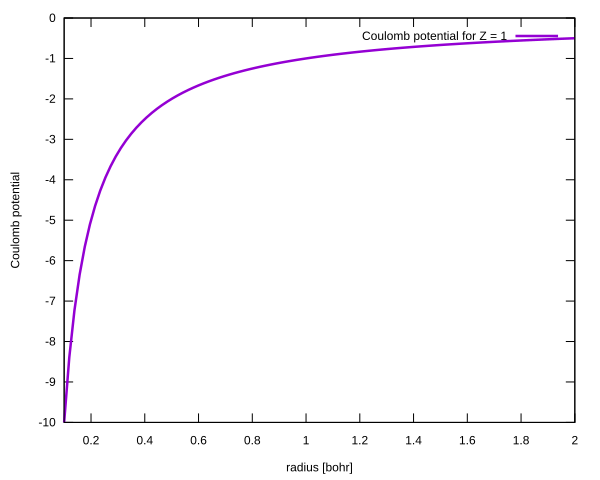
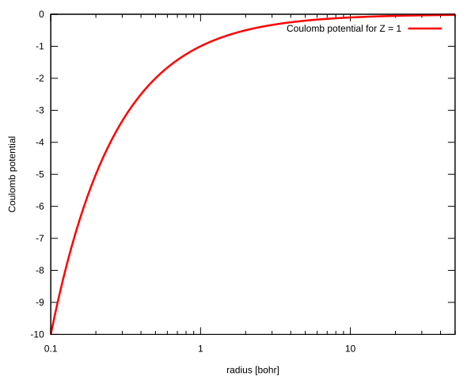

# Coulomb potential

## Potential definition

The Coulomb potential is defined by the following equation:

$$
V(r) = -\frac{Z}{r}
$$

where $Z$ is the nuclear charge number. This potential has the infinite value for $r = 0$:

$$
\lim_{r \rightarrow 0}V(r) = \lim_{r \rightarrow 0} -\frac{Z}{r} = -\infty
$$

For the Coulomb potential the eigenvalues are given in analytical form:

$$
E_{n, \ell} = -\frac{Z^2}{2 (n + \ell)^2}
$$

## Plots of the Coulomb potential on a linear and a logarithmic scale

<table>
<tr>
    <td></td>
    <td></td>
</tr>
</table>

## Eigenvalues for the final adaptive step for $Z = 1$

| n   | L = 0 | L = 1 | L = 2 | L = 3 | L = 4 |
| --- | ---   | ---   | ---   | ---   | ---   |
| 0   | -5.000 000 000e-01 | -1.249 999 999e-01 | -5.555 555 555e-02 | -3.125 000 000e-02 | -1.999 999 993e-02 |
| 1   | -1.250 000 000e-01 | -5.555 555 551e-02 | -3.124 999 999e-02 | -2.000 000 000e-02 | -1.388 888 880e-02 |
| 2   | -5.555 555 554e-02 | -3.124 999 997e-02 | -1.999 999 998e-02 | -1.388 888 888e-02 | -1.020 408 115e-02 |
| 3   | -3.124 999 875e-02 | -1.999 997 861e-02 | -1.388 888 643e-02 | -1.020 403 644e-02 | -7.812 045 036e-03 |

## Convergence analysis and evaluated eigenfunctions

+ [Case L = 0](./ell0/README.md)
+ [Case L = 1](./ell1/README.md)
+ [Case L = 2](./ell2/README.md)
+ [Case L = 3](./ell3/README.md)
+ [Case L = 4](./ell4/README.md)
