# Coulomb potential, L = 0

## L = 0, n = 0, $E_{n, l}$ = -5.000000000E-01

## L = 0

| Step | Dofs | n = 0 | n = 1 | n = 2 | n = 3 |
| ---  | ---  | ---   | ---   | ---   | ---   |
| 0    | 17   | -3.471 681 247E-01 | -9.928 397 176E-02 | -4.648 423 172E-02 | -2.695 4699 71E-02 |
| 1    | 23   | -4.681 310 078E-01 | -1.225 317 433E-01 | -5.498 266 345E-02 | -3.103 640 081E-02 |
| 2    | 29   | -4.991 207 272E-01 | -1.249 828 858E-01 | -5.555 340 470E-02 | -3.124 941 137E-02 |
| 3    | 35   | -4.999 972 677E-01 | -1.249 999 820E-01 | -5.555 555 045E-02 | -3.124 999 046E-02 |
| 4    | 47   | -4.999 999 969E-01 | -1.249 999 995E-01 | -5.555 555 223E-02 | -3.124 999 218E-02 |
| 5    | 65   | -4.999 999 994E-01 | -1.249 999 998E-01 | -5.555 555 550E-02 | -3.124 999 874E-02 |
| 6    | 71   | -5.000 000 000E-01 | -1.250 000 000E-01 | -5.555 555 554E-02 | -3.124 999 875E-02 |

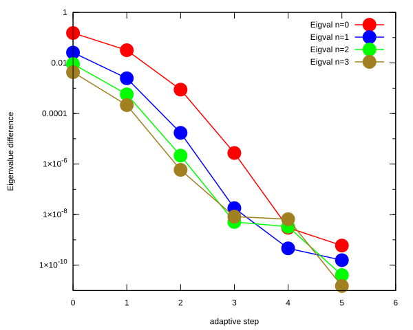

<table>
<tr>
    <td></td>
    <td>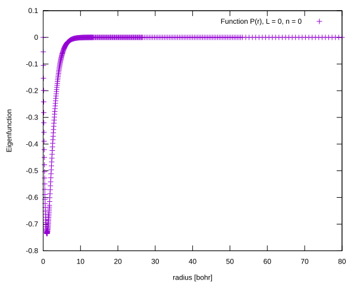</td>
</tr>
<tr>
    <td>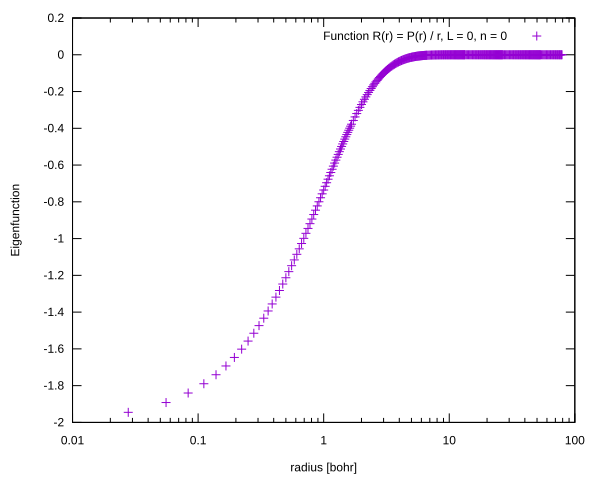</td>
    <td>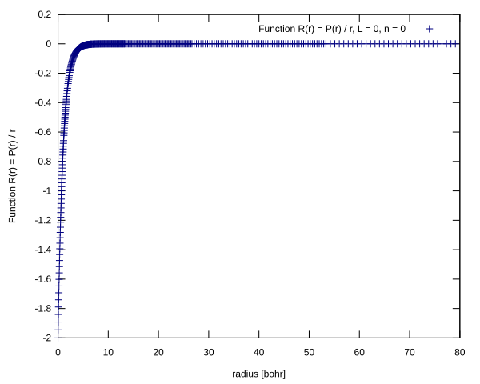</td>
</tr>
</table>

## L = 0, n = 1, $E_{n, l}$ = -1.250000000E-01

<table>
<tr>
    <td>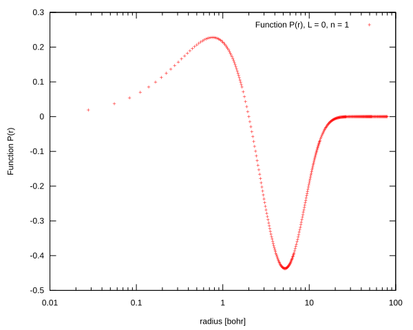</td>
    <td>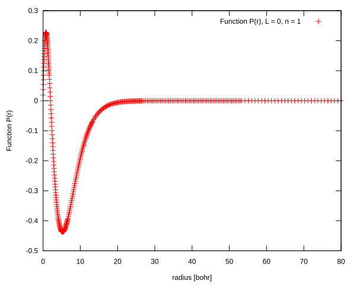</td>
</tr>
<tr>
    <td>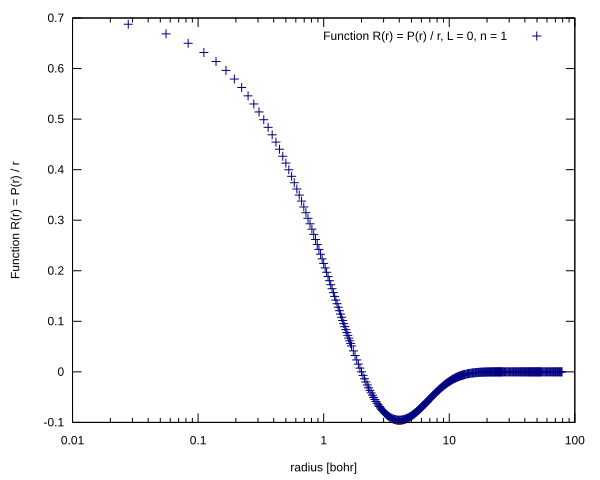</td>
    <td>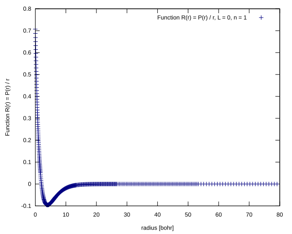</td>
</tr>
</table>

## L = 0, n = 2, $E_{n, l}$ = -5.555555554E-02

<table>
<tr>
    <td>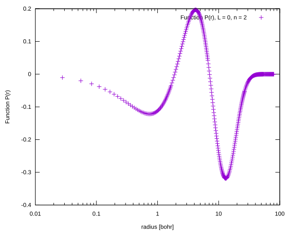</td>
    <td>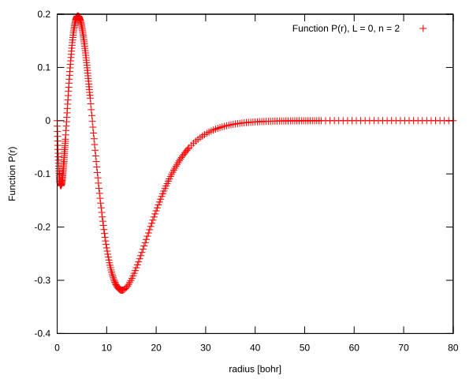</td>
</tr>
<tr>
    <td>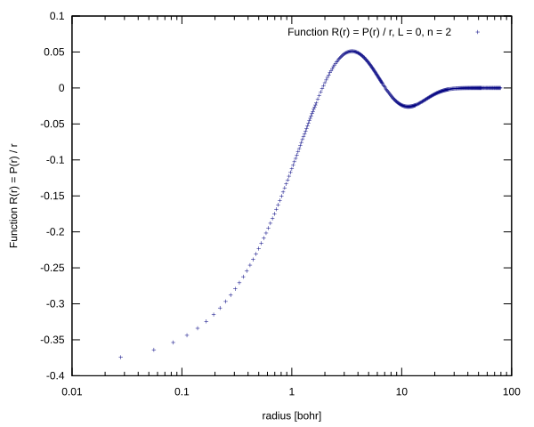</td>
    <td>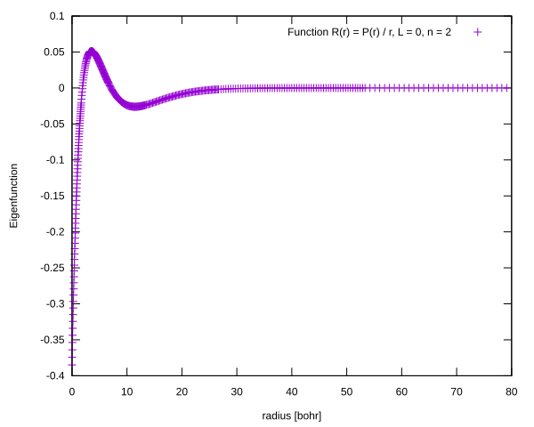</td>
</tr>
</table>

## L = 0, n = 3, $E_{n, l}$ = -3.124999875E-02

<table>
<tr>
    <td>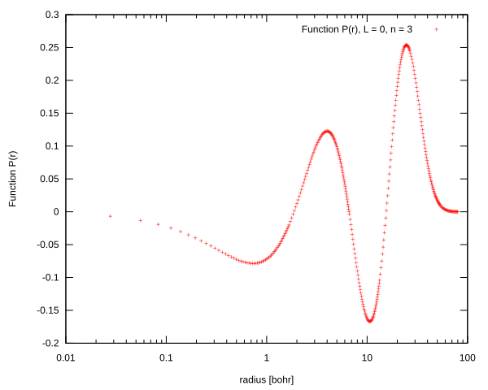</td>
    <td>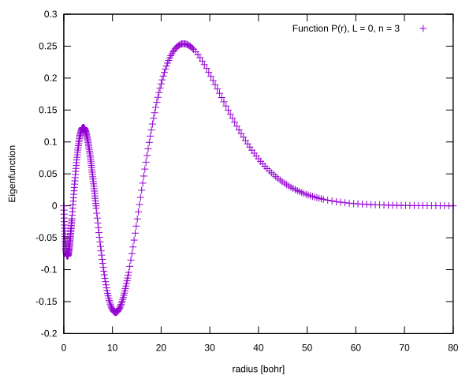</td>
</tr>
<tr>
    <td>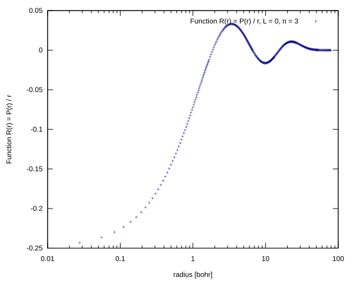</td>
    <td>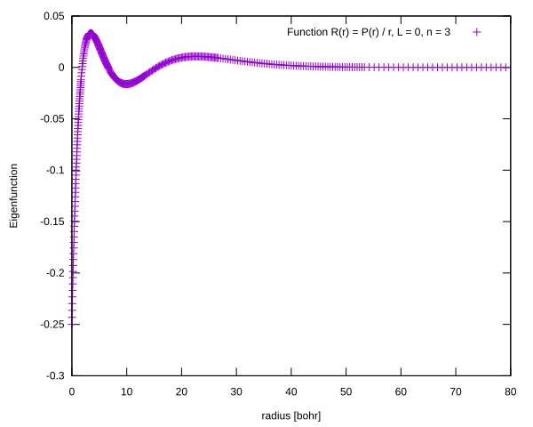</td>
</tr>
</table>

