# Coulomb potential, L = 1

## L = 1, n = 0, $E_{n, l} = -1.249999999e-01$

<table>
<tr>
    <td>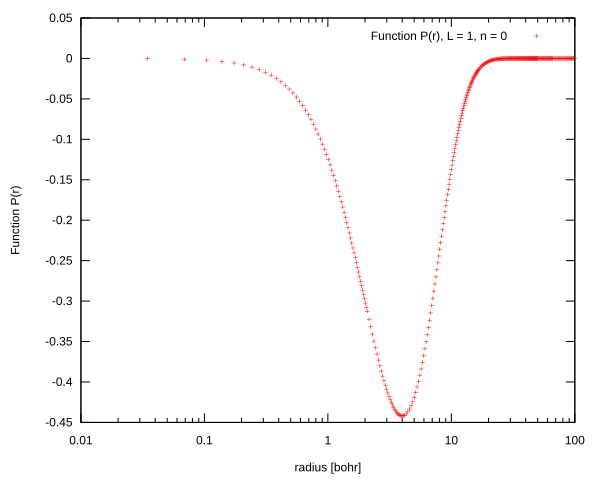</td>
    <td>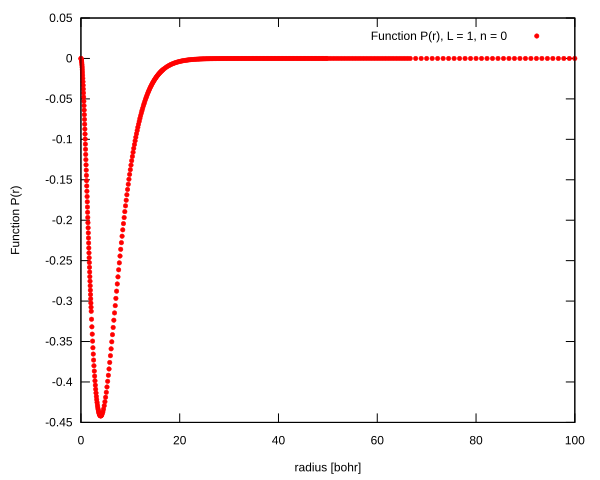</td>
</tr>
<tr>
    <td>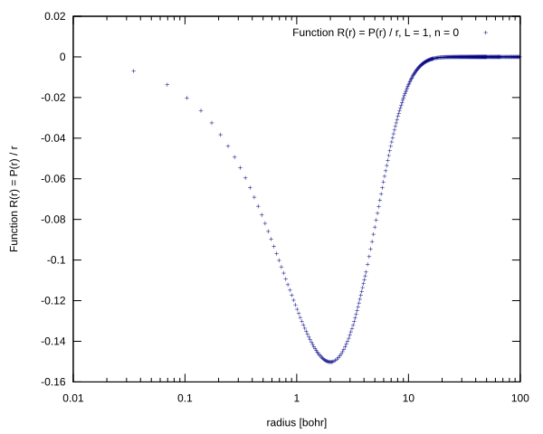</td>
    <td>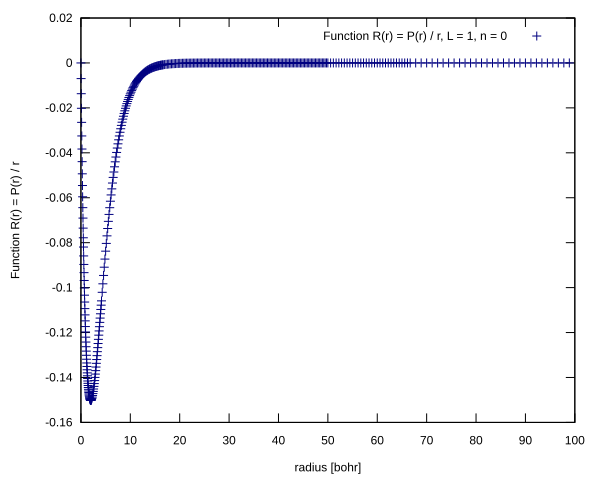</td>
</tr>
</table>

## L = 1, n = 1, $E_{n, l} = -5.555555551e-02$

<table>
<tr>
    <td>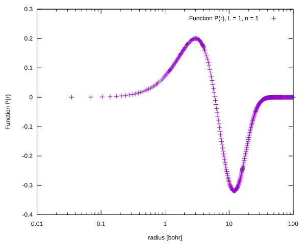</td>
    <td>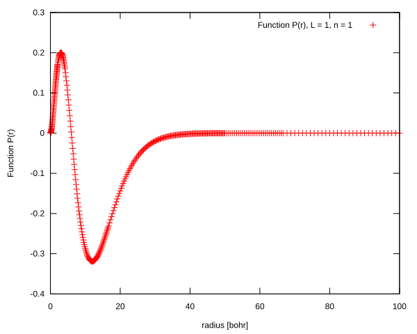</td>
</tr>
<tr>
    <td>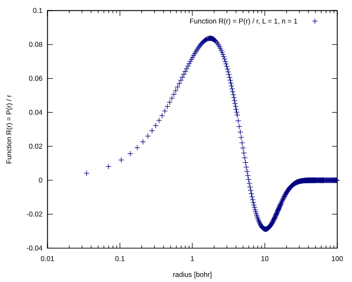</td>
    <td>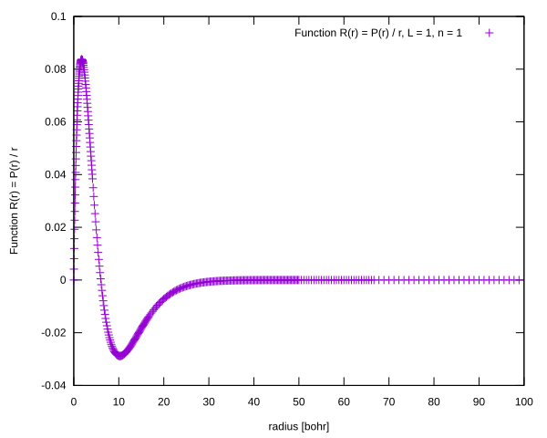</td>
</tr>
</table>

## L = 1, n = 2, $E_{n, l} = -3.124999997e-02$

<table>
<tr>
    <td>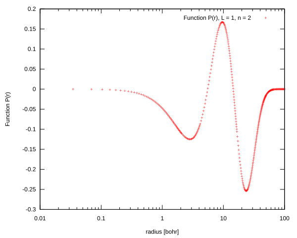</td>
    <td>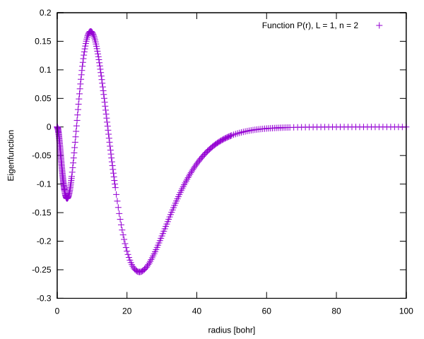</td>
</tr>
<tr>
    <td>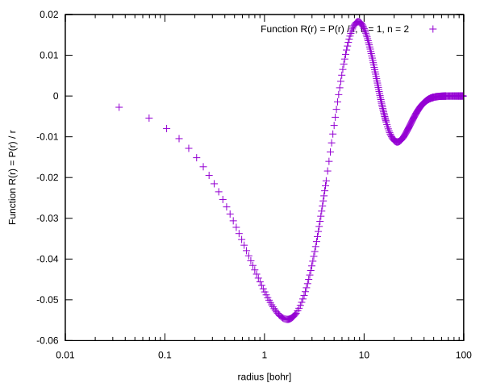</td>
    <td>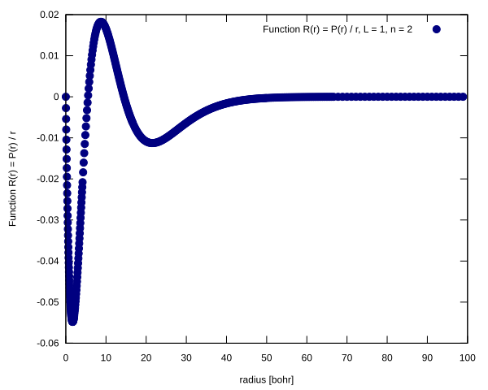</td>
</tr>
</table>

## L = 1, n = 3, $E_{n, l} = -1.999997861e-02$

<table>
<tr>
    <td>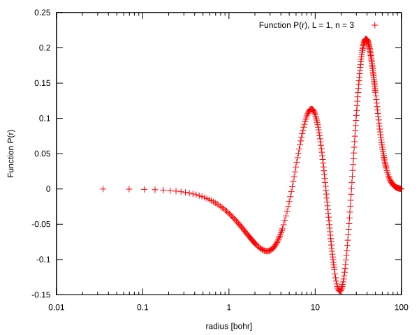</td>
    <td>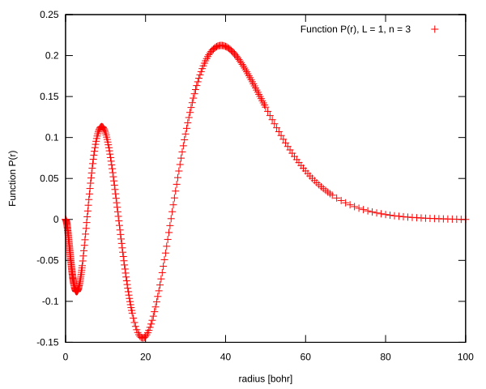</td>
</tr>
<tr>
    <td>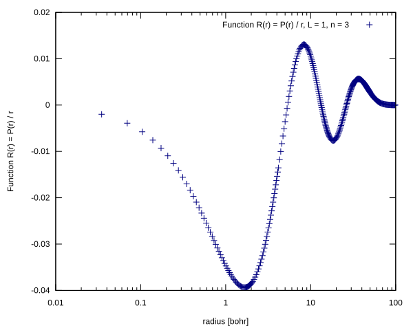</td>
    <td>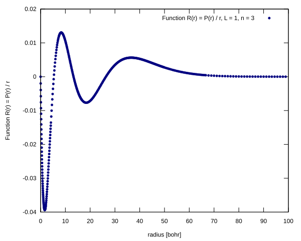</td>
</tr>
</table>

