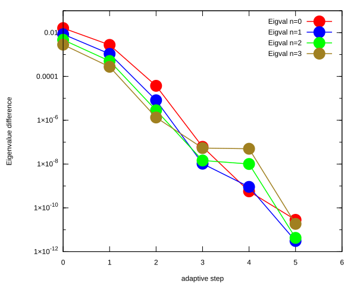

# Coulomb potential, L = 1

## Eigenvalue convergence analysis

| Step | Dofs | n = 0 | n = 1 | n = 2 | n = 3 |
| ---  | ---  | ---   | ---   | ---   | ---   |
| 0    | 17   | -1.088 786 731E-01 | -4.710 167 268E-02 | -2.654 331 230E-02 | -1.717 354 516E-02 |
| 1    | 23   | -1.222 497 125E-01 | -5.448 609 733E-02 | -3.074 450 328E-02 | -1.972 414 624E-02 |
| 2    | 29   | -1.249 626 638E-01 | -5.554 738 683E-02 | -3.124 716 067E-02 | -1.999 864 011E-02 |
| 3    | 35   | -1.249 999 388E-01 | -5.555 554 512E-02 | -3.124 998 543E-02 | -1.999 992 489E-02 |
| 4    | 47   | -1.249 999 994E-01 | -5.555 555 460E-02 | -3.124 998 990E-02 | -1.999 992 862E-02 |
| 5    | 59   | -1.249 999 999E-01 | -5.555 555 551E-02 | -3.124 999 997E-02 | -1.999 997 859E-02 |
| 6    | 71   | -1.249 999 999E-01 | -5.555 555 551E-02 | -3.124 999 997E-02 | -1.999 997 861E-02 |

<table>
<tr>
    <td></td>
    <td></td>
</tr>
</table>

## Eigenfunction: L = 1, n = 0, $E_{n, l}$ = -1.249999999E-01

<table>
<tr>
    <td></td>
    <td></td>
</tr>
<tr>
    <td></td>
    <td></td>
</tr>
</table>

## Eigenfunction: L = 1, n = 1, $E_{n, l}$ = -5.555555551e-02

<table>
<tr>
    <td></td>
    <td></td>
</tr>
<tr>
    <td></td>
    <td></td>
</tr>
</table>

## Eigenfunction: L = 1, n = 2, $E_{n, l}$ = -3.124999997e-02

<table>
<tr>
    <td></td>
    <td></td>
</tr>
<tr>
    <td></td>
    <td></td>
</tr>
</table>

## Eigenfunction: L = 1, n = 3, $E_{n, l}$ = -1.999997861e-02

<table>
<tr>
    <td></td>
    <td></td>
</tr>
<tr>
    <td></td>
    <td></td>
</tr>
</table>

