# Coulomb potential, L = 2

## L = 2 n = 0, $E_{n, l} = -5.555555555e-02$

<table>
<tr>
    <td>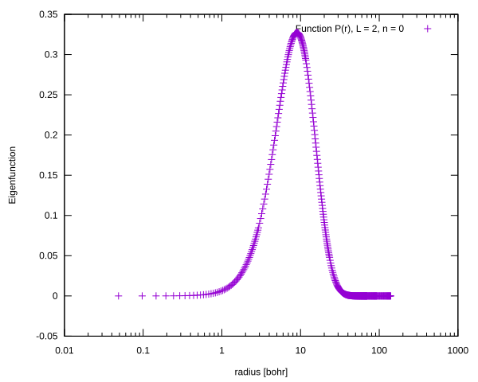</td>
    <td></td>
</tr>
<tr>
    <td>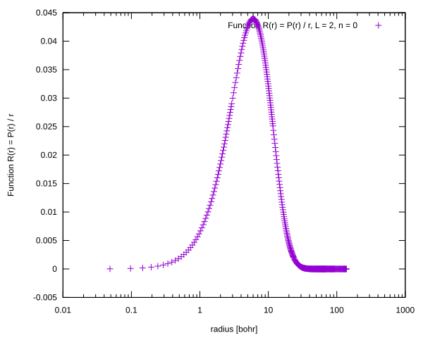</td>
    <td>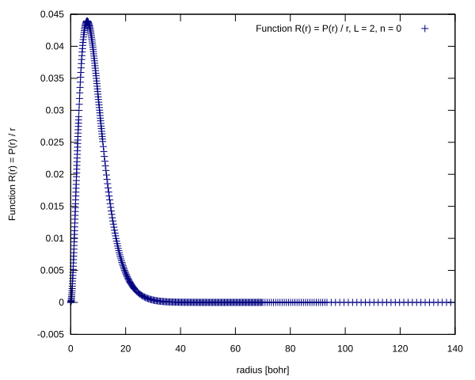</td>
</tr>
</table>

## L = 2 n = 1, $E_{n, l} = -3.124999999e-02$

<table>
<tr>
    <td>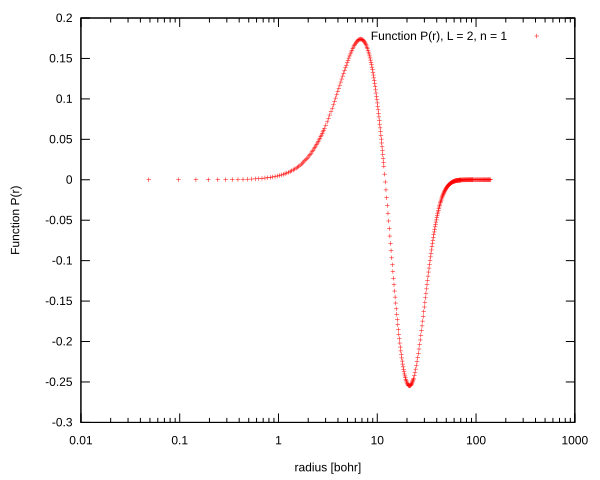</td>
    <td>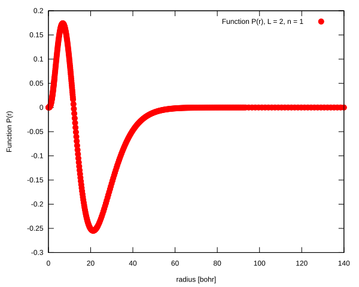</td>
</tr>
<tr>
    <td>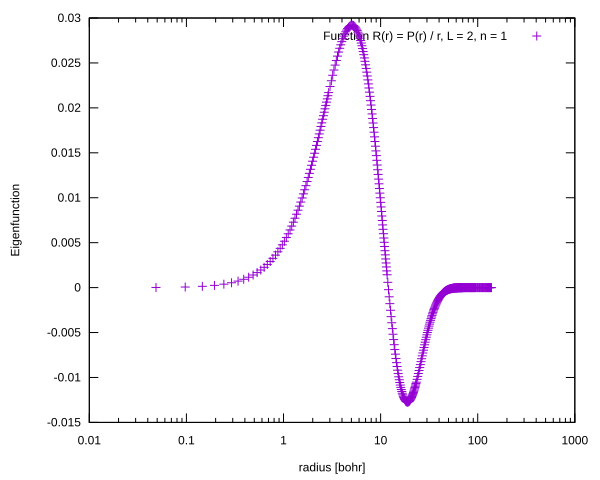</td>
    <td>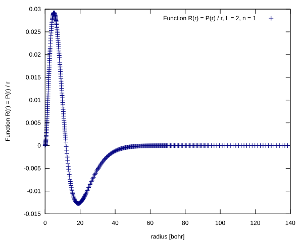</td>
</tr>
</table>

## L = 2 n = 2, $E_{n, l} = -1.999999998e-02$

<table>
<tr>
    <td>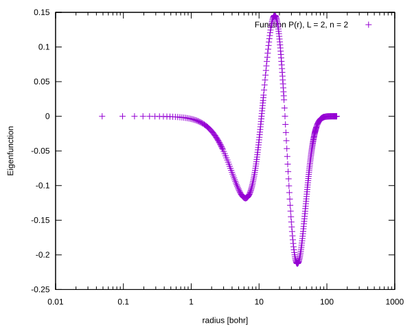</td>
    <td>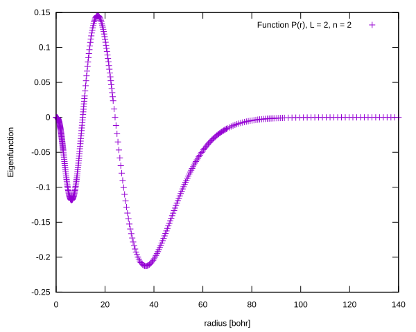</td>
</tr>
<tr>
    <td></td>
    <td>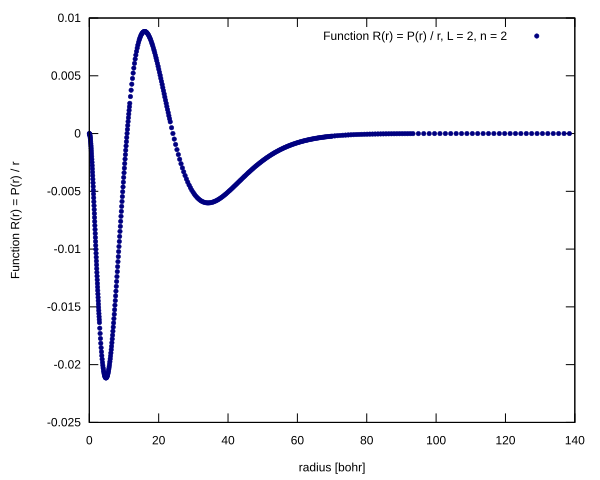</td>
</tr>
</table>

## L = 2 n = 3, $E_{n, l} = -1.388888643e-02$

<table>
<tr>
    <td></td>
    <td>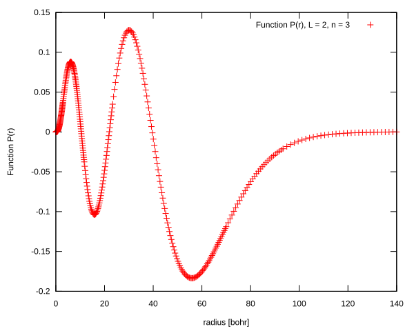</td>
</tr>
<tr>
    <td>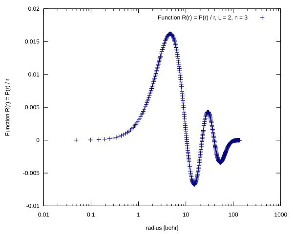</td>
    <td>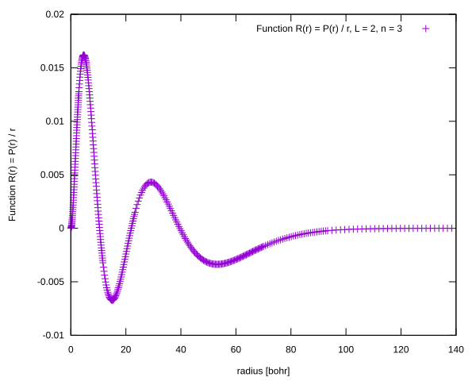</td>
</tr>
</table>

