# Coulomb potential, L = 2

## Eigenvalue convergence analysis

| Step | Dofs | n = 0 | n = 1 | n = 2 | n = 3 |
| ---  | ---  | ---   | ---   | ---   | ---   |
| 0    | 17   |  -5.313 502 897E-02 | -2.882 835 320E-02 | -1.809 346 878E-02 | -1.247 741 113E-02 |
| 1    | 23   |  -5.532 090 306E-02 | -3.104 551 696E-02 | -1.985 394 256E-02 | -1.378 770 352E-02 |
| 2    | 35   |  -5.554 289 429E-02 | -3.124 168 056E-02 | -1.999 484 793E-02 | -1.388 551 304E-02 |
| 3    | 41   |  -5.555 552 283E-02 | -3.124 998 346E-02 | -1.999 997 941E-02 | -1.388 879 846E-02 |
| 4    | 47   |  -5.555 555 539E-02 | -3.124 999 925E-02 | -1.999 998 764E-02 | -1.388 880 321E-02 |
| 5    | 59   |  -5.555 555 554E-02 | -3.124 999 999E-02 | -1.999 999 998E-02 | -1.388 888 642E-02 |
| 6    | 77   |  -5.555 555 555E-02 | -3.124 999 999E-02 | -1.999 999 998E-02 | -1.388 888 643E-02 |

<table>
<tr>
    <td>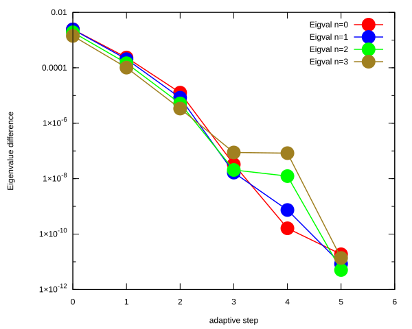</td>
    <td>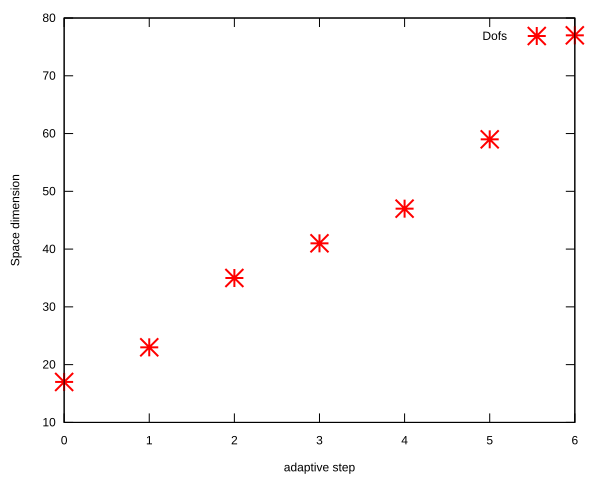</td>
</tr>
</table>

## Eigenfunction: L = 2 n = 0, $E_{n, l}$ = -5.555555555e-02

<table>
<tr>
    <td>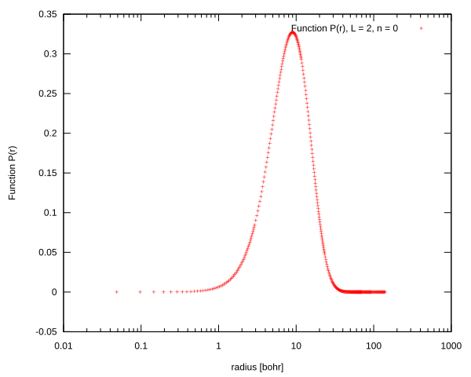</td>
    <td>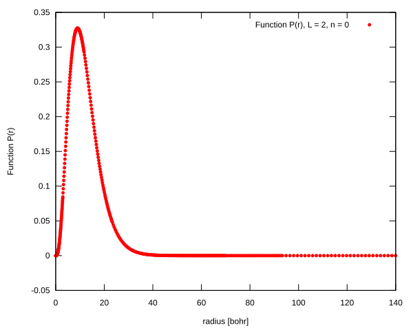</td>
</tr>
<tr>
    <td>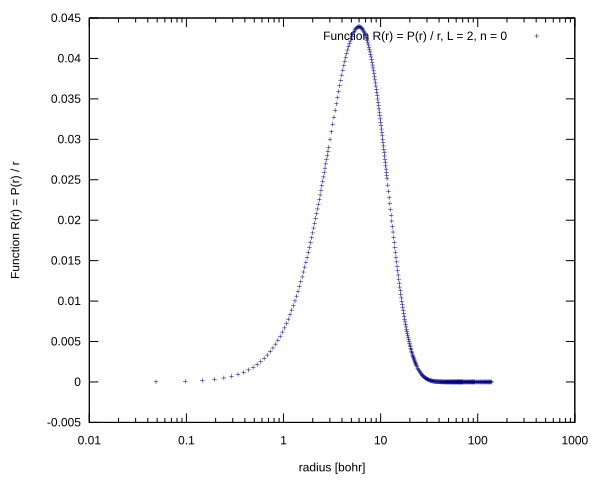</td>
    <td>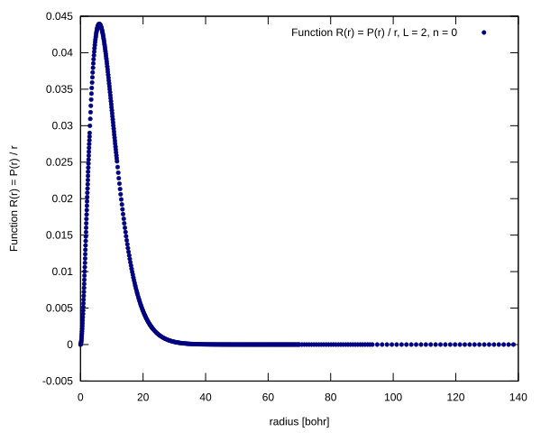</td>
</tr>
</table>

## Eigenfunction: L = 2 n = 1, $E_{n, l}$ = -3.124999999e-02

<table>
<tr>
    <td></td>
    <td></td>
</tr>
<tr>
    <td>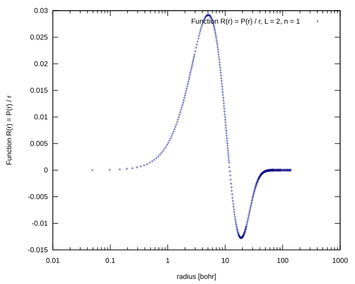</td>
    <td>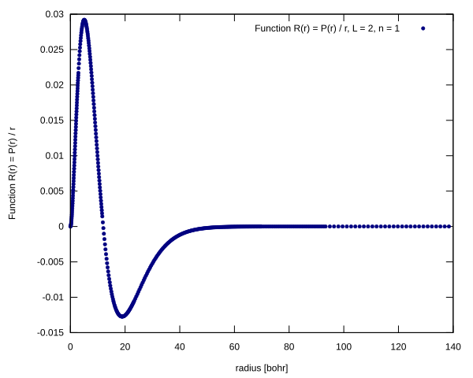</td>
</tr>
</table>

## Eigenfunction: L = 2 n = 2, $E_{n, l}$ = -1.999999998e-02

<table>
<tr>
    <td>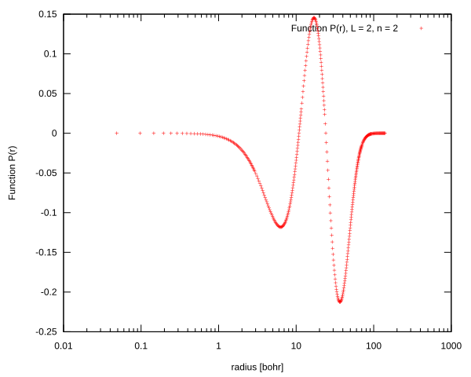</td>
    <td>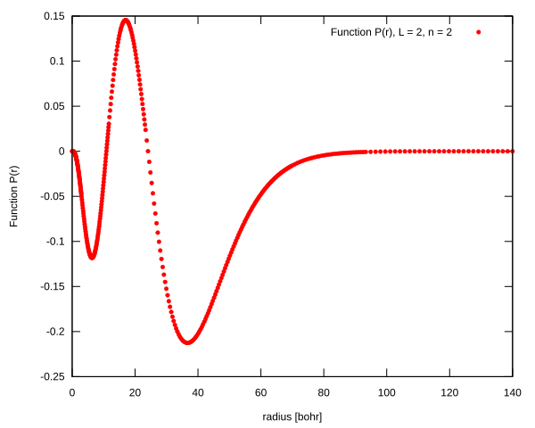</td>
</tr>
<tr>
    <td>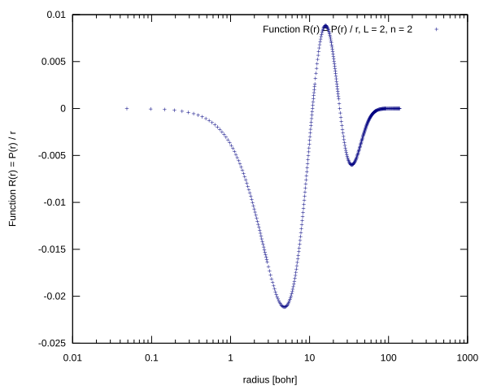</td>
    <td></td>
</tr>
</table>

## Eigenfunction: L = 2 n = 3, $E_{n, l}$ = -1.388888643e-02

<table>
<tr>
    <td>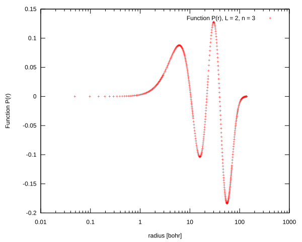</td>
    <td>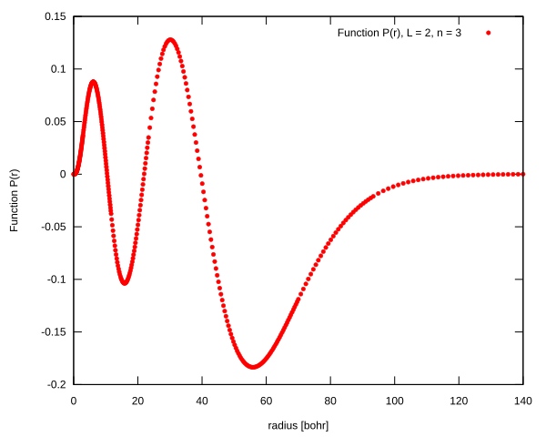</td>
</tr>
<tr>
    <td>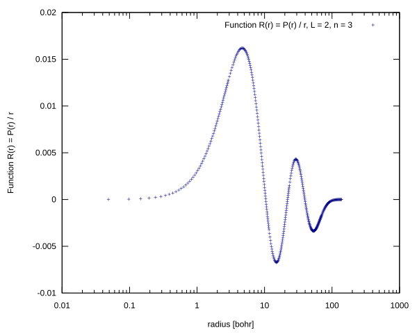</td>
    <td>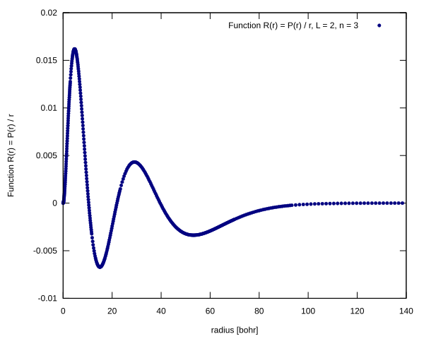</td>
</tr>
</table>

