# Coulomb potential, L = 3

## L = 3, n = 0

<table>
<tr>
    <td>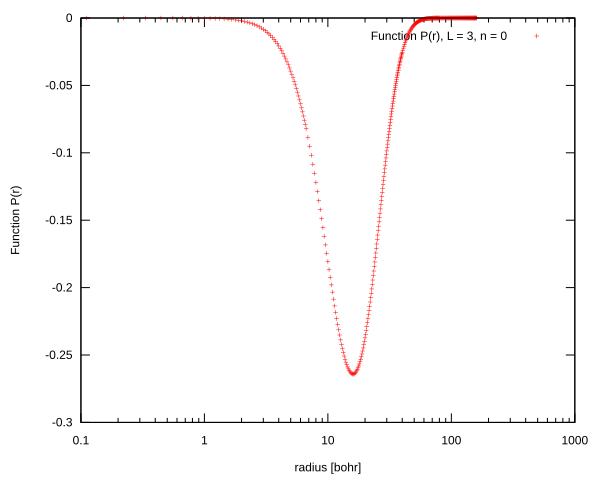</td>
    <td>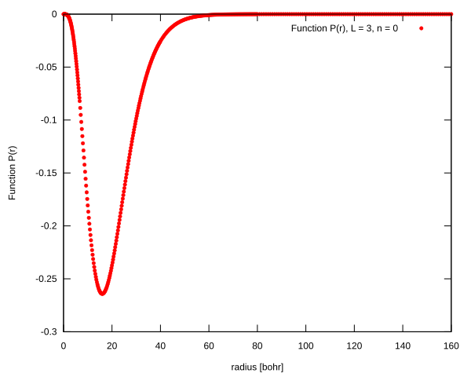</td>
</tr>
<tr>
    <td>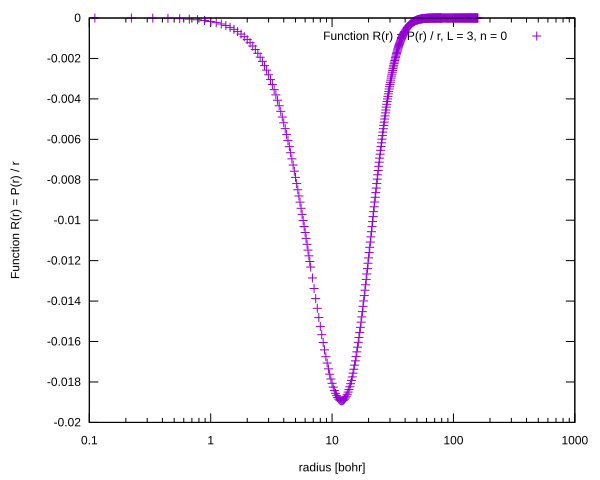</td>
    <td>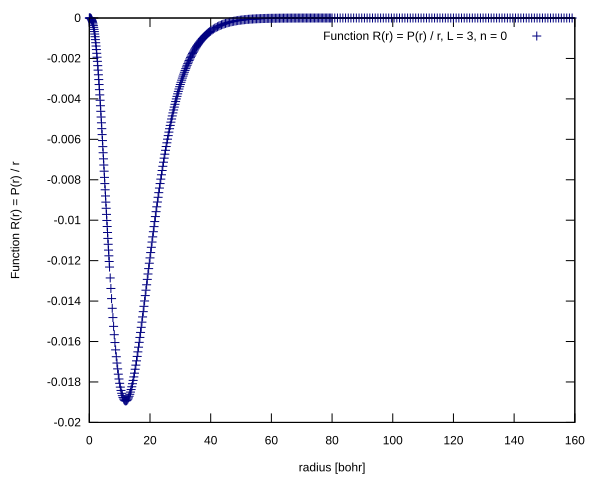</td>
</tr>
</table>

## L = 3, n = 1

<table>
<tr>
    <td>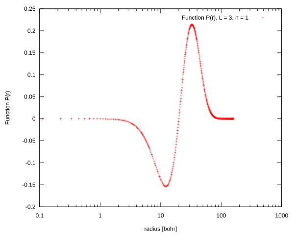</td>
    <td>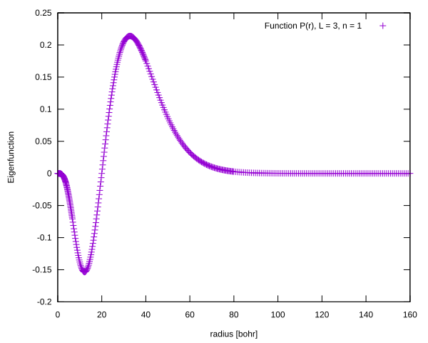</td>
</tr>
<tr>
    <td></td>
    <td></td>
</tr>
</table>

## L = 3, n = 2

<table>
<tr>
    <td>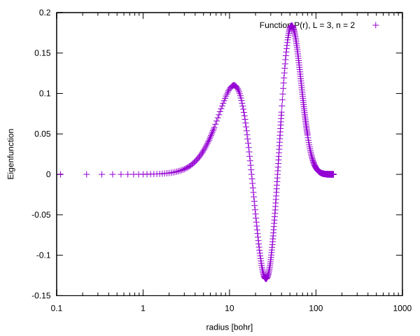</td>
    <td>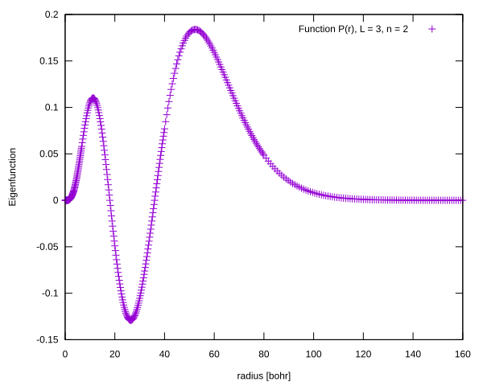</td>
</tr>
<tr>
    <td>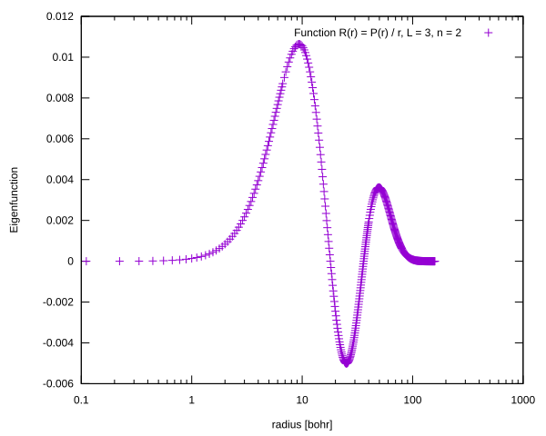</td>
    <td>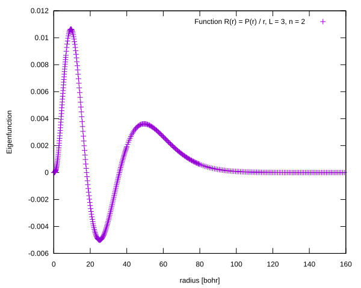</td>
</tr>
</table>

## L = 3, n = 3

<table>
<tr>
    <td></td>
    <td>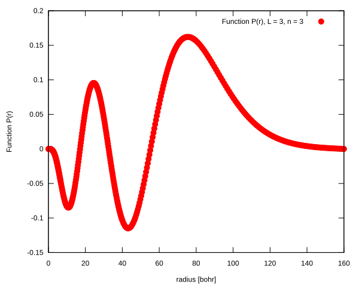</td>
</tr>
<tr>
    <td>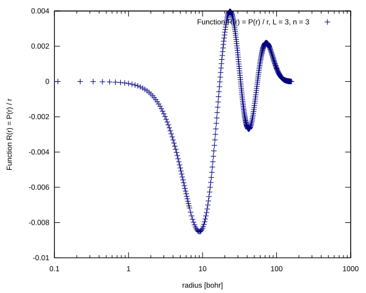</td>
    <td>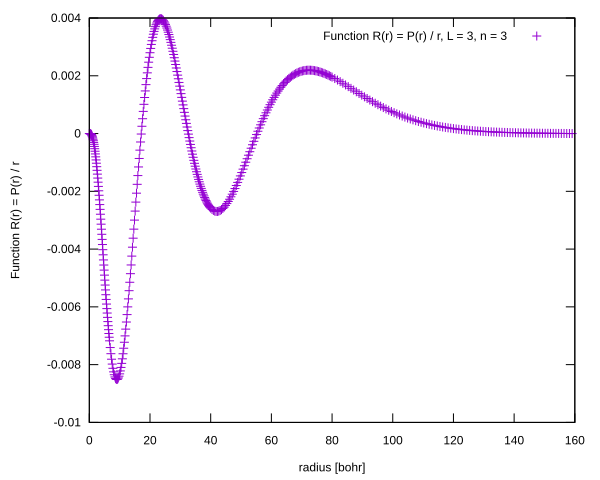</td>
</tr>
</table>

