# Coulomb potential, L = 3

## Eigenvalue convergence analysis

| Step | Dofs | n = 0 | n = 1 | n = 2 | n = 3 |
| ---  | ---  | ---   | ---   | ---   | ---   |
| 0    | 17   |  -3.072 659 233E-02 | -1.941 880 443E-02 | -1.339 993 553E-02 | -9.815 755 708E-03 |
| 1    | 23   |  -3.122 883 045E-02 | -1.997 196 161E-02 | -1.386 180 350E-02 | -1.018 071 605E-02 |
| 2    | 29   |  -3.124 950 537E-02 | -1.999 946 350E-02 | -1.388 843 152E-02 | -1.020 366 752E-02 |
| 3    | 41   |  -3.124 950 630E-02 | -1.999 947 129E-02 | -1.388 845 267E-02 | -1.020 369 969E-02 |
| 4    | 47   |  -3.124 950 636E-02 | -1.999 947 139E-02 | -1.388 845 280E-02 | -1.020 369 983E-02 |
| 5    | 65   |  -3.124 999 741E-02 | -1.999 999 770E-02 | -1.388 888 718E-02 | -1.020 403 521E-02 |
| 6    | 77   |  -3.125 000 000E-02 | -2.000 000 000E-02 | -1.388 888 888E-02 | -1.020 403 644E-02 |

<table>
<tr>
    <td>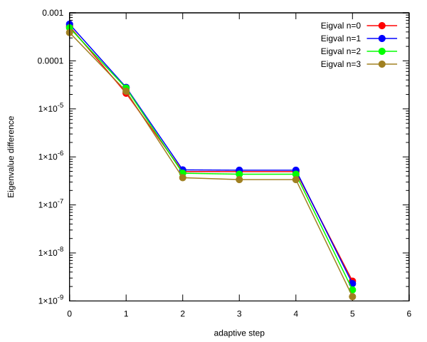</td>
    <td>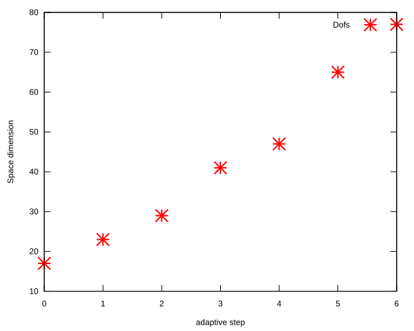</td>
</tr>
</table>

## Eigenfunction: L = 3, n = 0, $E_{n, l}$ = -3.125000000e-02

<table>
<tr>
    <td></td>
    <td></td>
</tr>
<tr>
    <td>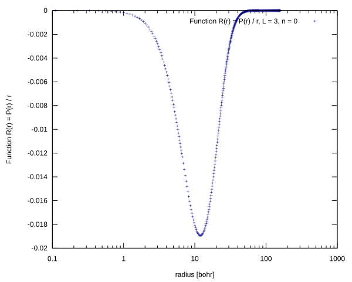</td>
    <td>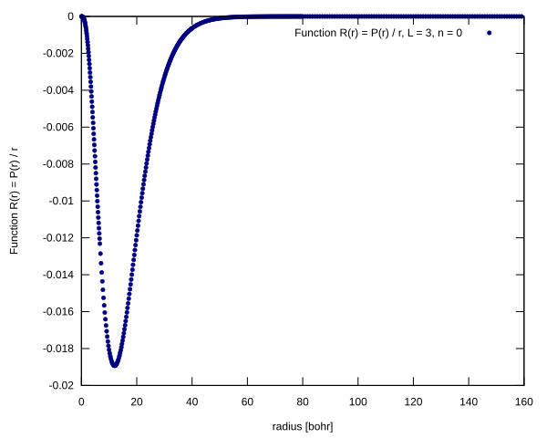</td>
</tr>
</table>

## Eigenfunction: L = 3, n = 1, $E_{n, l}$ = -2.000000000e-02

<table>
<tr>
    <td></td>
    <td>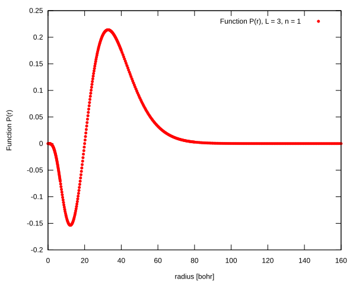</td>
</tr>
<tr>
    <td>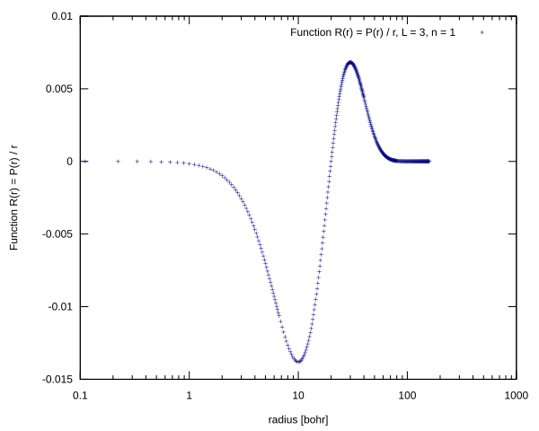</td>
    <td>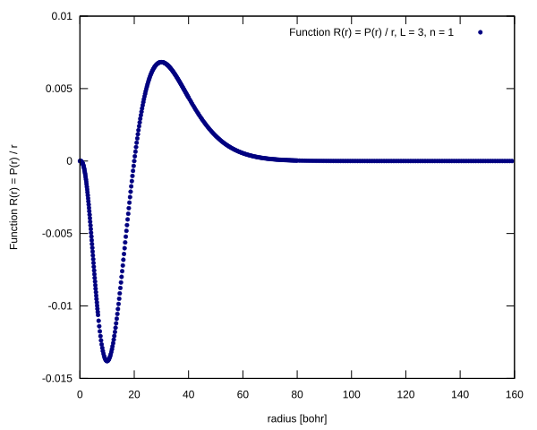</td>
</tr>
</table>

## Eigenfunction: L = 3, n = 2, $E_{n, l}$ = -1.388888888e-02

<table>
<tr>
    <td>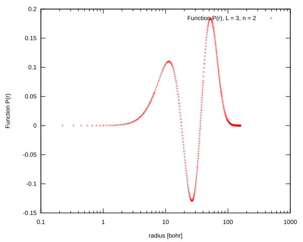</td>
    <td>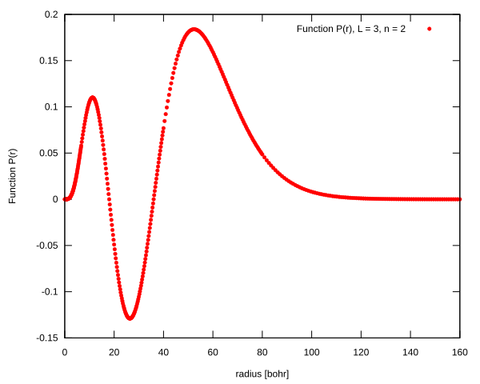</td>
</tr>
<tr>
    <td>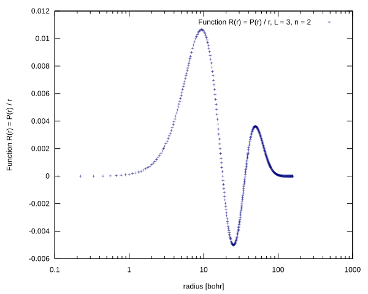</td>
    <td>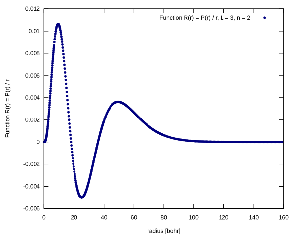</td>
</tr>
</table>

## Eigenfunction: L = 3, n = 3, $E_{n, l}$ = -1.020403644e-02

<table>
<tr>
    <td></td>
    <td>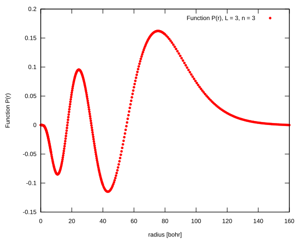</td>
</tr>
<tr>
    <td>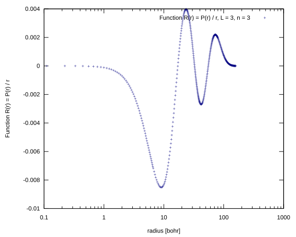</td>
    <td>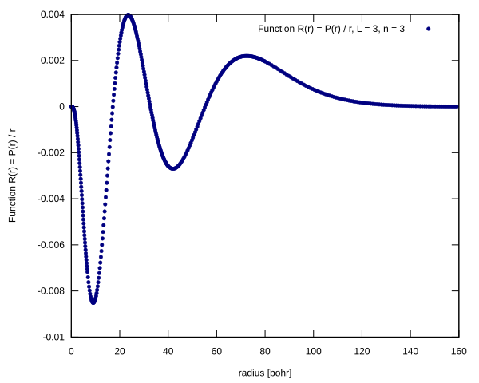</td>
</tr>
</table>

