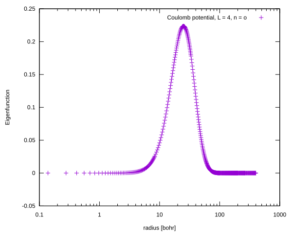
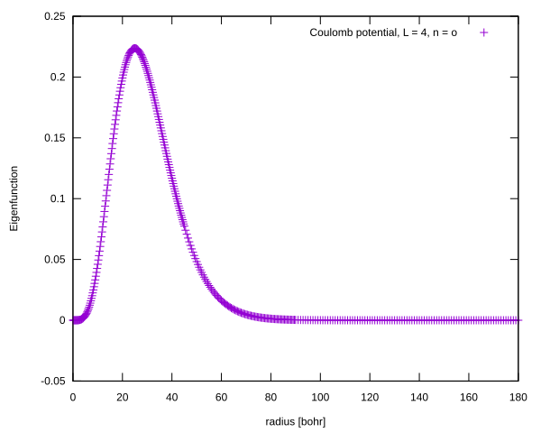
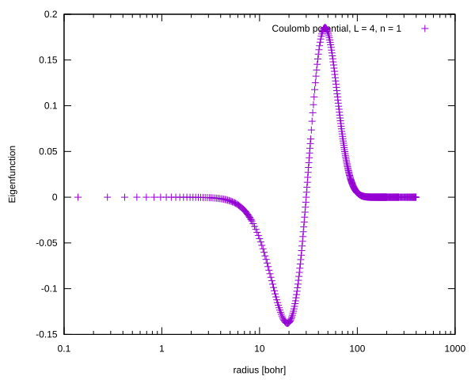
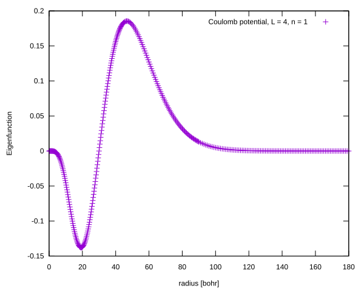
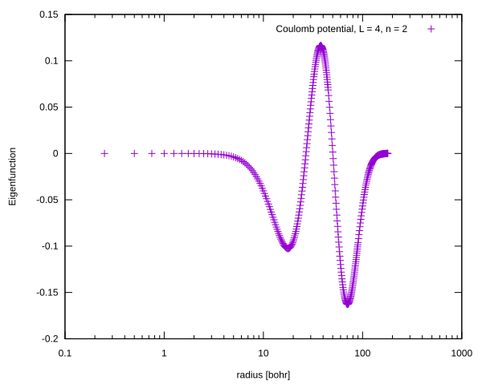
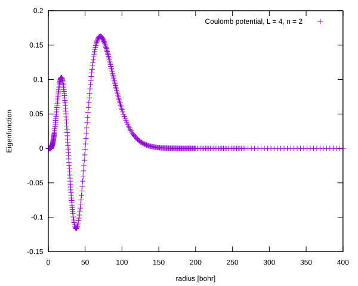
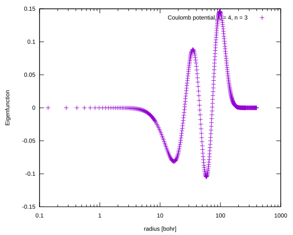
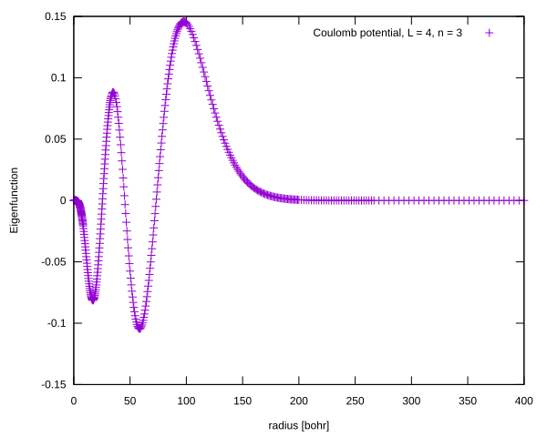

# Coulomb potential, L = 4

<table>
<tr>
    <td></td>
    <td></td>
</tr>
</table>

<table>
<tr>
    <td></td>
    <td></td>
</tr>
</table>

<table>
<tr>
    <td></td>
    <td></td>
</tr>
</table>

<table>
<tr>
    <td></td>
    <td></td>
</tr>
</table>

