# Coulomb potential, L = 4

## L = 4, n = 0, $E_{n, l} = -1.999999993e-02$

<table>
<tr>
    <td>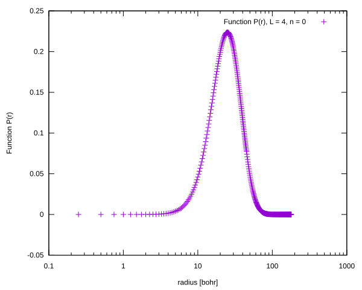</td>
    <td></td>
</tr>
<tr>
    <td></td>
    <td>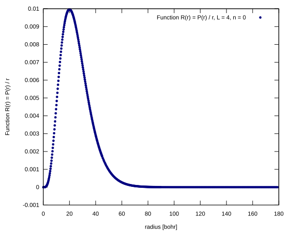</td>
</tr>
</table>

## L = 4, n = 1, $E_{n, l} = -1.388888880e-02$

<table>
<tr>
    <td>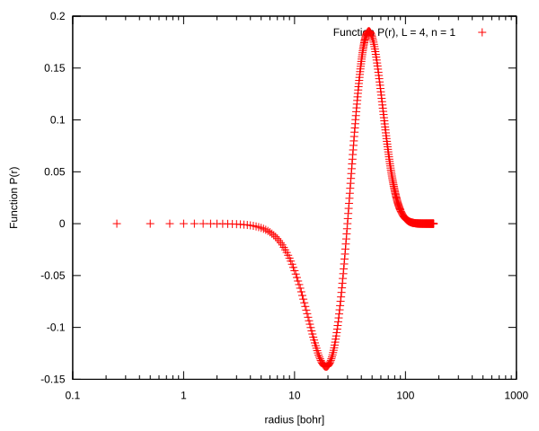</td>
    <td>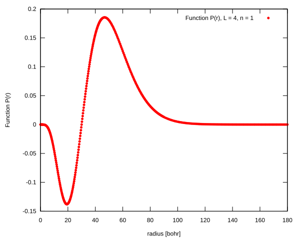</td>
</tr>
<tr>
    <td>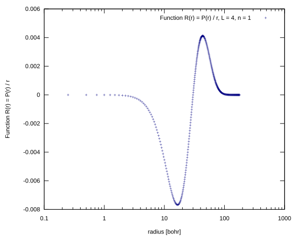</td>
    <td>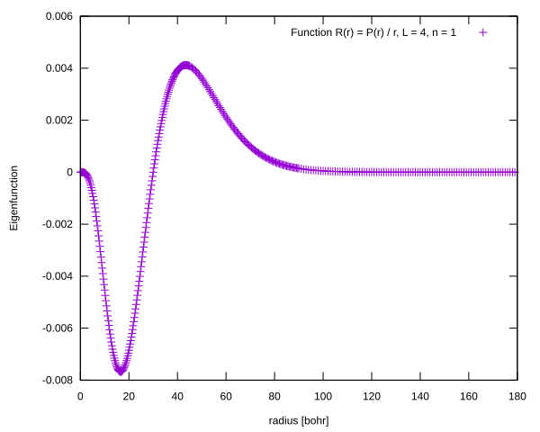</td>
</tr>
</table>

## L = 4, n = 2, $E_{n, l} = -1.020408115e-02$

<table>
<tr>
    <td>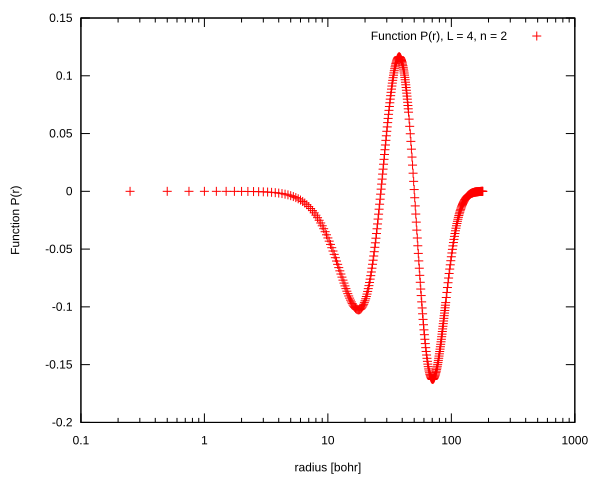</td>
    <td>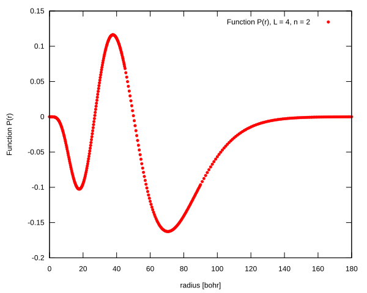</td>
</tr>
<tr>
    <td>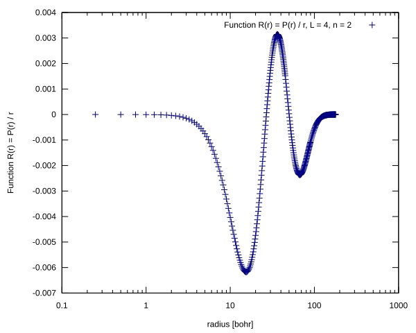</td>
    <td>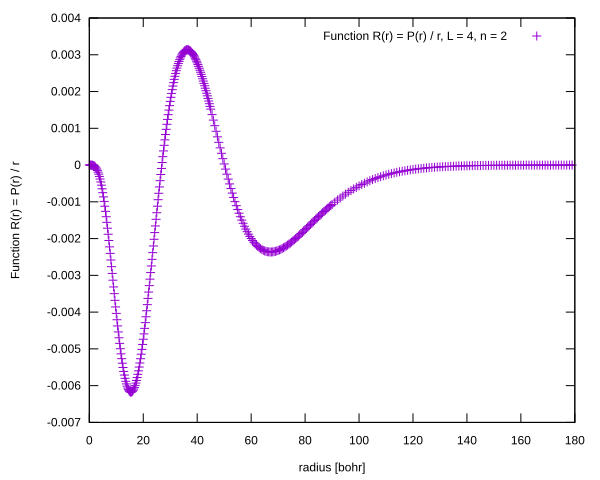</td>
</tr>
</table>

## L = 4, n = 3, $E_{n, l} = -7.812045036e-03$

<table>
<tr>
    <td>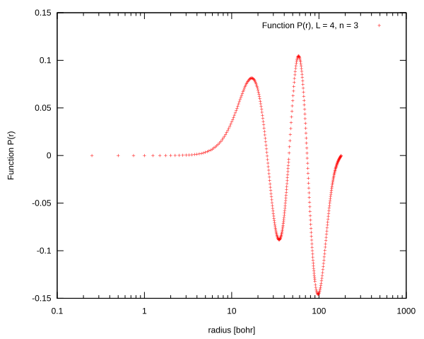</td>
    <td>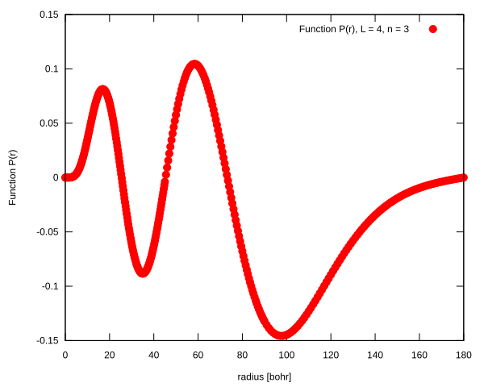</td>
</tr>
<tr>
    <td>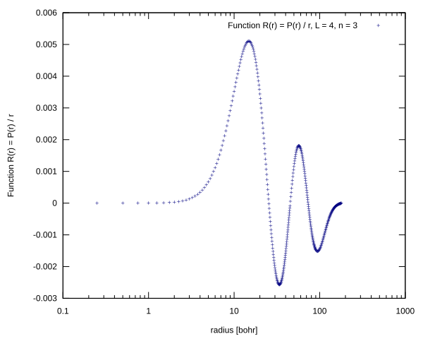</td>
    <td>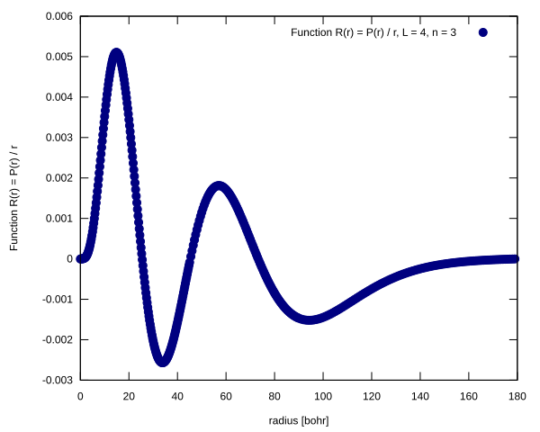</td>
</tr>
</table>

