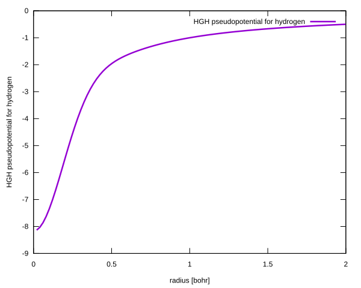
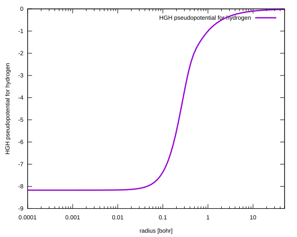

# Hartwigsen-Goedecker-Hutter pseudopotential for hydrogen

## Potential definition

The potential is defined by the following equation:

$$
V(r) = -\frac{Z_\mathrm{ion}}{r} \mathrm{erf}(w / \sqrt{2}) + \mathrm{exp}(-w^2 / 2) [C_1 + C_2 w^2 + C_3 w^3 + C_4 w^4]
$$

where $w = r / r_{\mathrm{loc}}$. The coefficients in the above equations are as follows:

$$
\begin{aligned}
C_1 &= -4.180237,\\
C_2 &= 0.725075,\\
C_3 &= C_4 = 0,\\
Z_{\mathrm{ion}} &= 1,\\
r_{\mathrm{loc}} &= 0.2.
\end{aligned}
$$

For details about the Hartwigsen-Goedecker-Hutter pseudopotential, refer to the following article:

+ C. Hartwigsen, S. Goedecker, and J. Hutter, *Relativistic separable dual-space Gaussian pseudopotentials from H to Rn*, [Phys. Rev. B 58, 3641](https://doi.org/10.1103/PhysRevB.58.3641)

## Eigenvalues

According to the definition of the pseudopotential for the hydrogen atom, this potential has eigenvalues that are close to those of the hydrogen atom. Therefore:

$$
E_{n, \ell} = -\frac{1}{2 (n + \ell)^2}
$$

## Plots of the potential on a linear and a logarithmic scale

<table>
<tr>
    <td></td>
    <td></td>
</tr>
</table>

## Eigenvalues for the final adaptive step for $Z = 1$

| n   | L = 0 | L = 1 | L = 2 | L = 3 | L = 4 |
| --- | ---   | ---   | ---   | ---   | ---   |
| 0   | -4.999 425 640E-01 | -1.249 923 359E-01 | -5.555 553 668E-02 | -3.124 999 999E-02 | -1.999999993E-02 |
| 1   | -1.250 005 758E-01 | -5.555 294 428E-02 | -3.124 998 870E-02 | -1.999 999 999E-02 | -1.388888880E-02 |
| 2   | -5.555 604 403E-02 | -3.124 885 048E-02 | -1.999 999 336E-02 | -1.388 888 887E-02 | -1.020408115E-02 |
| 3   | -3.125 024 854E-02 | -1.999 937 891E-02 | -1.388 888 233E-02 | -1.020 403 644E-02 | -7.812045036E-03 |

## Convergence analysis and evaluated eigenfunctions

+ [Case L = 0](./ell0/README.md)
+ [Case L = 1](./ell1/README.md)
+ [Case L = 2](./ell2/README.md)
+ [Case L = 3](./ell3/README.md)
+ [Case L = 4](./ell4/README.md)

