# Hartwigsen-Goedecker-Hutter pseudopotential for hydrogen, L = 0

## Eigenvalue convergence analysis

| Step | Dofs | n = 0 | n = 1 | n = 2 | n = 3 |
| ---  | ---  | ---   | ---   | ---   | ---   |
| 0 | 17 |  -3.470 523 793E-01 | -9.927 796 844E-02 | -4.648 316 022E-02 | -2.695 435 920E-02 |
| 1 | 23 |  -4.681 448 160E-01 | -1.225 163 459E-01 | -5.497 548 031E-02 | -3.103 284 031E-02 |
| 2 | 29 |  -4.987 495 778E-01 | -1.249 187 332E-01 | -5.553 314 354E-02 | -3.124 066 892E-02 |
| 3 | 35 |  -4.994 060 234E-01 | -1.249 305 957E-01 | -5.553 519 148E-02 | -3.124 143 027E-02 |
| 4 | 47 |  -4.996 777 409E-01 | -1.249 677 631E-01 | -5.554 633 811E-02 | -3.124 615 166E-02 |
| 5 | 53 |  -4.999 405 649E-01 | -1.250 003 211E-01 | -5.555 596 513E-02 | -3.125 021 005E-02 |
| 6 | 59 |  -4.999 425 306E-01 | -1.250 005 712E-01 | -5.555 603 947E-02 | -3.125 024 145E-02 |
| 7 | 71 |  -4.999 425 311E-01 | -1.250 005 715E-01 | -5.555 604 274E-02 | -3.125 024 800E-02 |
| 8 | 83 |  -4.999 425 640E-01 | -1.250 005 758E-01 | -5.555 604 403E-02 | -3.125 024 854E-02 |

<table>
<tr>
    <td>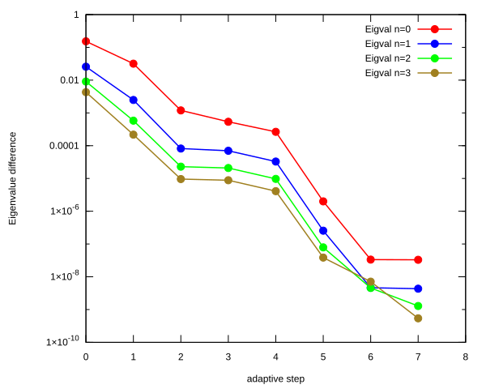</td>
    <td>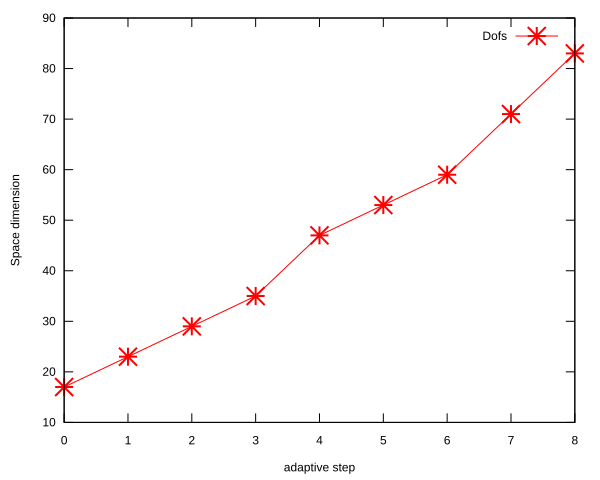</td>
</tr>
</table>

## Eigenfunction: L = 0, n = 0, $E_{n, l}$ = -4.999425640E-01

<table>
<tr>
    <td>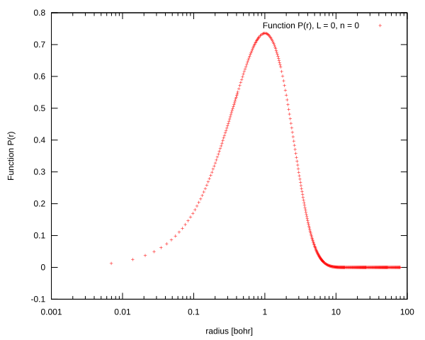</td>
    <td>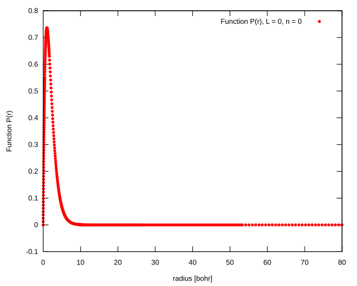</td>
</tr>
<tr>
    <td>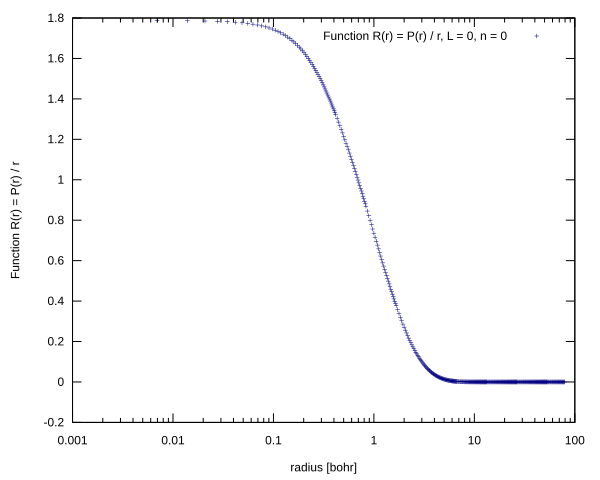</td>
    <td>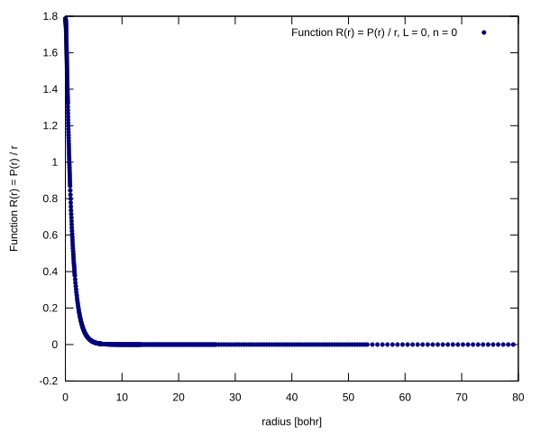</td>
</tr>
</table>

## Eigenfunction:L = 0, n = 1, $E_{n, l}$ = -1.250005758E-01

<table>
<tr>
    <td>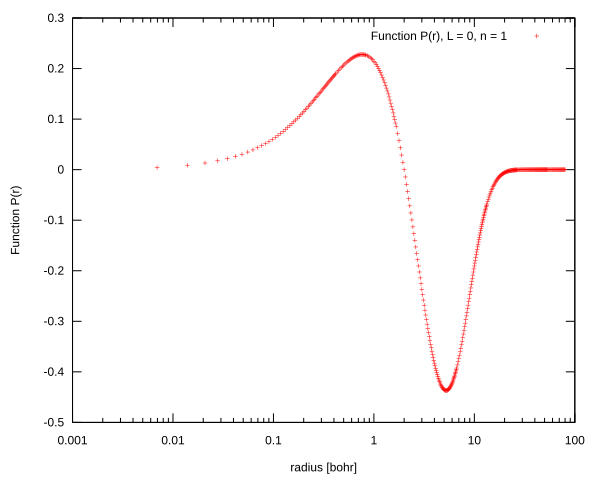</td>
    <td>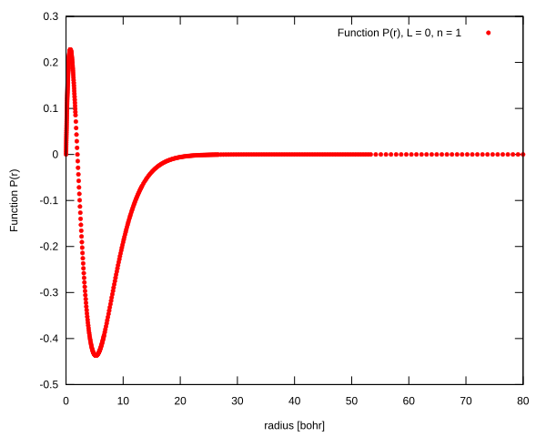</td>
</tr>
<tr>
    <td>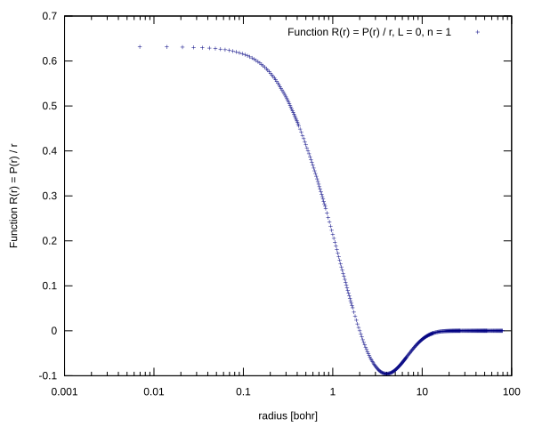</td>
    <td>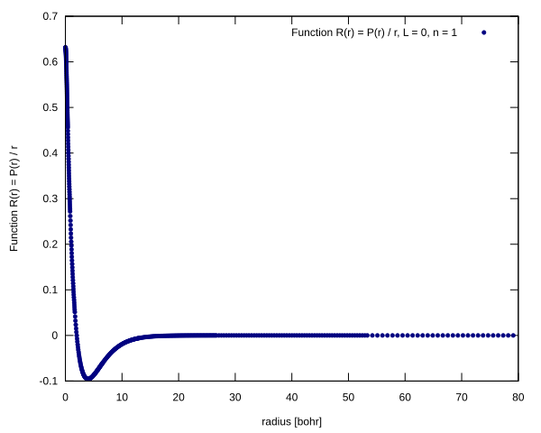</td>
</tr>
</table>

## Eigenfunction:L = 0, n = 2, $E_{n, l}$ = -5.555604403E-02

<table>
<tr>
    <td>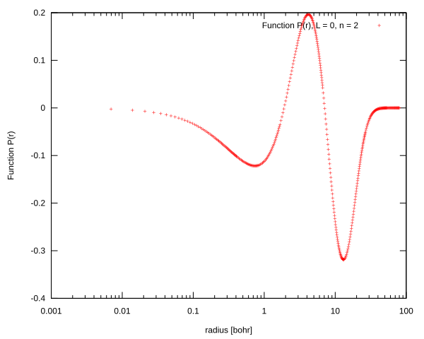</td>
    <td>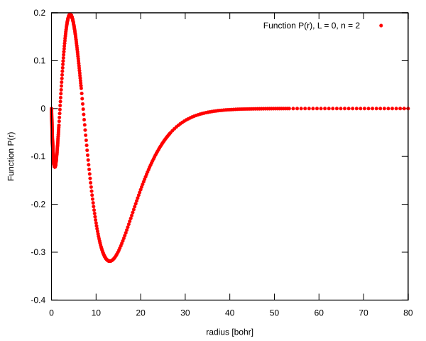</td>
</tr>
<tr>
    <td>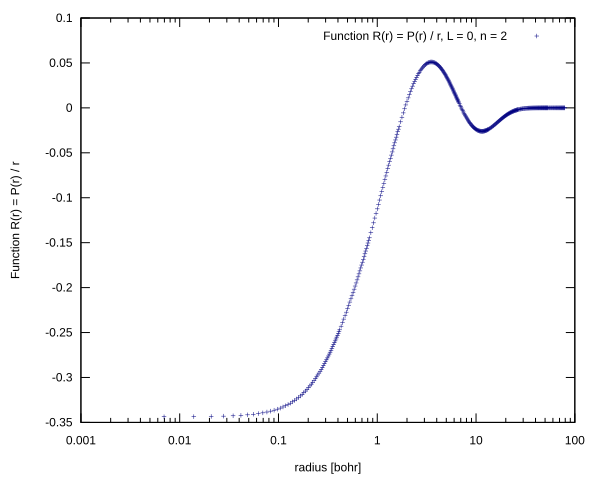</td>
    <td>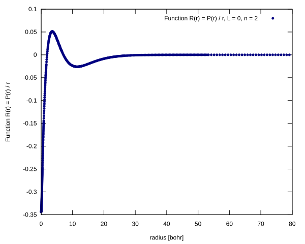</td>
</tr>
</table>

## Eigenfunction:L = 0, n = 3, $E_{n, l}$ = -3.125024854E-02

<table>
<tr>
    <td>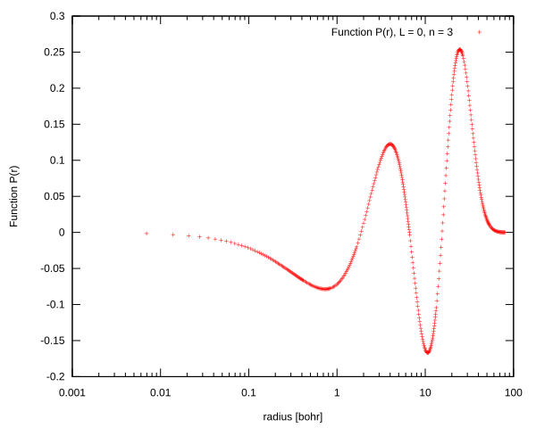</td>
    <td>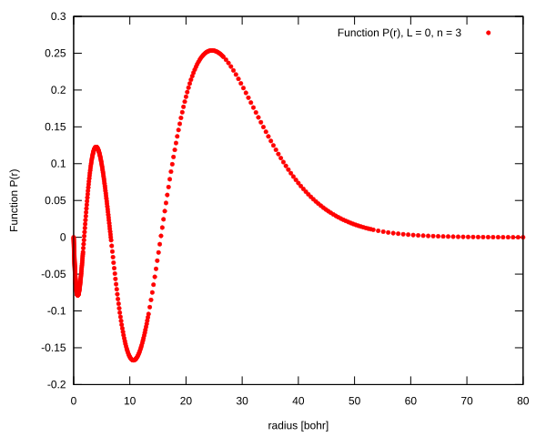</td>
</tr>
<tr>
    <td>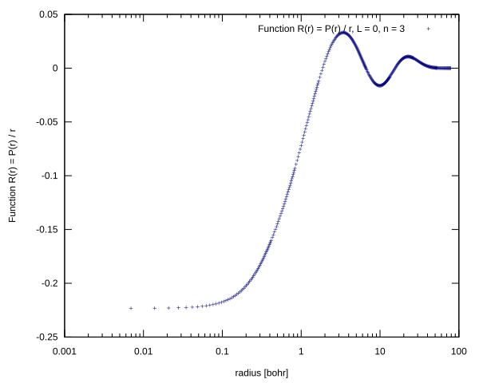</td>
    <td>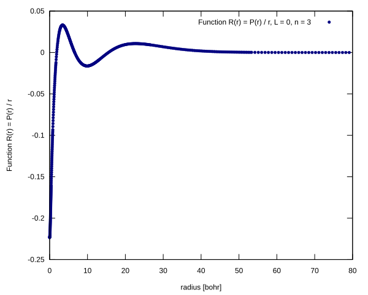</td>
</tr>
</table>

