# Hartwigsen-Goedecker-Hutter pseudopotential for hydrogen, L = 1

## Eigenvalue convergence analysis

| Step | Dofs | n = 0 | n = 1 | n = 2 | n = 3 |
| ---  | ---  | ---   | ---   | ---   | ---   |
| 0 | 17 |  -1.089443855E-01 | -4.712636063E-02 | -2.655480868E-02 | -1.717983609E-02 |
| 1 | 23 |  -1.222495174E-01 | -5.448607985E-02 | -3.074450220E-02 | -1.972414776E-02 |
| 2 | 29 |  -1.249558993E-01 | -5.554501332E-02 | -3.124610173E-02 | -1.999808382E-02 |
| 3 | 35 |  -1.249921846E-01 | -5.555290301E-02 | -3.124882232E-02 | -1.999931808E-02 |
| 4 | 47 |  -1.249922648E-01 | -5.555291903E-02 | -3.124882963E-02 | -1.999932329E-02 |
| 5 | 59 |  -1.249922653E-01 | -5.555291994E-02 | -3.124883970E-02 | -1.999937326E-02 |
| 6 | 71 |  -1.249923359E-01 | -5.555294428E-02 | -3.124885048E-02 | -1.999937891E-02 |

<table>
<tr>
    <td>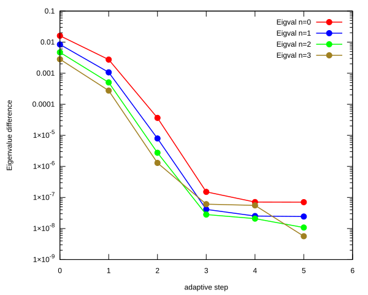</td>
    <td>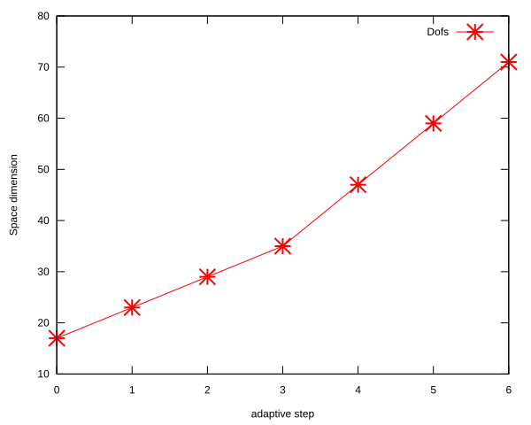</td>
</tr>
</table>

## Eigenfunction: L = 1, n = 0, $E_{n, l}$ = -1.249923359E-01

<table>
<tr>
    <td>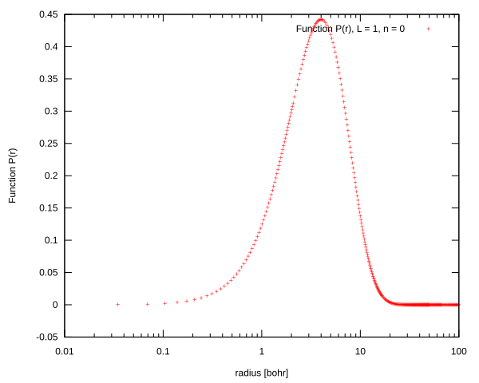</td>
    <td>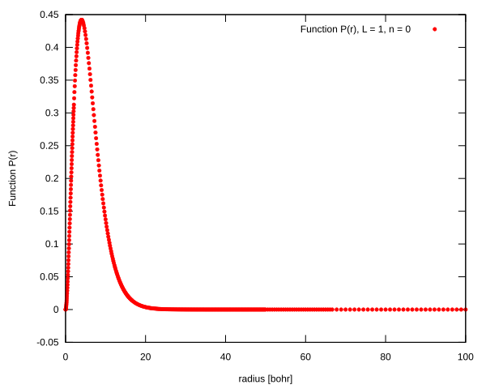</td>
</tr>
<tr>
    <td>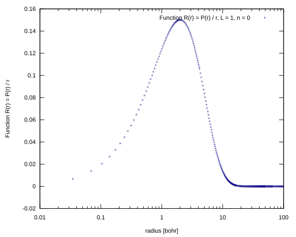</td>
    <td>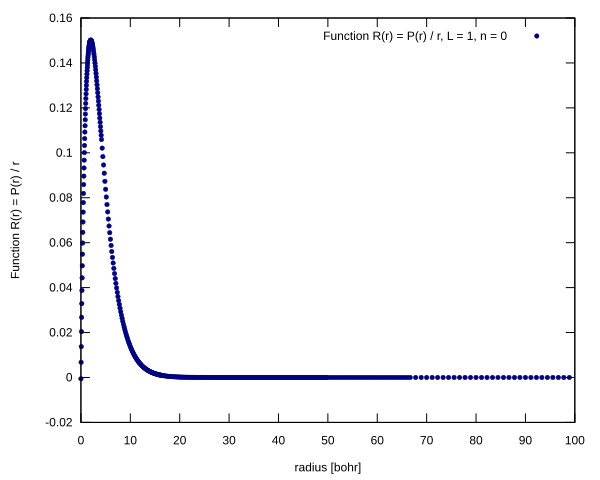</td>
</tr>
</table>

## Eigenfunction: L = 1, n = 1, $E_{n, l}$ = -5.555294428E-02

<table>
<tr>
    <td>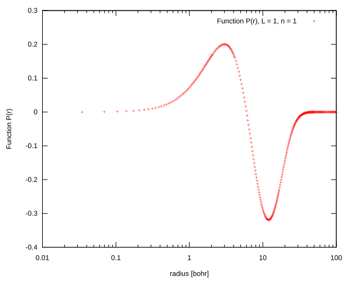</td>
    <td>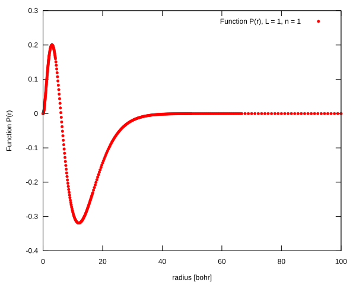</td>
</tr>
<tr>
    <td>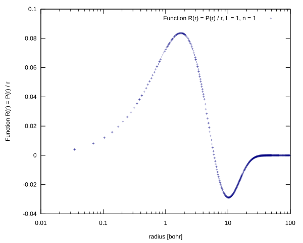</td>
    <td>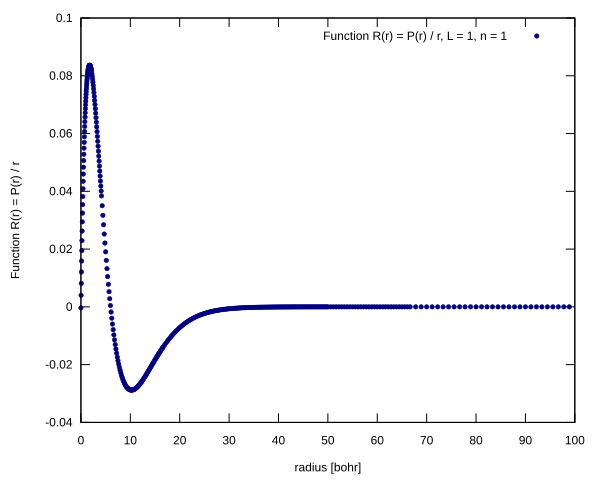</td>
</tr>
</table>

## Eigenfunction: L = 1, n = 2, $E_{n, l}$ = -3.124885048E-02

<table>
<tr>
    <td>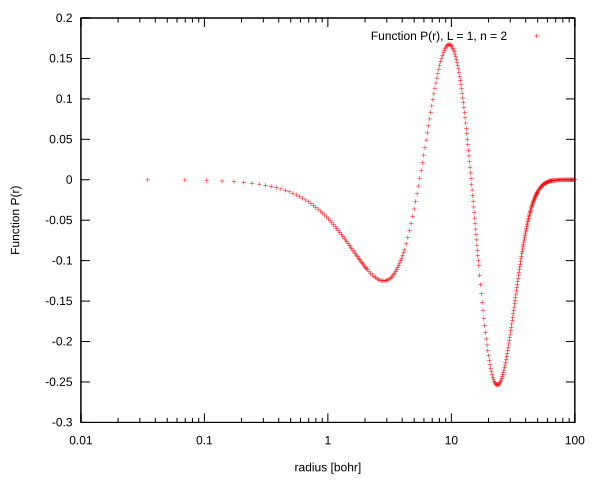</td>
    <td>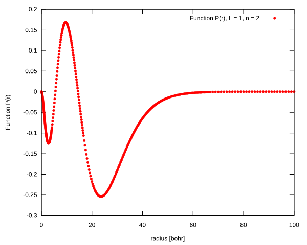</td>
</tr>
<tr>
    <td>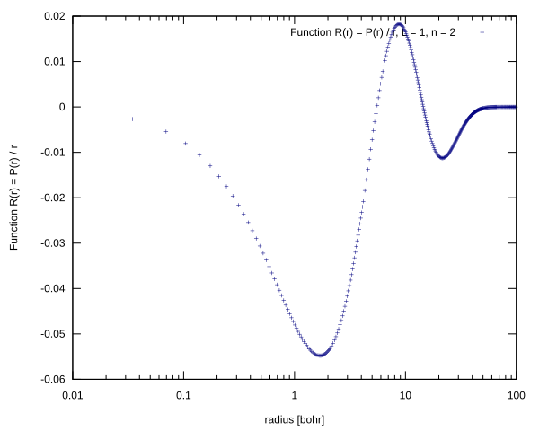</td>
    <td>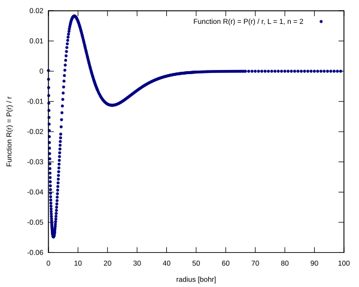</td>
</tr>
</table>

## Eigenfunction: L = 1, n = 3, $E_{n, l}$ = -1.999937891E-02

<table>
<tr>
    <td>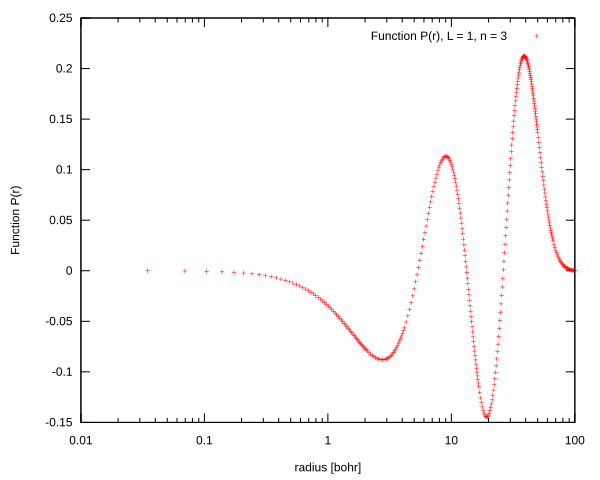</td>
    <td>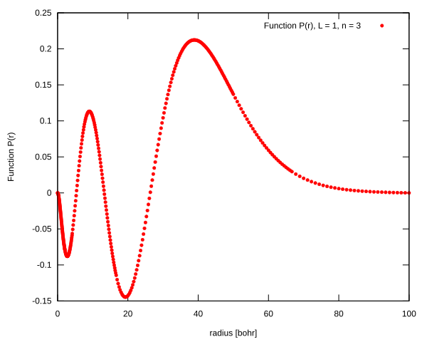</td>
</tr>
<tr>
    <td>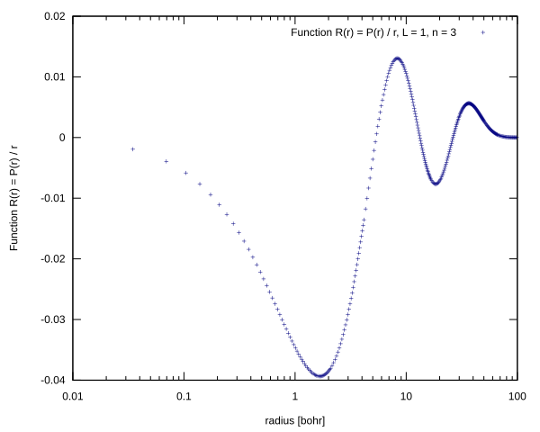</td>
    <td>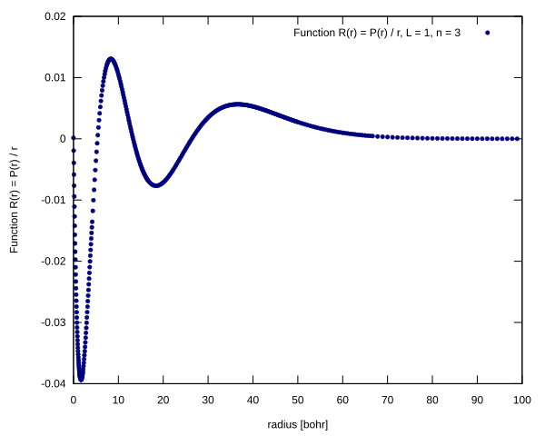</td>
</tr>
</table>

