# Hartwigsen-Goedecker-Hutter pseudopotential for hydrogen, L = 2

## Eigenvalue convergence analysis

| Step | Dofs | n = 0 | n = 1 | n = 2 | n = 3 |
| ---  | ---  | ---   | ---   | ---   | ---   |
| 0 | 17 |  -5.313517987E-02 | -2.882843800E-02 | -1.809351346E-02 | -1.247743642E-02 |
| 1 | 23 |  -5.532080636E-02 | -3.104544371E-02 | -1.985389349E-02 | -1.378767059E-02 |
| 2 | 35 |  -5.554285710E-02 | -3.124165815E-02 | -1.999483474E-02 | -1.388550484E-02 |
| 3 | 41 |  -5.555550330E-02 | -3.124997182E-02 | -1.999997260E-02 | -1.388879424E-02 |
| 4 | 47 |  -5.555553651E-02 | -3.124998795E-02 | -1.999998101E-02 | -1.388879910E-02 |
| 5 | 59 |  -5.555553665E-02 | -3.124998868E-02 | -1.999999336E-02 | -1.388888231E-02 |
| 6 | 77 |  -5.555553668E-02 | -3.124998870E-02 | -1.999999336E-02 | -1.388888233E-02 |

<table>
<tr>
    <td>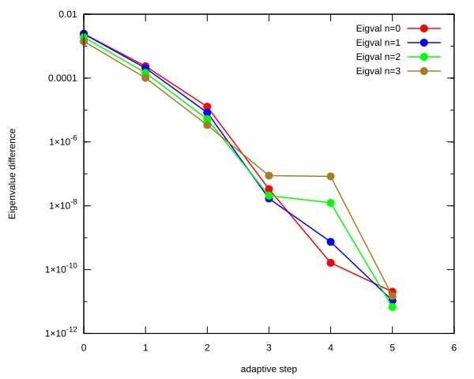</td>
    <td>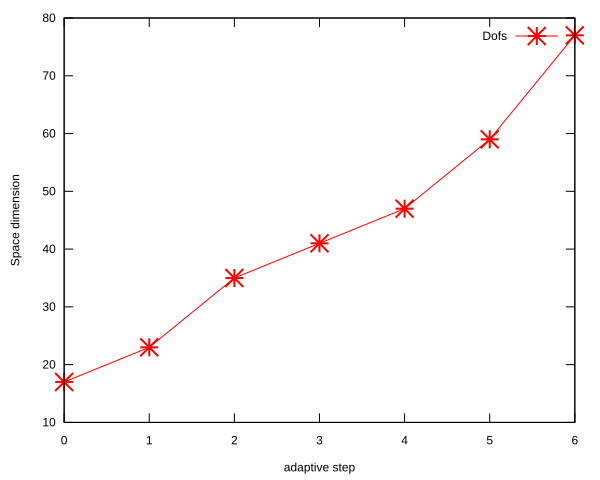</td>
</tr>
</table>

## Eigenfunction: L = 2 n = 0, $E_{n, l}$ = -5.555553668E-02

<table>
<tr>
    <td>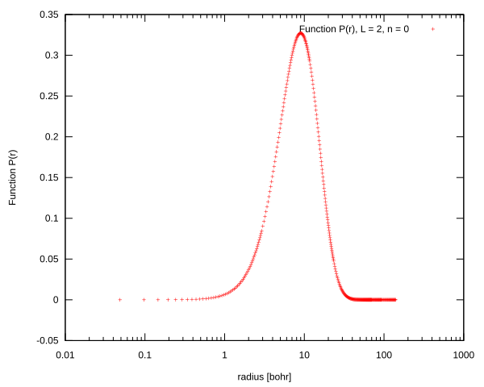</td>
    <td>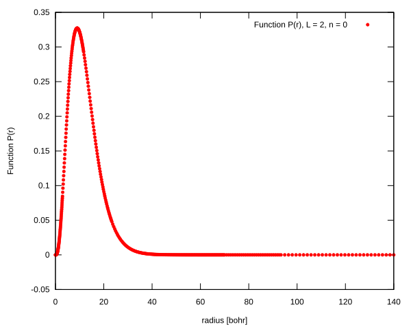</td>
</tr>
<tr>
    <td>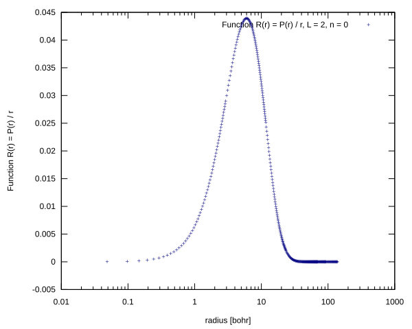</td>
    <td>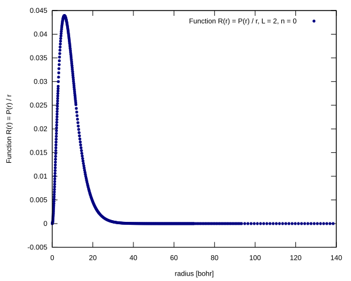</td>
</tr>
</table>

## Eigenfunction: L = 2 n = 1, $E_{n, l}$ = -3.124998870E-02

<table>
<tr>
    <td>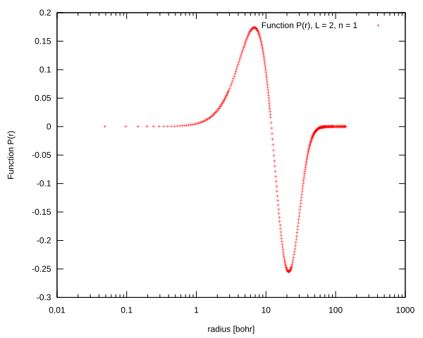</td>
    <td>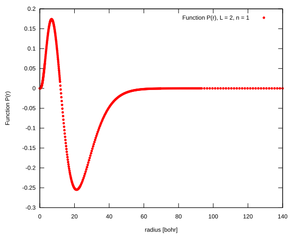</td>
</tr>
<tr>
    <td>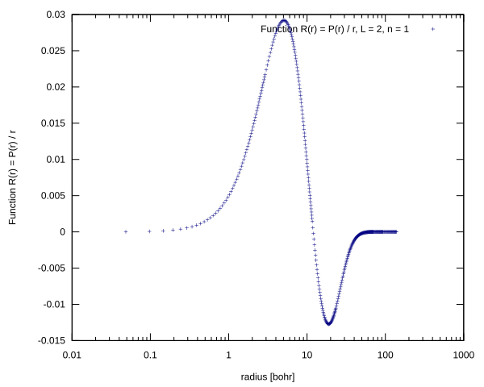</td>
    <td>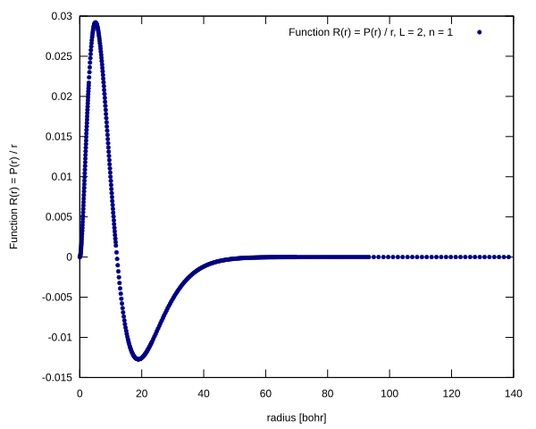</td>
</tr>
</table>

## Eigenfunction: L = 2 n = 2, $E_{n, l}$ = -1.999999336E-02

<table>
<tr>
    <td>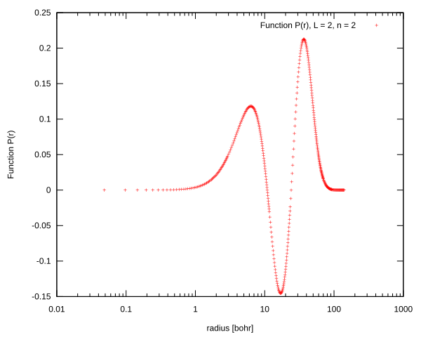</td>
    <td>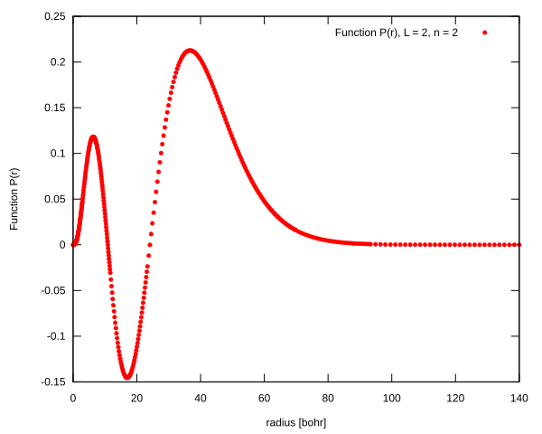</td>
</tr>
<tr>
    <td>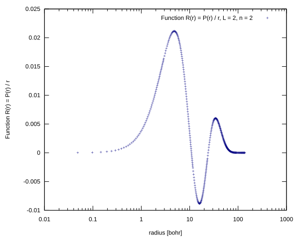</td>
    <td>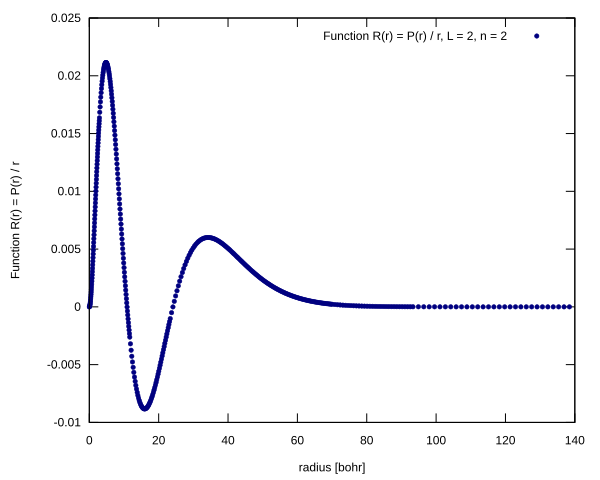</td>
</tr>
</table>

## Eigenfunction: L = 2 n = 3, $E_{n, l}$ = -1.388888233E-02

<table>
<tr>
    <td>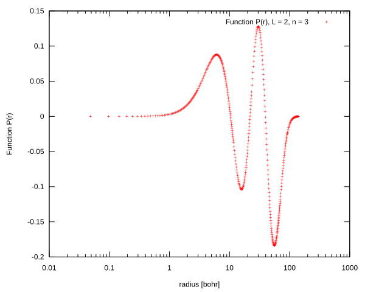</td>
    <td>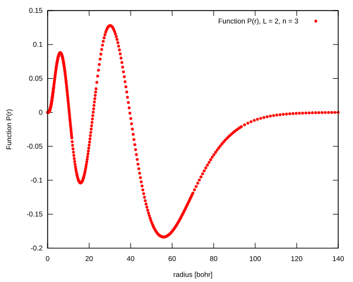</td>
</tr>
<tr>
    <td>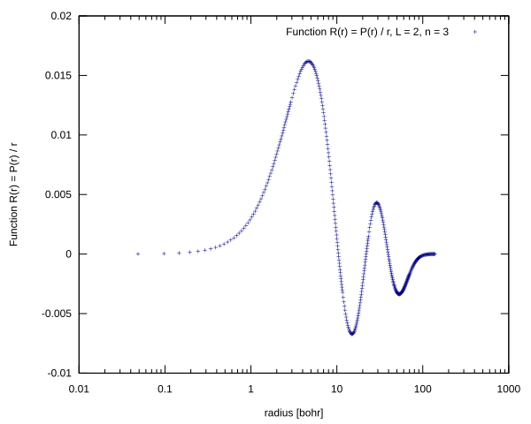</td>
    <td>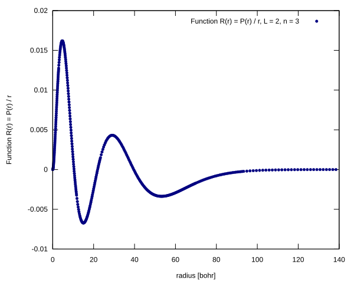</td>
</tr>
</table>

