# Hartwigsen-Goedecker-Hutter pseudopotential for hydrogen, L = 3

## Eigenvalue convergence analysis

| Step | Dofs | n = 0 | n = 1 | n = 2 | n = 3 |
| ---  | ---  | ---   | ---   | ---   | ---   |
| 0 | 17 |  -3.072 633 114E-02 | -1.941 853 415E-02 | -1.339 973 898E-02 | -9.815 627 932E-03 |
| 1 | 23 |  -3.122 883 056E-02 | -1.997 196 176E-02 | -1.386 180 365E-02 | -1.018 071 618E-02 |
| 2 | 29 |  -3.124 950 520E-02 | -1.999 946 332E-02 | -1.388 843 138E-02 | -1.020 366 742E-02 |
| 3 | 41 |  -3.124 950 613E-02 | -1.999 947 112E-02 | -1.388 845 253E-02 | -1.020 369 958E-02 |
| 4 | 47 |  -3.124 950 618E-02 | -1.999 947 122E-02 | -1.388 845 265E-02 | -1.020 369 972E-02 |
| 5 | 65 |  -3.124 999 740E-02 | -1.999 999 770E-02 | -1.388 888 717E-02 | -1.020 403 521E-02 |
| 6 | 77 |  -3.124 999 999E-02 | -1.999 999 999E-02 | -1.388 888 887E-02 | -1.020 403 644E-02 |

<table>
<tr>
    <td>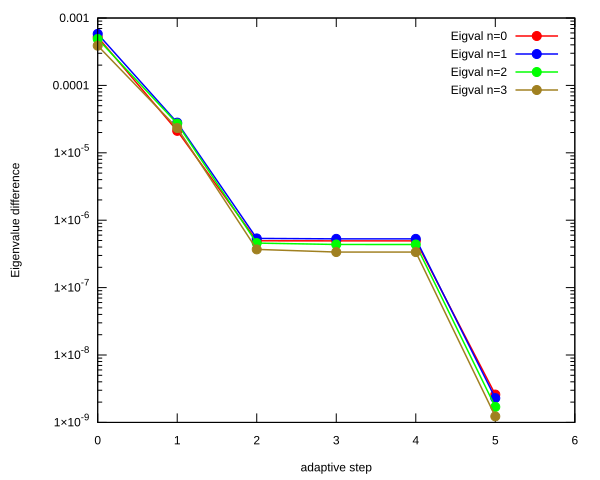</td>
    <td>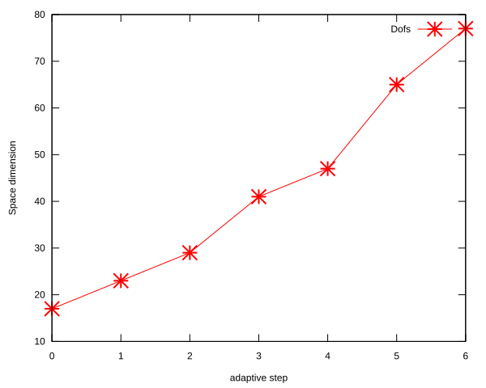</td>
</tr>
</table>

## Eigenfunction: L = 3, n = 0, $E_{n, l}$ = -3.124999999E-02

<table>
<tr>
    <td>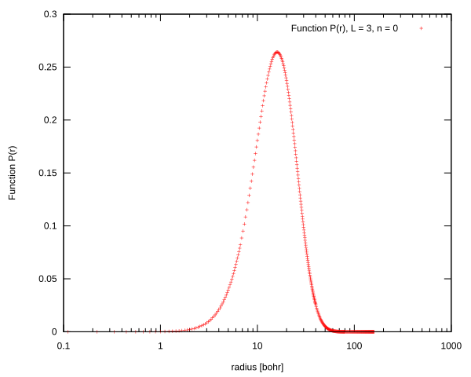</td>
    <td>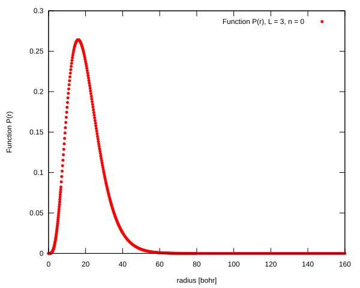</td>
</tr>
<tr>
    <td>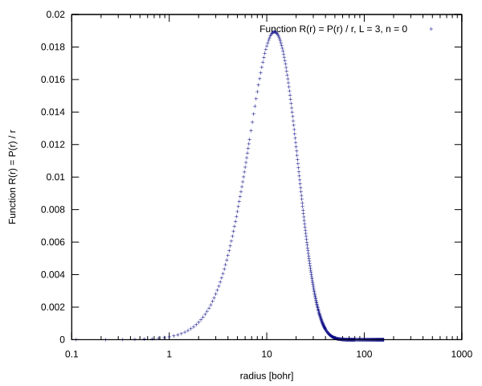</td>
    <td>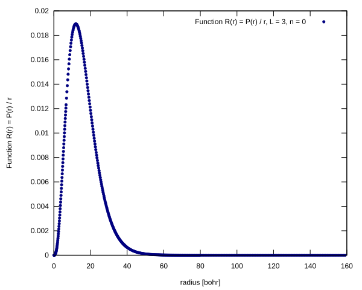</td>
</tr>
</table>

## Eigenfunction: L = 3, n = 1, $E_{n, l}$ = -1.999999999E-02

<table>
<tr>
    <td>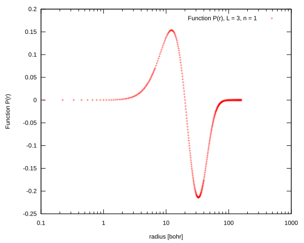</td>
    <td>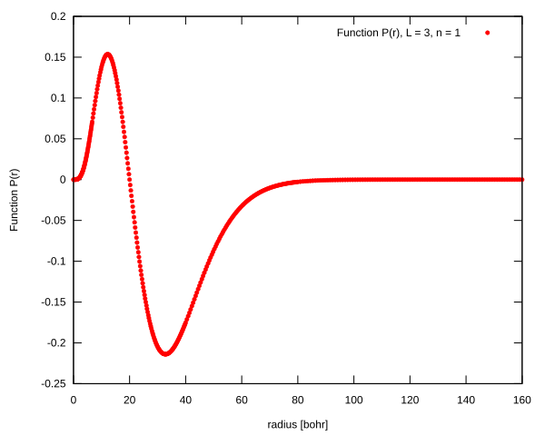</td>
</tr>
<tr>
    <td>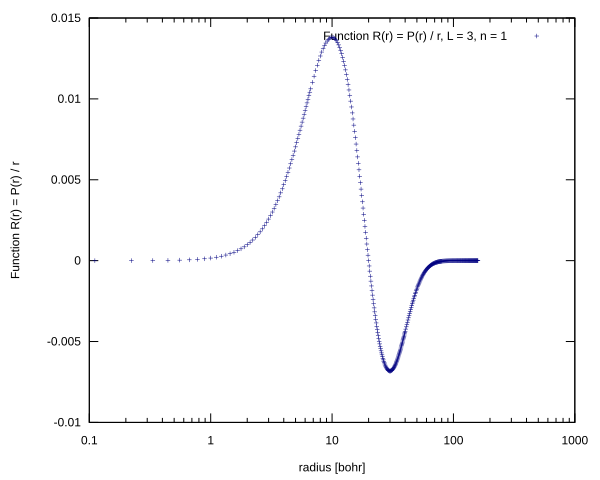</td>
    <td>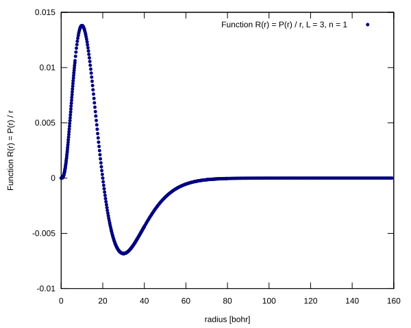</td>
</tr>
</table>

## Eigenfunction: L = 3, n = 2, $E_{n, l}$ = -1.388888887E-02

<table>
<tr>
    <td>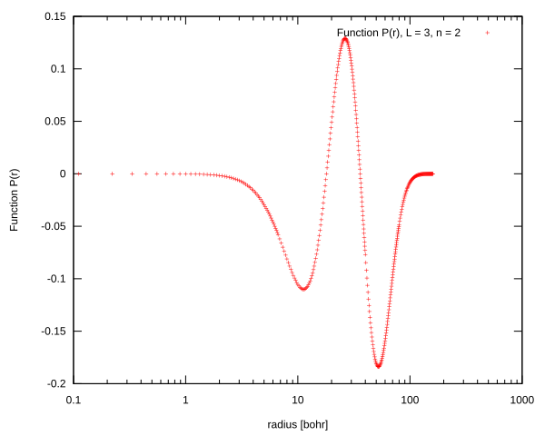</td>
    <td>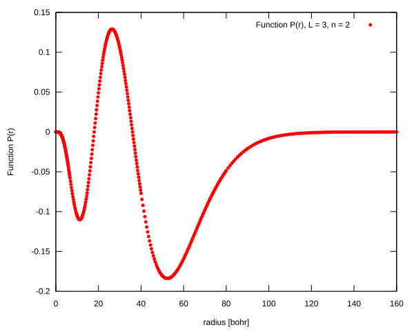</td>
</tr>
<tr>
    <td>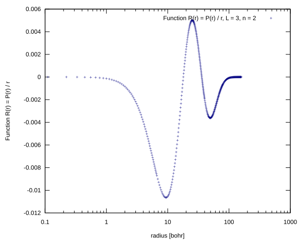</td>
    <td>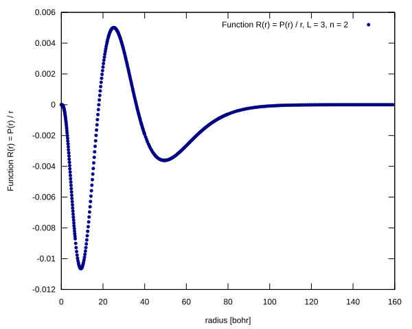</td>
</tr>
</table>

## Eigenfunction: L = 3, n = 3, $E_{n, l}$ = -1.020403644E-02

<table>
<tr>
    <td>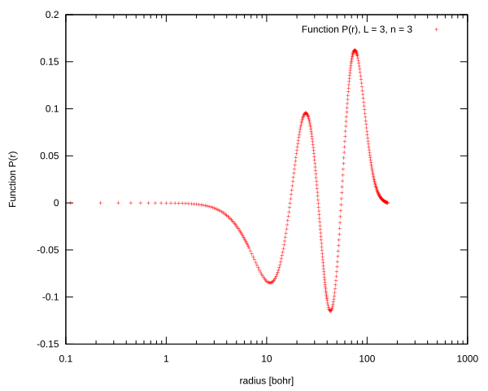</td>
    <td></td>
</tr>
<tr>
    <td>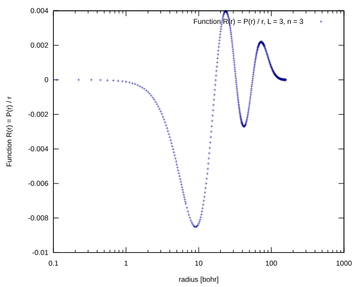</td>
    <td>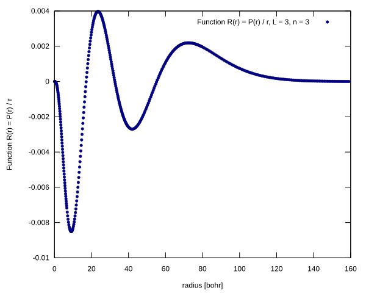</td>
</tr>
</table>

