# Hartwigsen-Goedecker-Hutter pseudopotential for hydrogen, L = 4

## Eigenvalue convergence analysis

| Step | Dofs | n = 0 | n = 1 | n = 2 | n = 3 |
| ---  | ---  | ---   | ---   | ---   | ---   |
| 0 | 17 |  -1.978556918E-02 | -1.350185509E-02 | -9.777834312E-03 | -7.421607023E-03 |
| 1 | 23 |  -1.999456559E-02 | -1.388100860E-02 | -1.019623282E-02 | -7.805100072E-03 |
| 2 | 29 |  -1.999999441E-02 | -1.388887357E-02 | -1.020401179E-02 | -7.811845416E-03 |
| 3 | 47 |  -1.999999987E-02 | -1.388888865E-02 | -1.020408094E-02 | -7.812044702E-03 |
| 4 | 59 |  -1.999999993E-02 | -1.388888879E-02 | -1.020408114E-02 | -7.812045001E-03 |
| 5 | 71 |  -1.999999993E-02 | -1.388888880E-02 | -1.020408115E-02 | -7.812045036E-03 |

<table>
<tr>
    <td>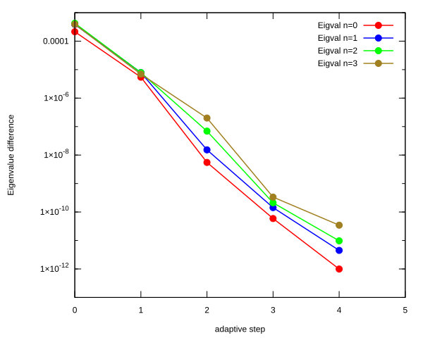</td>
    <td>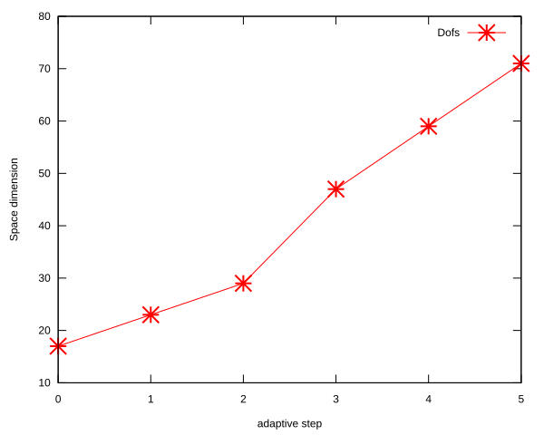</td>
</tr>
</table>

## Eigenfunction: L = 4, n = 0, $E_{n, l}$ = -1.999999993E-02

<table>
<tr>
    <td>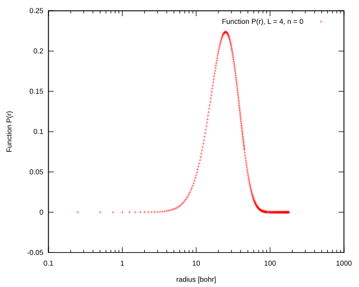</td>
    <td>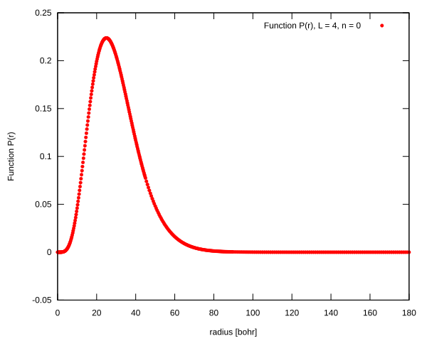</td>
</tr>
<tr>
    <td>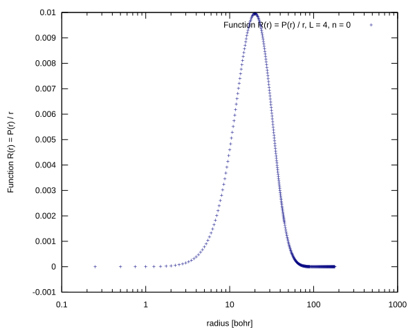</td>
    <td></td>
</tr>
</table>

## Eigenfunction: L = 4, n = 1, $E_{n, l}$ = -1.388888880E-02

<table>
<tr>
    <td>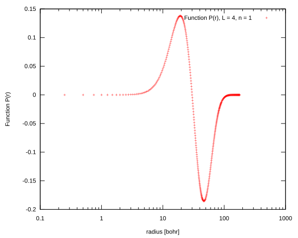</td>
    <td>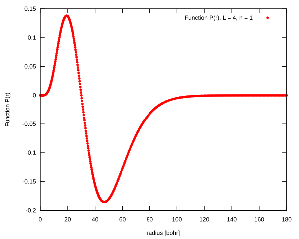</td>
</tr>
<tr>
    <td>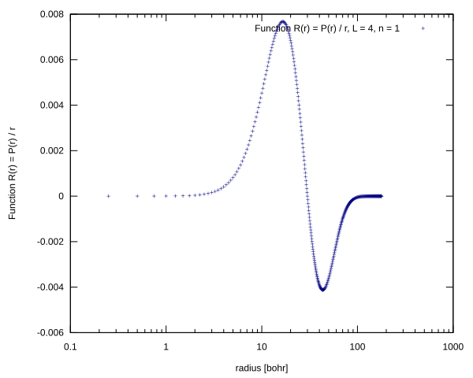</td>
    <td>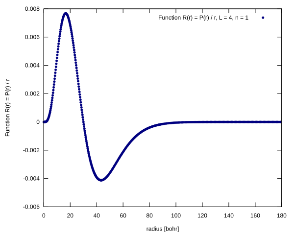</td>
</tr>
</table>

## Eigenfunction: L = 4, n = 2, $E_{n, l}$ = -1.020408115E-02

<table>
<tr>
    <td>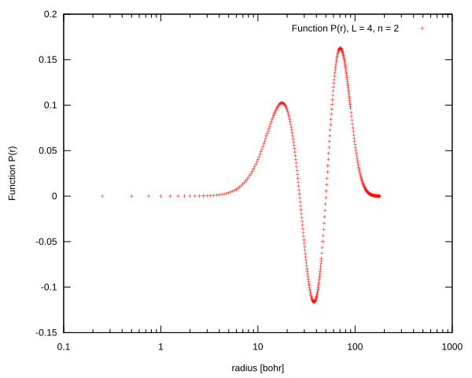</td>
    <td>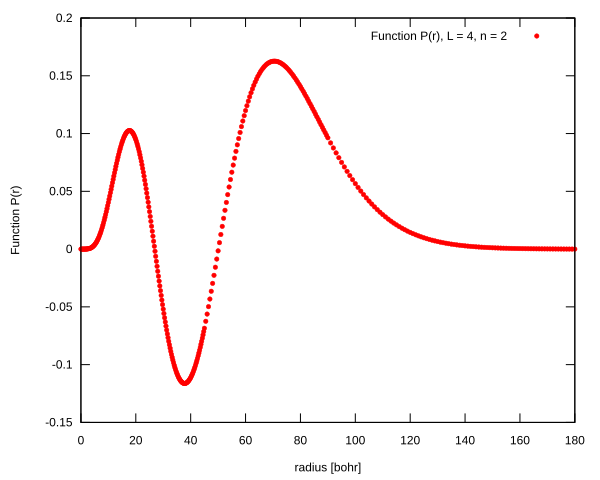</td>
</tr>
<tr>
    <td>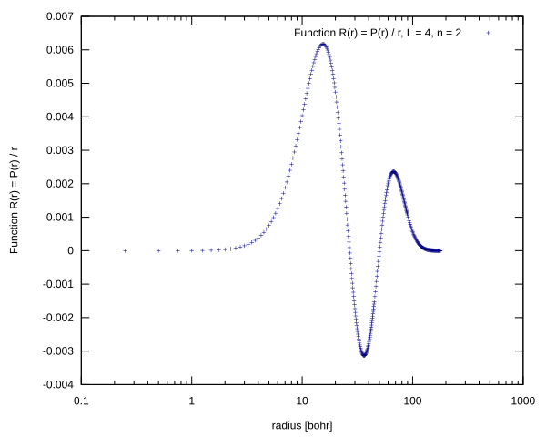</td>
    <td>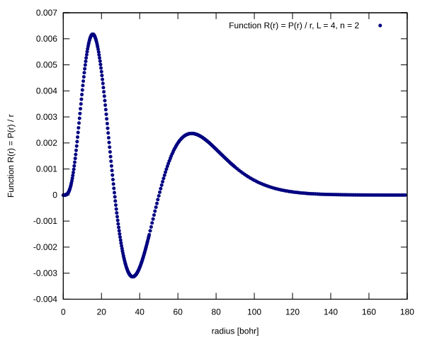</td>
</tr>
</table>

## Eigenfunction: L = 4, n = 3, $E_{n, l}$ = -7.812045036E-03

<table>
<tr>
    <td></td>
    <td>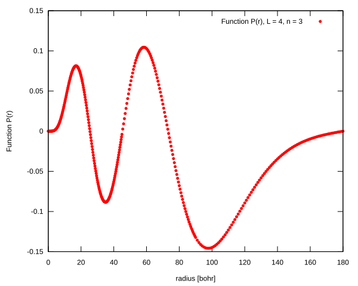</td>
</tr>
<tr>
    <td></td>
    <td>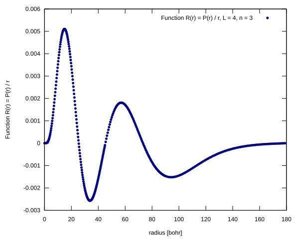</td>
</tr>
</table>

