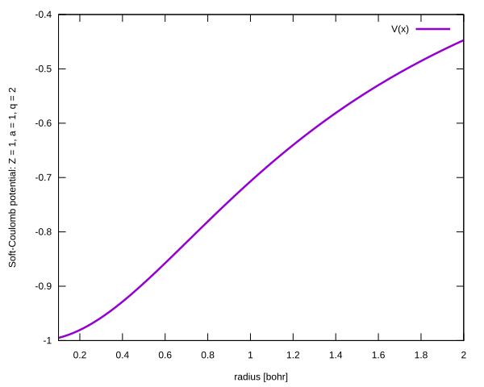
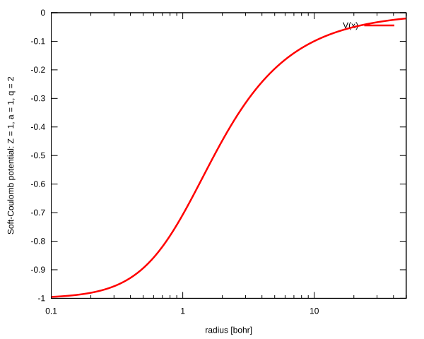

# Soft-Coulomb potential

## Potential definition

The Soft-Coulomb potential is defined by the following equation:

$$
V(r) = -Z / (r^q + a^q)^{1/q}
$$

where $Z, a, q \in \mathbb{R}$ are parameters of the potential.

## Plots of the potential on a linear and a logarithmic scale

<table>
<tr>
    <td></td>
    <td></td>
</tr>
</table>

## Eigenvalues for the final adaptive step for (Z = 1 , a = 1 , q = 1):

| n   | L = 0 | L = 1 | L = 2 | L = 3 | L = 4 |
| --- | ---   | ---   | ---   | ---   | ---   |
| 0   | -2.748 913 488E-01 | -1.130 241 923E-01 | -5.443 621 132E-02 | -3.106 846 094E-02 | -1.995 592 911E-02 |
| 1   | -9.267 932 458E-02 | -5.206 037 471E-02 | -3.078 150 170E-02 | -1.990 725 618E-02 | -1.386 340 305E-02 |
| 2   | -4.548 894 273E-02 | -2.977 994 021E-02 | -1.976 089 175E-02 | -1.383 527 603E-02 | -1.018 803 821E-02 |
| 3   | -2.688 634 302E-02 | -1.924 733 813E-02 | -1.375 071 548E-02 | -1.017 029 065E-02 | -7.801 286 054E-03 |

## Convergence analysis and evaluated eigenfunctions

+ [Case L = 0](./ell0/README.md)
+ [Case L = 1](./ell1/README.md)
+ [Case L = 2](./ell2/README.md)
+ [Case L = 3](./ell3/README.md)
+ [Case L = 4](./ell4/README.md)
