# Soft-Coulomb potential $(Z = 1 , a = 1 , q = 2)$: L = 0

## Eigenvalue convergence analysis

| Step | Dofs | n = 0 | n = 1 | n = 2 | n = 3 |
| ---  | ---  | ---   | ---   | ---   | ---   |
| 0 | 17 |  -2.595 979 602E-01 | -8.754 848 295E-02 | -4.311 034 306E-02 | -2.558 398 004E-02 |
| 1 | 23 |  -2.729 616 223E-01 | -9.167 640 311E-02 | -4.501 956 931E-02 | -2.664 168 278E-02 |
| 2 | 29 |  -2.746 509 056E-01 | -9.261 614 093E-02 | -4.546 599 338E-02 | -2.687 569 865E-02 |
| 3 | 35 |  -2.748 910 705E-01 | -9.267 924 764E-02 | -4.548 890 060E-02 | -2.688 629 292E-02 |
| 4 | 41 |  -2.748 913 316E-01 | -9.267 931 554E-02 | -4.548 892 686E-02 | -2.688 630 549E-02 |
| 5 | 59 |  -2.748 913 484E-01 | -9.267 932 344E-02 | -4.548 894 177E-02 | -2.688 634 235E-02 |
| 6 | 71 |  -2.748 913 487E-01 | -9.267 932 457E-02 | -4.548 894 272E-02 | -2.688 634 299E-02 |
| 7 | 89 |  -2.748 913 488E-01 | -9.267 932 458E-02 | -4.548 894 273E-02 | -2.688 634 302E-02 |

<table>
<tr>
    <td>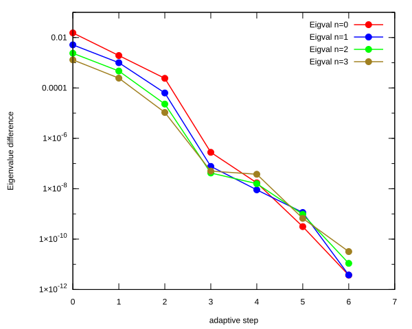</td>
    <td>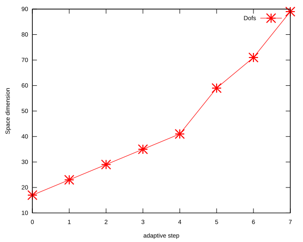</td>
</tr>
</table>

## Eigenfunction: L = 0, n = 0, $E_{n, l}$ = -2.748913488E-01

<table>
<tr>
    <td>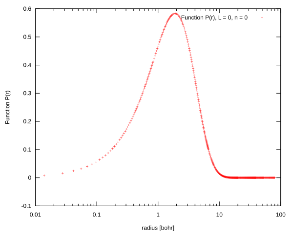</td>
    <td>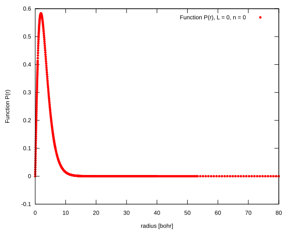</td>
</tr>
<tr>
    <td>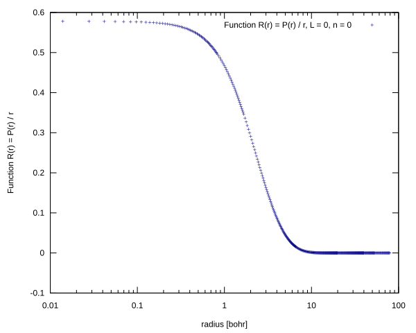</td>
    <td>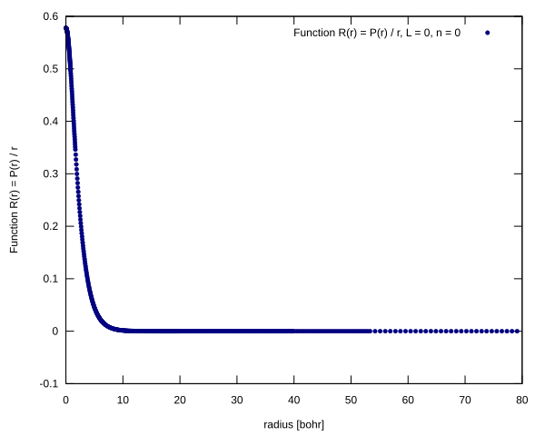</td>
</tr>
</table>

## Eigenfunction:L = 0, n = 1, $E_{n, l}$ = -9.267932458E-02

<table>
<tr>
    <td>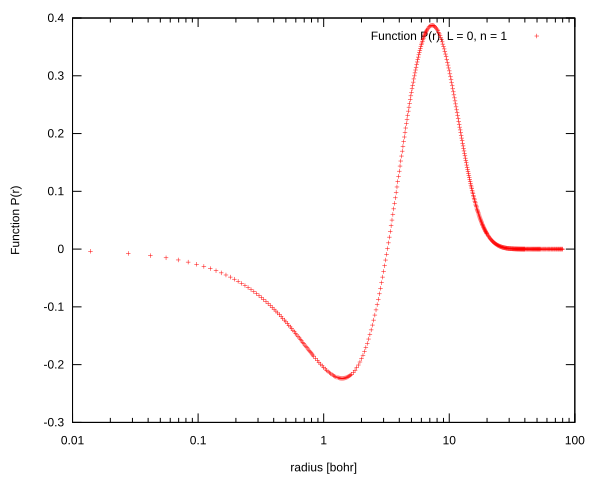</td>
    <td>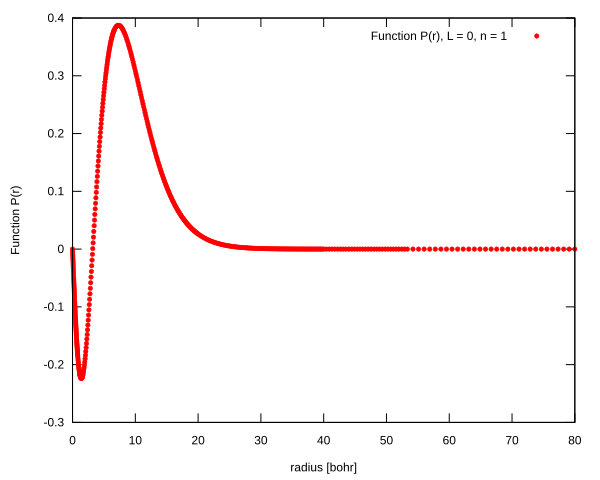</td>
</tr>
<tr>
    <td>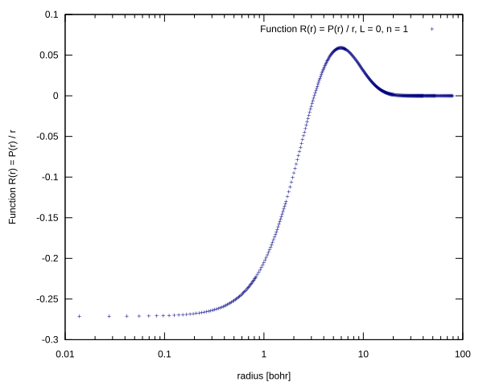</td>
    <td>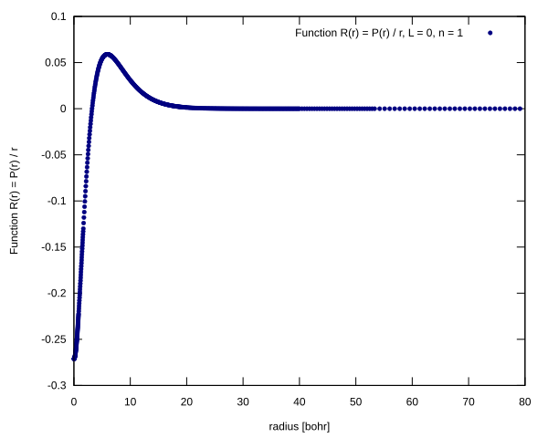</td>
</tr>
</table>

## Eigenfunction:L = 0, n = 2, $E_{n, l}$ = -4.548894273E-02

<table>
<tr>
    <td>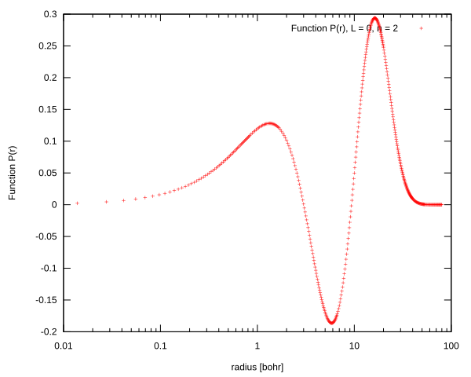</td>
    <td>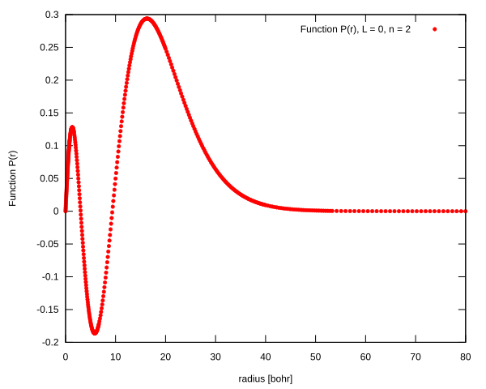</td>
</tr>
<tr>
    <td>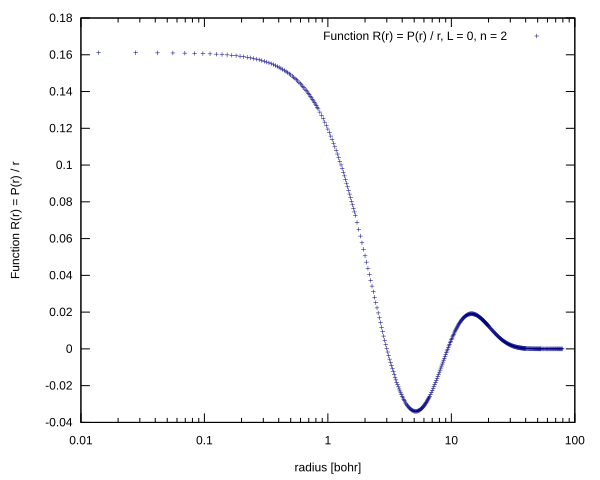</td>
    <td>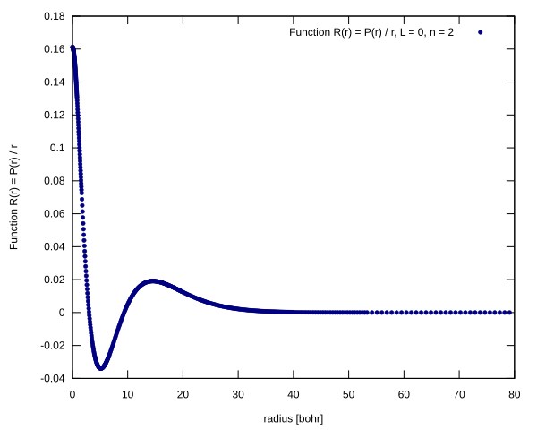</td>
</tr>
</table>

## Eigenfunction:L = 0, n = 3, $E_{n, l}$ = -2.688634302E-02

<table>
<tr>
    <td>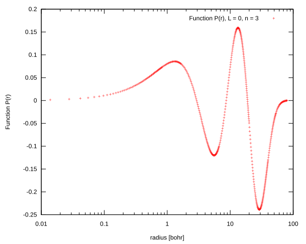</td>
    <td>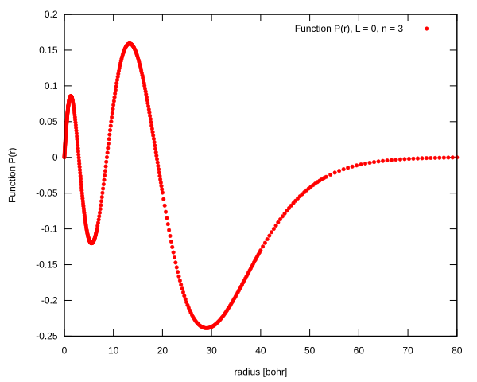</td>
</tr>
<tr>
    <td>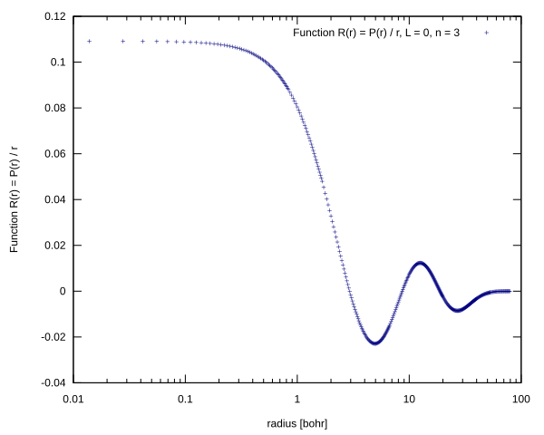</td>
    <td>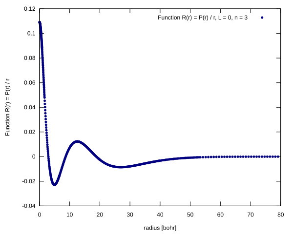</td>
</tr>
</table>

