# Soft-Coulomb potential (Z = 1 , a = 1 , q = 1): L = 1

## Eigenvalue convergence analysis

| Step | Dofs | n = 0 | n = 1 | n = 2 | n = 3 |
| ---  | ---  | ---   | ---   | ---   | ---   |
| 0 | 17 |  -9.959 005 583E-02 | -4.460 467 533E-02 | -2.552 613 492E-02 | -1.665 444 664E-02 |
| 1 | 23 |  -1.120 128 757E-01 | -5.163 714 563E-02 | -2.957 257 902E-02 | -1.913 153 600E-02 |
| 2 | 29 |  -1.130 109 669E-01 | -5.205 263 627E-02 | -2.977 569 195E-02 | -1.924 481 924E-02 |
| 3 | 35 |  -1.130 230 833E-01 | -5.205 991 714E-02 | -2.977 971 406E-02 | -1.924 717 035E-02 |
| 4 | 53 |  -1.130 241 908E-01 | -5.206 037 415E-02 | -2.977 993 998E-02 | -1.924 733 801E-02 |
| 5 | 59 |  -1.130 241 911E-01 | -5.206 037 427E-02 | -2.977 994 001E-02 | -1.924 733 802E-02 |
| 6 | 71 |  -1.130 241 923E-01 | -5.206 037 471E-02 | -2.977 994 021E-02 | -1.924 733 813E-02 |

<table>
<tr>
    <td>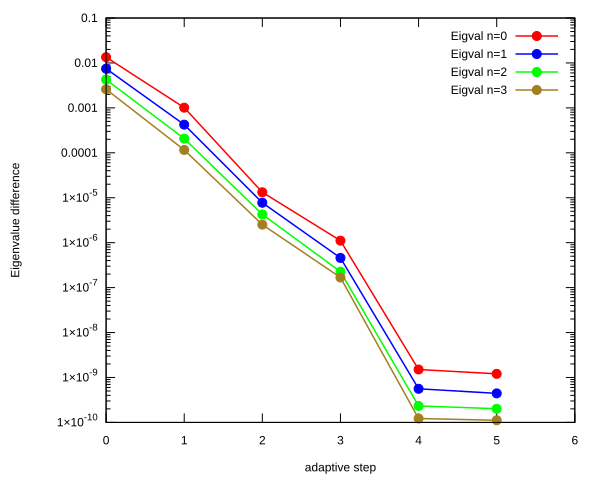</td>
    <td>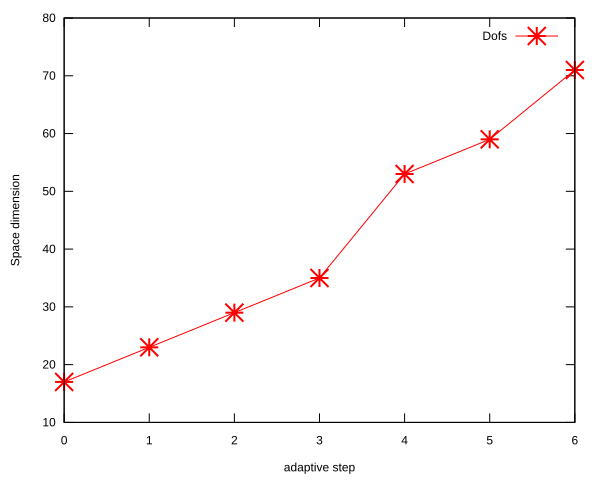</td>
</tr>
</table>

## Eigenfunction: L = 1, n = 0, $E_{n, l}$ = -1.130241923E-01

<table>
<tr>
    <td>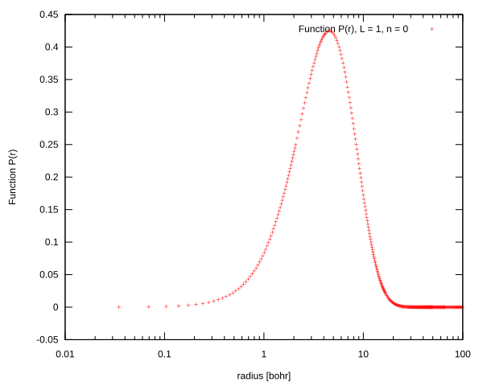</td>
    <td>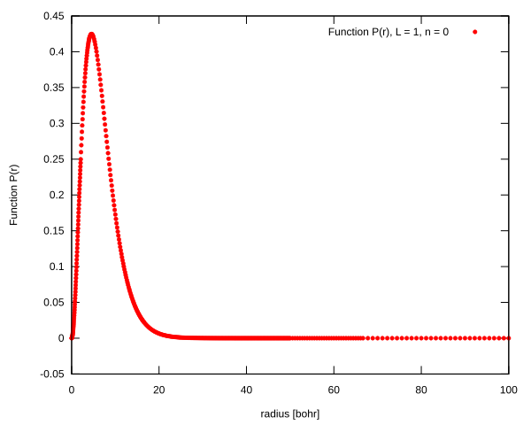</td>
</tr>
<tr>
    <td>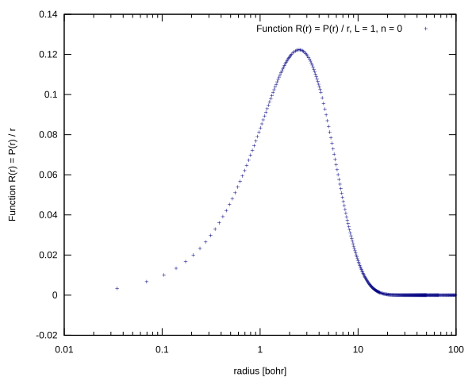</td>
    <td>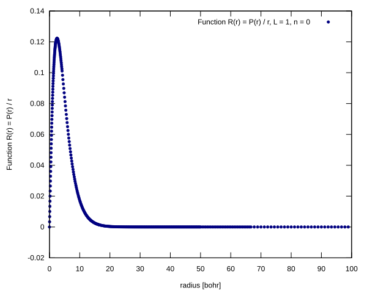</td>
</tr>
</table>

## Eigenfunction:L = 1, n = 1, $E_{n, l}$ = -5.206037471E-02

<table>
<tr>
    <td>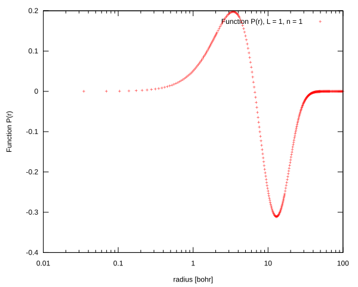</td>
    <td>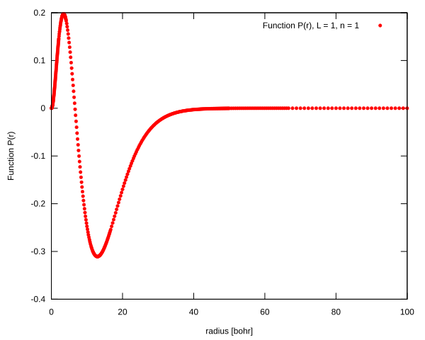</td>
</tr>
<tr>
    <td>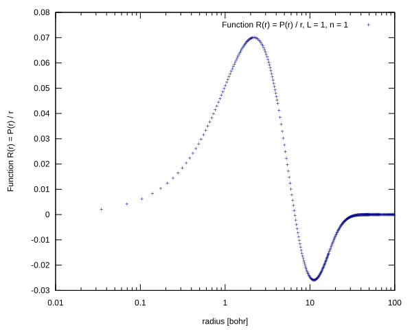</td>
    <td>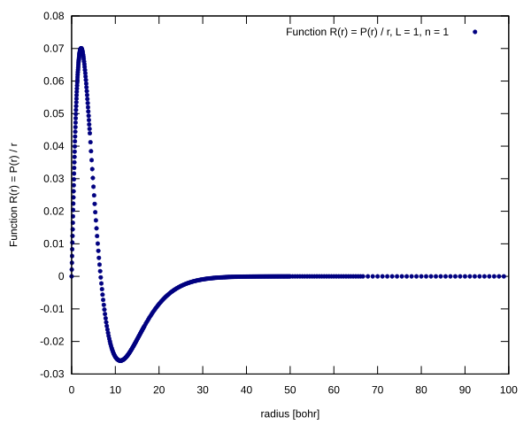</td>
</tr>
</table>

## Eigenfunction:L = 1, n = 2, $E_{n, l}$ = -2.977994021E-02

<table>
<tr>
    <td>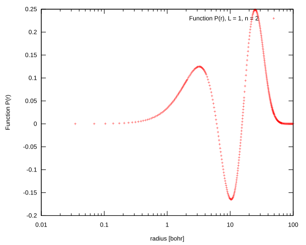</td>
    <td>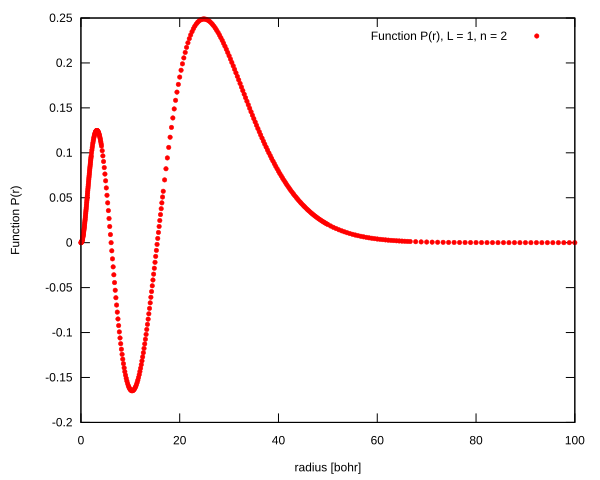</td>
</tr>
<tr>
    <td>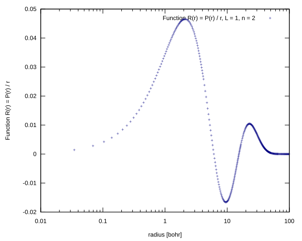</td>
    <td>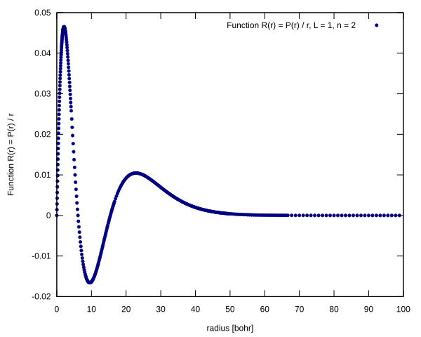</td>
</tr>
</table>

## Eigenfunction:L = 1, n = 3, $E_{n, l}$ = -1.924733813E-02

<table>
<tr>
    <td>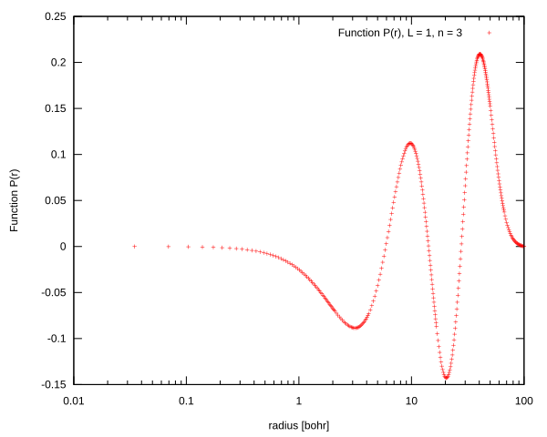</td>
    <td>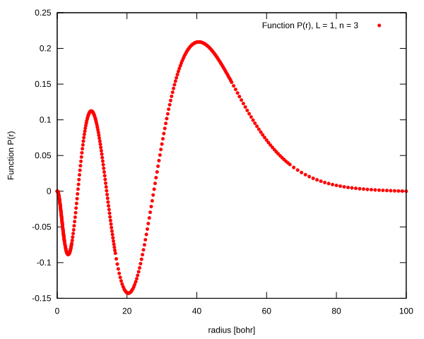</td>
</tr>
<tr>
    <td>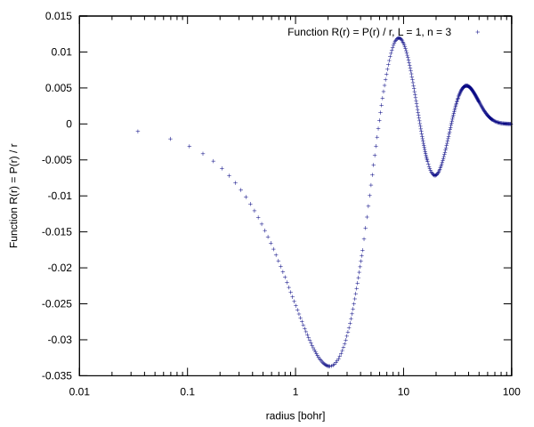</td>
    <td>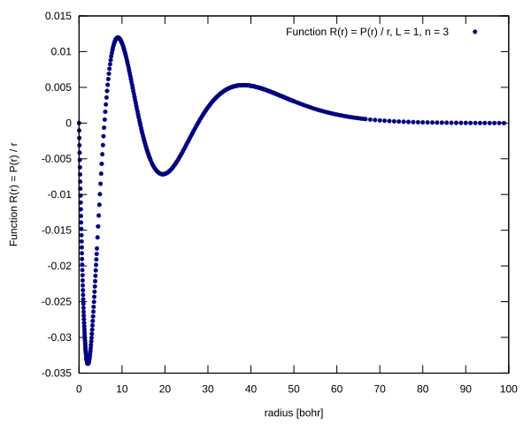</td>
</tr>
</table>

