# Soft-Coulomb potential, L = 3

## Eigenvalue convergence analysis

| Step | Dofs | n = 0 | n = 1 | n = 2 | n = 3 |
| ---  | ---  | ---   | ---   | ---   | ---   |
| 0 | 17 |  -3.052 432 621E-02 | -1.930 276 489E-02 | -1.333 039 028E-02 | -9.773 387 034E-03 |
| 1 | 29 |  -3.104 925 560E-02 | -1.988 162 218E-02 | -1.381 036 520E-02 | -1.014 874 324E-02 |
| 2 | 35 |  -3.106 792 868E-02 | -1.990 668 472E-02 | -1.383 479 552E-02 | -1.016 990 535E-02 |
| 3 | 41 |  -3.106 792 941E-02 | -1.990 668 951E-02 | -1.383 480 933E-02 | -1.016 993 061E-02 |
| 4 | 53 |  -3.106 845 847E-02 | -1.990 725 400E-02 | -1.383 527 436E-02 | -1.017 028 927E-02 |
| 5 | 71 |  -3.106 846 094E-02 | -1.990 725 618E-02 | -1.383 527 603E-02 | -1.017 029 065E-02 |
| 6 | 83 |  -3.106 846 094E-02 | -1.990 725 618E-02 | -1.383 527 603E-02 | -1.017 029 065E-02 |

<table>
<tr>
    <td>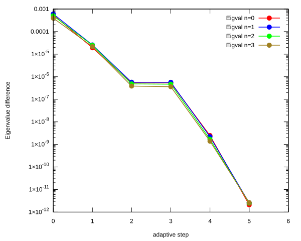</td>
    <td>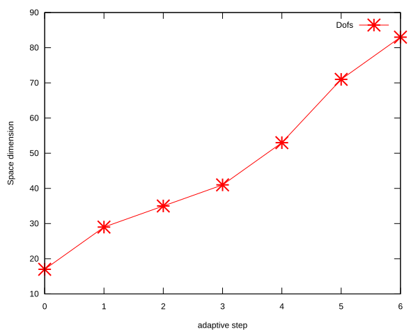</td>
</tr>
</table>

## Eigenfunction: L = 3, n = 0, $E_{n, l}$ = -3.106846094E-02

<table>
<tr>
    <td>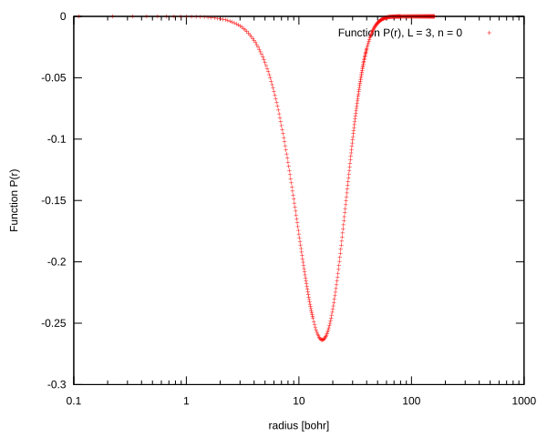</td>
    <td>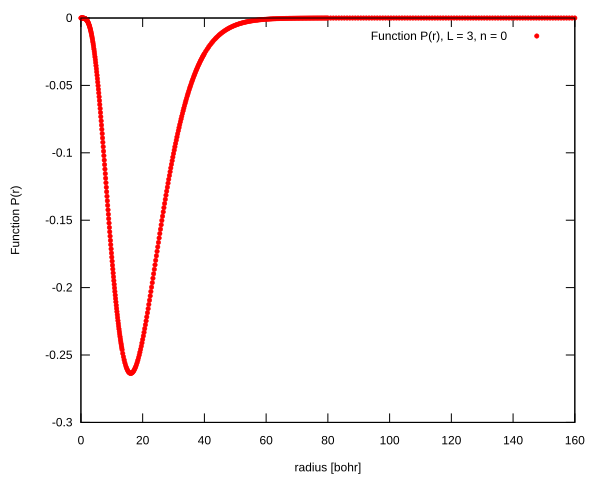</td>
</tr>
<tr>
    <td>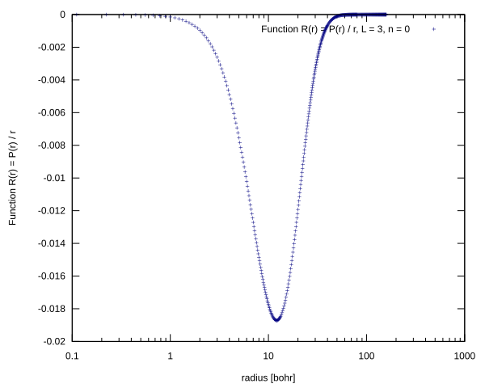</td>
    <td>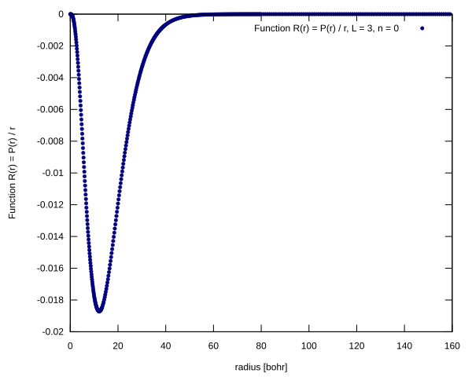</td>
</tr>
</table>

## Eigenfunction:L = 3, n = 1, $E_{n, l}$ = -1.990725618E-02

<table>
<tr>
    <td>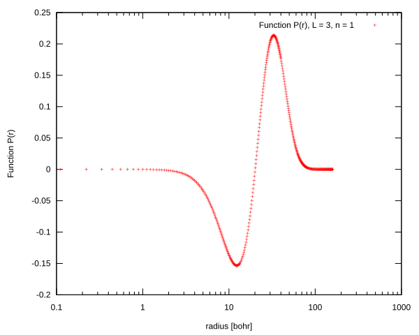</td>
    <td>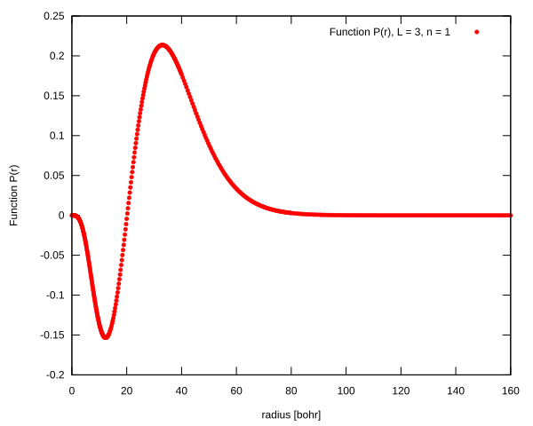</td>
</tr>
<tr>
    <td>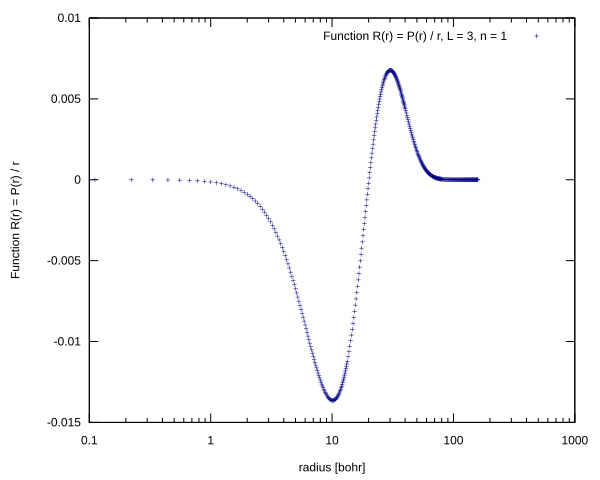</td>
    <td>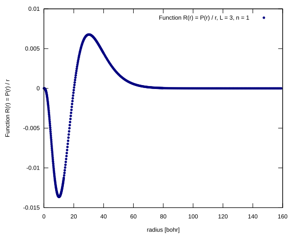</td>
</tr>
</table>

## Eigenfunction:L = 3, n = 2, $E_{n, l}$ = -1.383527603E-02

<table>
<tr>
    <td>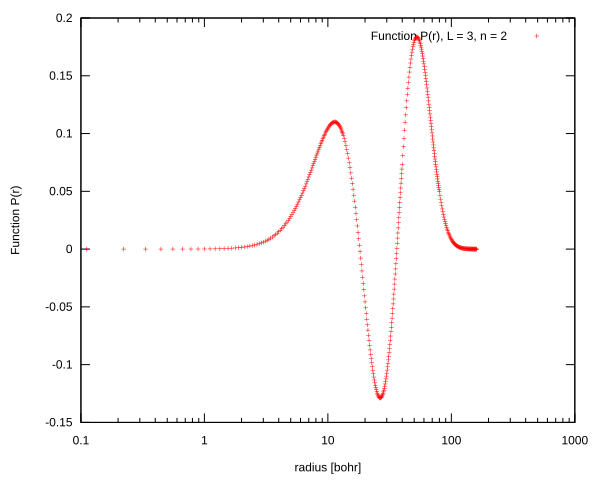</td>
    <td>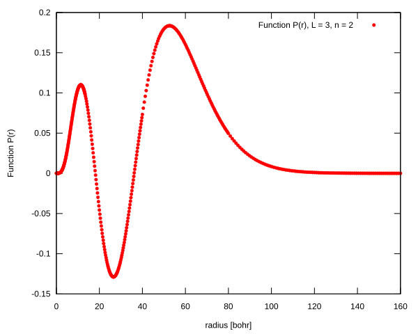</td>
</tr>
<tr>
    <td>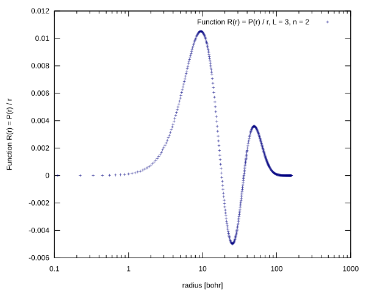</td>
    <td>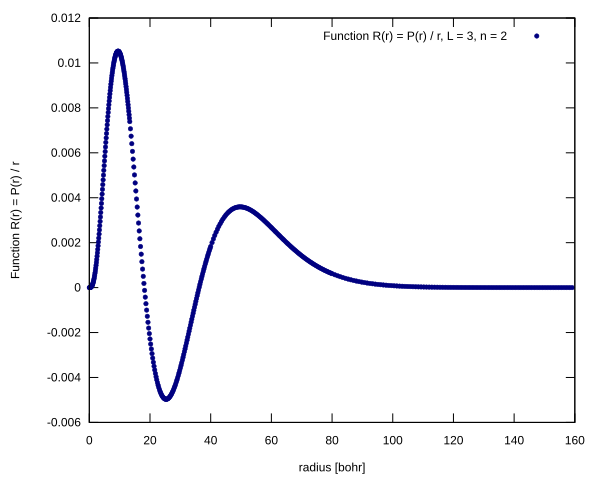</td>
</tr>
</table>

## Eigenfunction:L = 3, n = 3, $E_{n, l}$ = -1.017029065E-02

<table>
<tr>
    <td>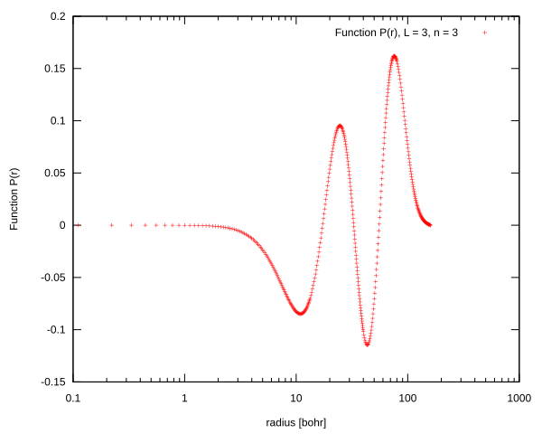</td>
    <td>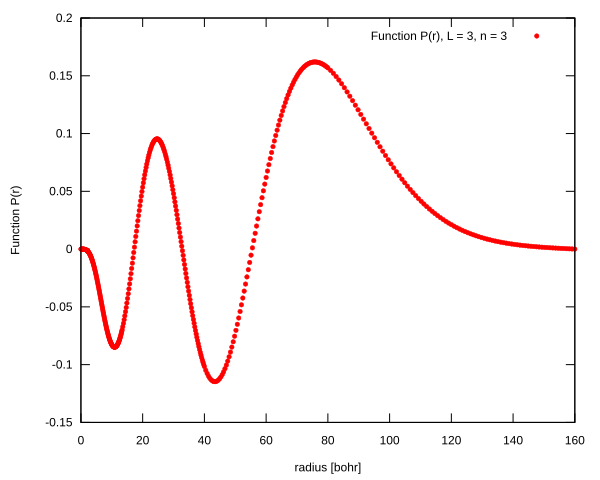</td>
</tr>
<tr>
    <td>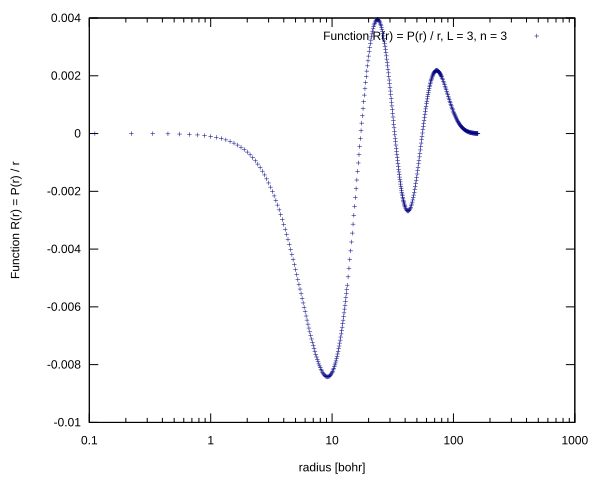</td>
    <td>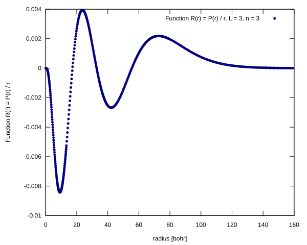</td>
</tr>
</table>

