# Soft-Coulomb potential (Z = 1 , a = 1 , q = 1): L = 4

## Eigenvalue convergence analysis

| Step | Dofs | n = 0 | n = 1 | n = 2 | n = 3 |
| ---  | ---  | ---   | ---   | ---   | ---   |
| 0 | 17 |  -1.974 451 973E-02 | -1.347 994 300E-02 | -9.764 480 094E-03 | -7.412 549 191E-03 |
| 1 | 23 |  -1.995 040 332E-02 | -1.385 536 729E-02 | -1.018 001 583E-02 | -7.794 173 709E-03 |
| 2 | 29 |  -1.995 592 402E-02 | -1.386 338 841E-02 | -1.018 796 918E-02 | -7.801 084 497E-03 |
| 3 | 47 |  -1.995 592 905E-02 | -1.386 340 291E-02 | -1.018 803 800E-02 | -7.801 285 722E-03 |
| 4 | 59 |  -1.995 592 911E-02 | -1.386 340 305E-02 | -1.018 803 820E-02 | -7.801 286 020E-03 |
| 5 | 71 |  -1.995 592 911E-02 | -1.386 340 305E-02 | -1.018 803 821E-02 | -7.801 286 054E-03 |

<table>
<tr>
    <td>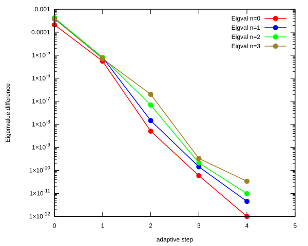</td>
    <td></td>
</tr>
</table>

## Eigenfunction: L = 4, n = 0, $E_{n, l}$ = -1.995592911E-02

<table>
<tr>
    <td>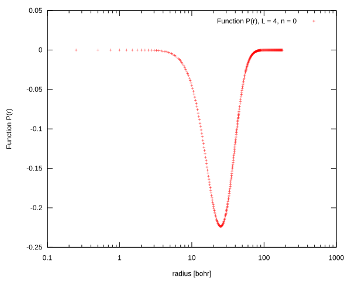</td>
    <td>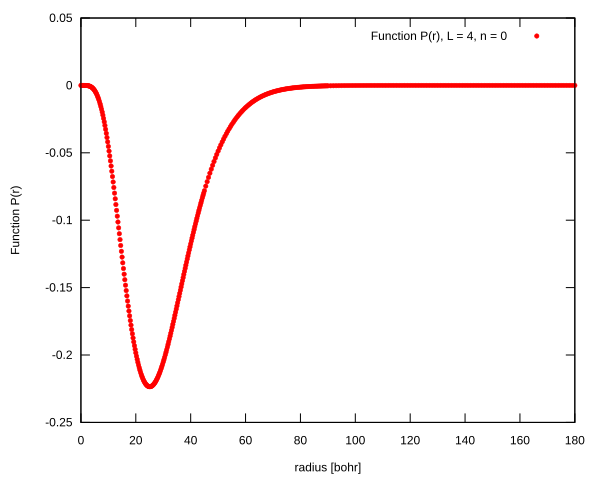</td>
</tr>
<tr>
    <td>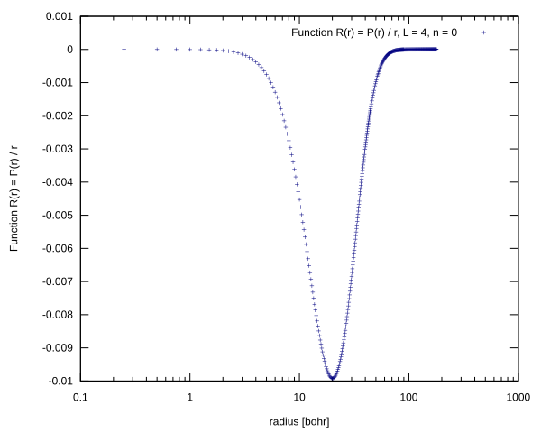</td>
    <td>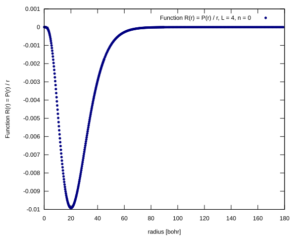</td>
</tr>
</table>

## Eigenfunction:L = 4, n = 1, $E_{n, l}$ = -1.386340305E-02

<table>
<tr>
    <td>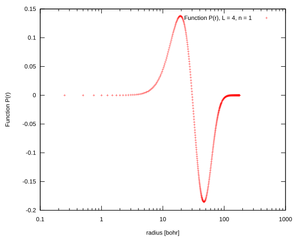</td>
    <td>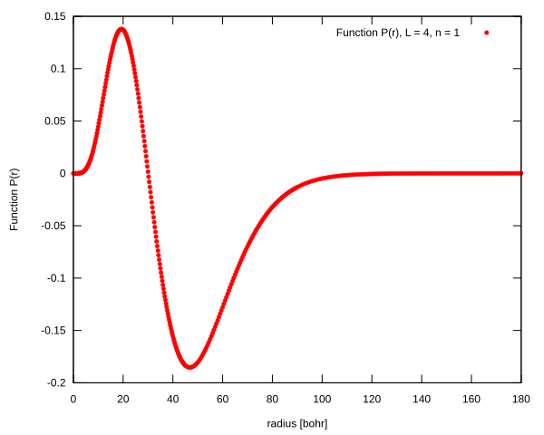</td>
</tr>
<tr>
    <td>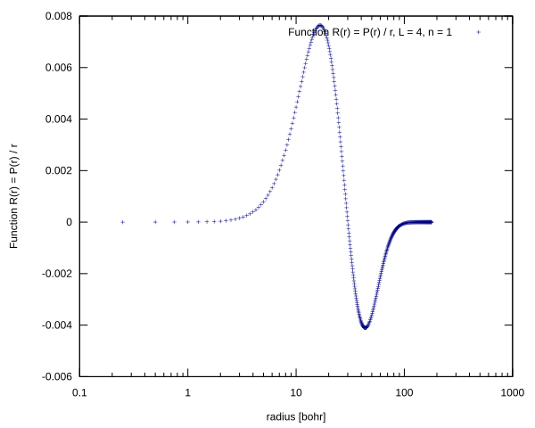</td>
    <td>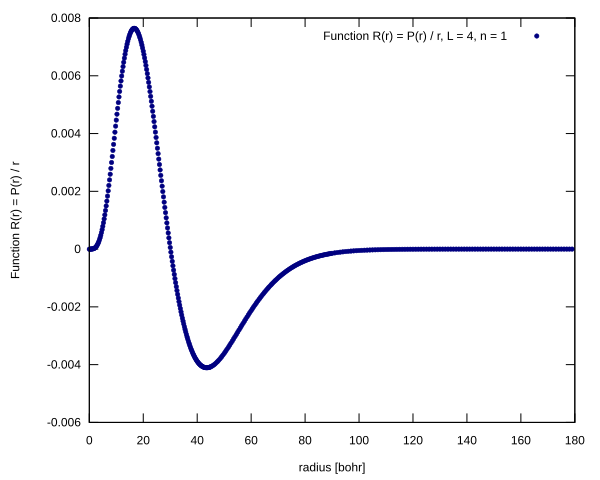</td>
</tr>
</table>

## Eigenfunction:L = 4, n = 2, $E_{n, l}$ = -1.018803821E-02

<table>
<tr>
    <td>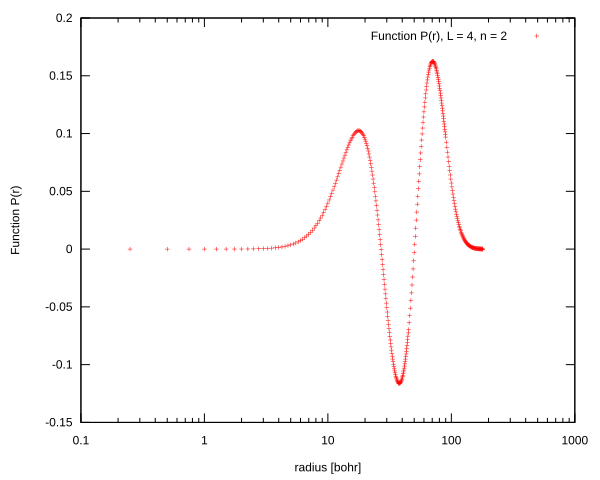</td>
    <td>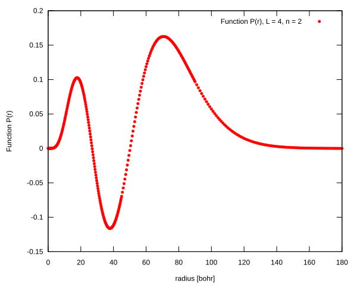</td>
</tr>
<tr>
    <td>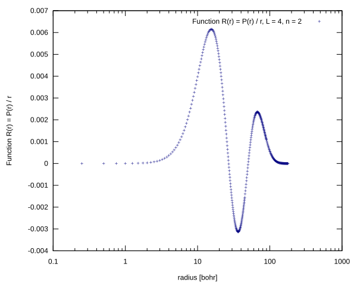</td>
    <td>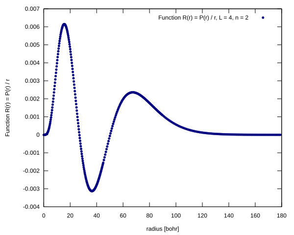</td>
</tr>
</table>

## Eigenfunction:L = 4, n = 3, $E_{n, l}$ = -7.801286054E-03

<table>
<tr>
    <td>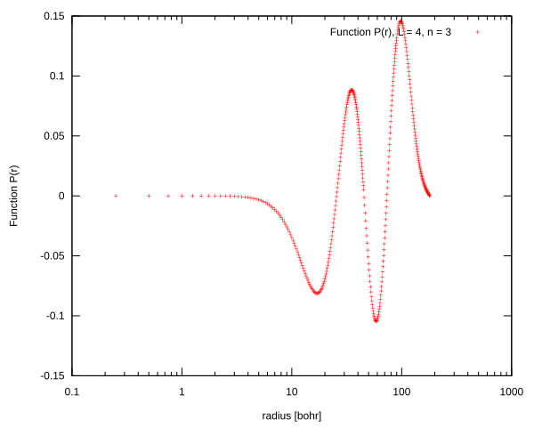</td>
    <td>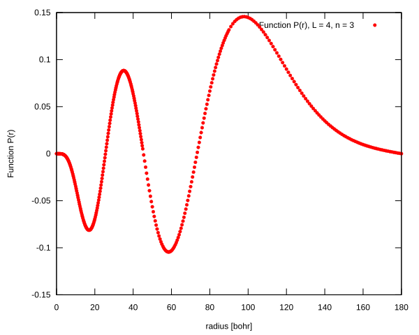</td>
</tr>
<tr>
    <td>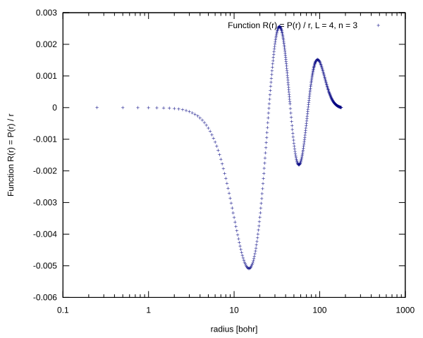</td>
    <td>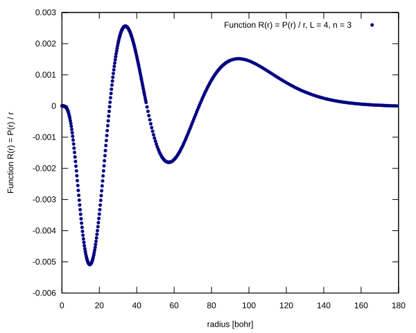</td>
</tr>
</table>

