# Coulomb potential, L = 0

## Eigenvalue convergence analysis

| Step | Dofs | n = 0 | n = 1 | n = 2 | n = 3 |
| ---  | ---  | ---   | ---   | ---   | ---   |
| 0 | 17 |  -3.003 594 007E-01 | -8.755 195 074E-02 | -4.155 008 809E-02 | -2.438 052 746E-02 |
| 1 | 23 |  -4.377 302 660E-01 | -1.181 917 033E-01 | -5.365 819 659E-02 | -3.046 593 745E-02 |
| 2 | 29 |  -4.963 546 851E-01 | -1.248 892 768E-01 | -5.553 888 702E-02 | -3.124 505 117E-02 |
| 3 | 35 |  -4.999 787 096E-01 | -1.249 998 127E-01 | -5.555 553 628E-02 | -3.124 998 217E-02 |
| 4 | 47 |  -4.999 999 765E-01 | -1.249 999 984E-01 | -5.555 555 441E-02 | -3.124 998 728E-02 |
| 5 | 65 |  -4.999 999 996E-01 | -1.249 999 996E-01 | -5.555 555 539E-02 | -3.124 999 992E-02 |
| 6 | 77 |  -5.000 000 000E-01 | -1.250 000 000E-01 | -5.555 555 555E-02 | -3.124 999 999E-02 |
| 7 | 95 |  -5.000 000 000E-01 | -1.250 000 000E-01 | -5.555 555 555E-02 | -3.124 999 999E-02 |
| 8 | 101 |  -5.000 000 000E-01 | -1.250 000 000E-01 | -5.555 555 555E-02 | -3.124 999 999E-02 |
| 9 | 107 |  -5.000 000 000E-01 | -1.250 000 000E-01 | -5.555 555 555E-02 | -3.124 999 999E-02 |

<table>
<tr>
    <td>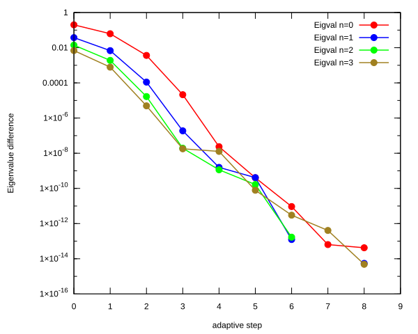</td>
    <td>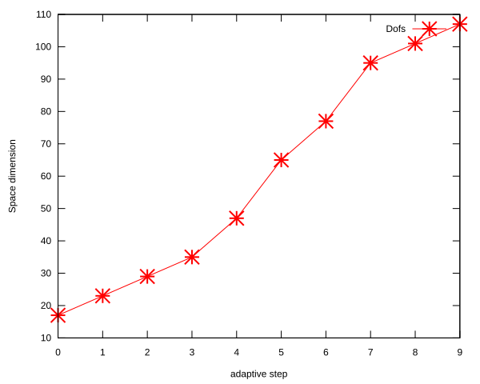</td>
</tr>
</table>

## Eigenfunction: L = 0, n = 0, $E_{n, l}$ = -5.000000000E-01

<table>
<tr>
    <td>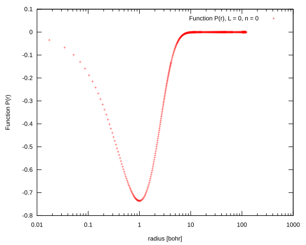</td>
    <td>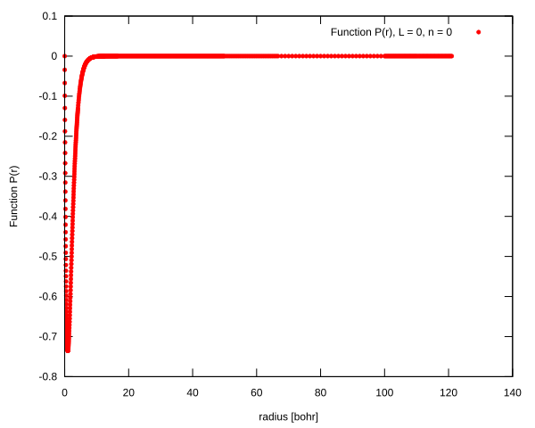</td>
</tr>
<tr>
    <td>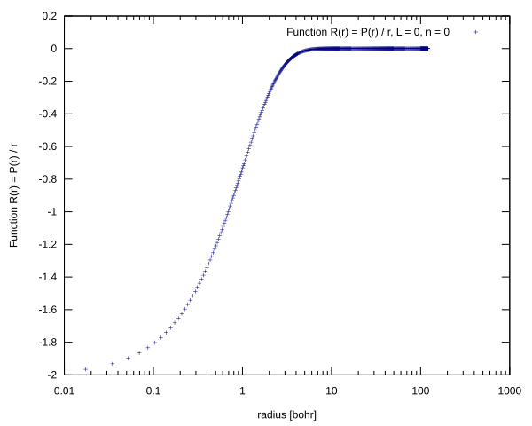</td>
    <td>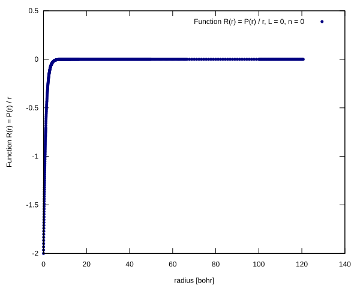</td>
</tr>
</table>

## Eigenfunction:L = 0, n = 1, $E_{n, l}$ = -1.250000000E-01

<table>
<tr>
    <td>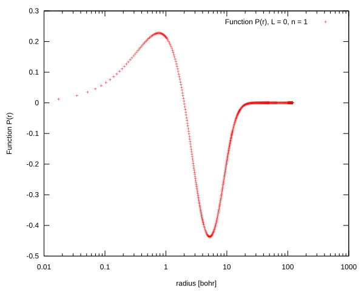</td>
    <td>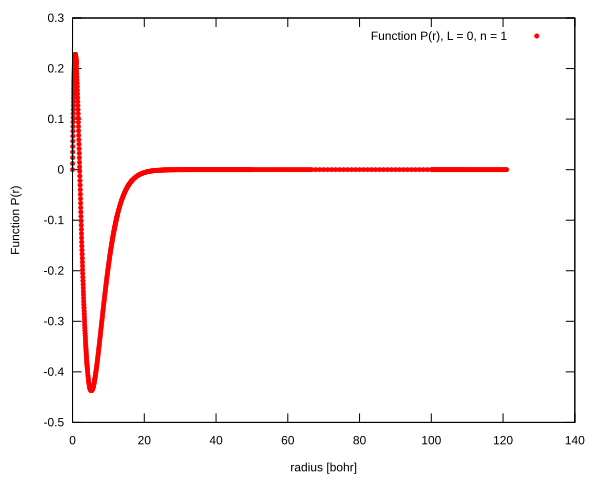</td>
</tr>
<tr>
    <td>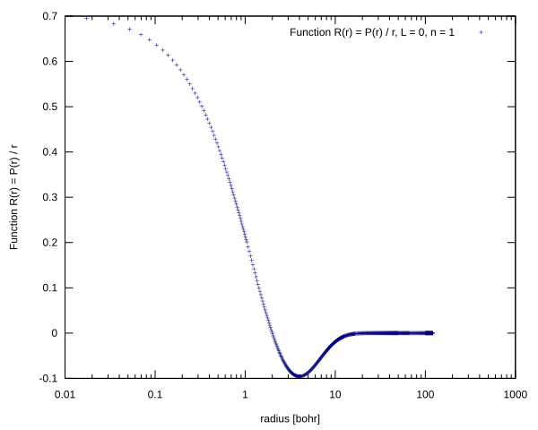</td>
    <td>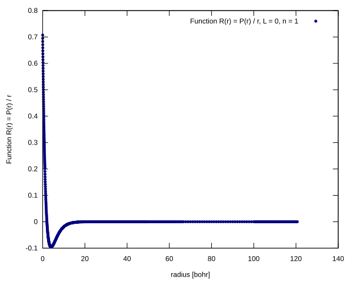</td>
</tr>
</table>

## Eigenfunction:L = 0, n = 2, $E_{n, l}$ = -5.555555555E-02

<table>
<tr>
    <td>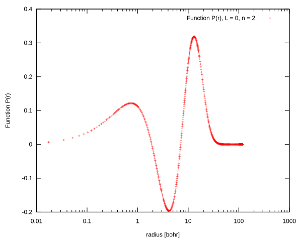</td>
    <td>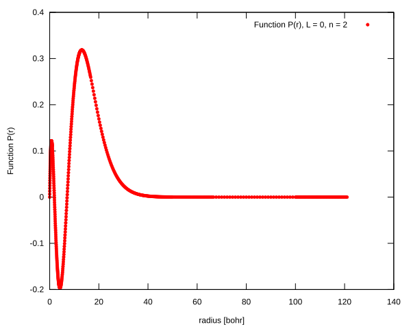</td>
</tr>
<tr>
    <td>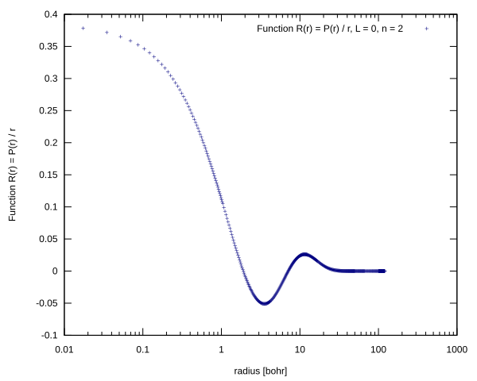</td>
    <td>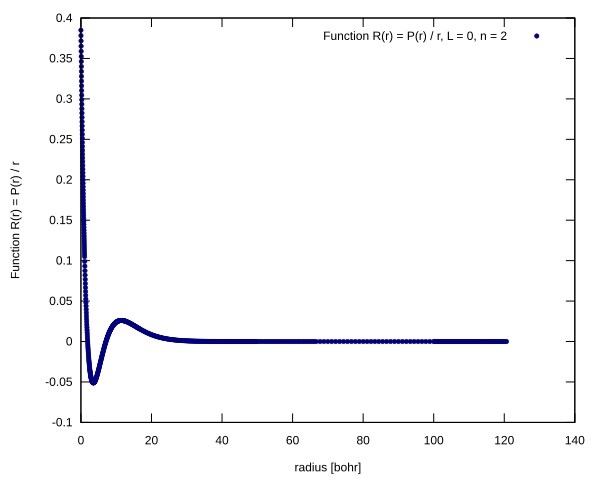</td>
</tr>
</table>

## Eigenfunction:L = 0, n = 3, $E_{n, l}$ = -3.124999999E-02

<table>
<tr>
    <td>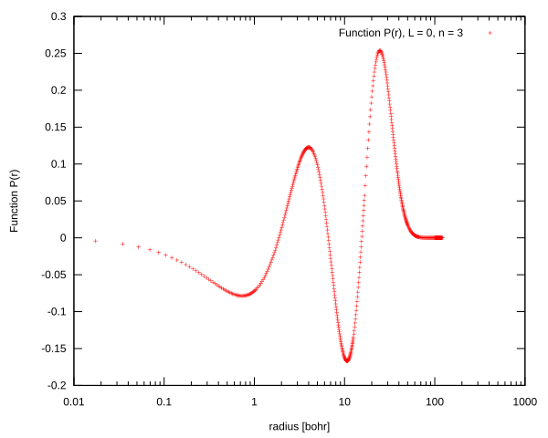</td>
    <td>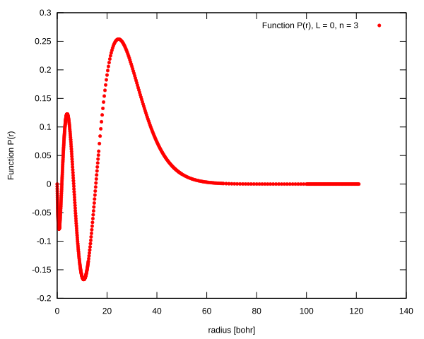</td>
</tr>
<tr>
    <td>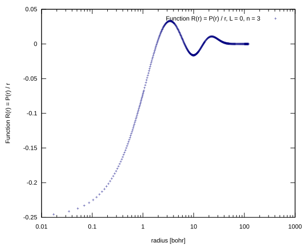</td>
    <td>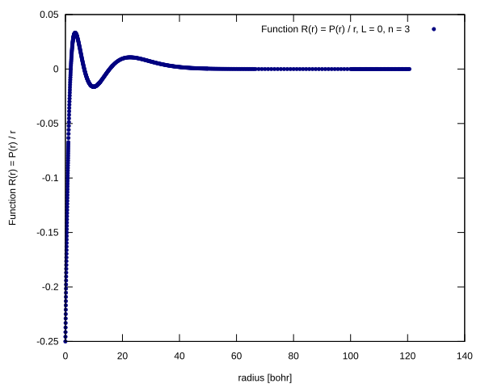</td>
</tr>
</table>

