# Hartwigsen-Goedecker-Hutter pseudopotential for hydrogen, L = 1

## Eigenvalue convergence analysis

| Step | Dofs | n = 0 | n = 1 | n = 2 | n = 3 |
| ---  | ---  | ---   | ---   | ---   | ---   |
| 0 | 17 |  -1.089 443 855E-01 | -4.712 636 063E-02 | -2.655 480 868E-02 | -1.717 983 609E-02 |
| 1 | 23 |  -1.222 495 174E-01 | -5.448 607 985E-02 | -3.074 450 220E-02 | -1.972 414 776E-02 |
| 2 | 29 |  -1.249 558 993E-01 | -5.554 501 332E-02 | -3.124 610 173E-02 | -1.999 808 382E-02 |
| 3 | 35 |  -1.249 921 846E-01 | -5.555 290 301E-02 | -3.124 882 232E-02 | -1.999 931 808E-02 |
| 4 | 47 |  -1.249 922 648E-01 | -5.555 291 903E-02 | -3.124 882 963E-02 | -1.999 932 329E-02 |
| 5 | 59 |  -1.249 922 653E-01 | -5.555 291 994E-02 | -3.124 883 970E-02 | -1.999 937 326E-02 |
| 6 | 71 |  -1.249 923 359E-01 | -5.555 294 428E-02 | -3.124 885 048E-02 | -1.999 937 891E-02 |
| 7 | 77 |  -1.249 923 359E-01 | -5.555 294 428E-02 | -3.124 885 048E-02 | -1.999 939 912E-02 |
| 8 | 83 |  -1.249 923 359E-01 | -5.555 294 428E-02 | -3.124 885 048E-02 | -1.999 940 026E-02 |
| 9 | 89 |  -1.249 9233 59E-01 | -5.555 294 428E-02 | -3.124 885 048E-02 | -1.999 940 030E-02 |
| 10 | 95 |  -1.249 923 359E-01 | -5.555 294 428E-02 | -3.124 885 048E-02 | -1.999 940 030E-02 |
| 11 | 101 |  -1.249 923 359E-01 | -5.555 294 428E-02 | -3.124 885 048E-02 | -1.999 940 030E-02 |

<table>
<tr>
    <td>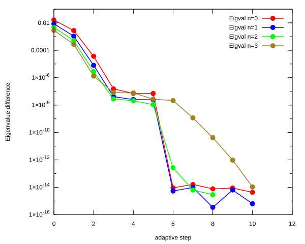</td>
    <td>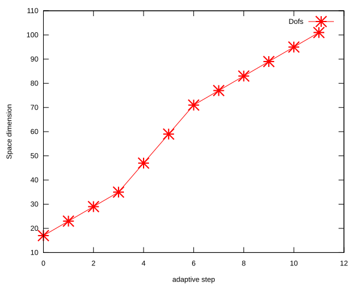</td>
</tr>
</table>

## Eigenfunction: L = 1, n = 0, $E_{n, l}$ = -1.249923359E-01

<table>
<tr>
    <td>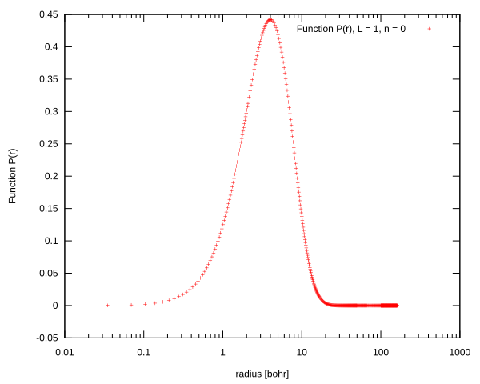</td>
    <td>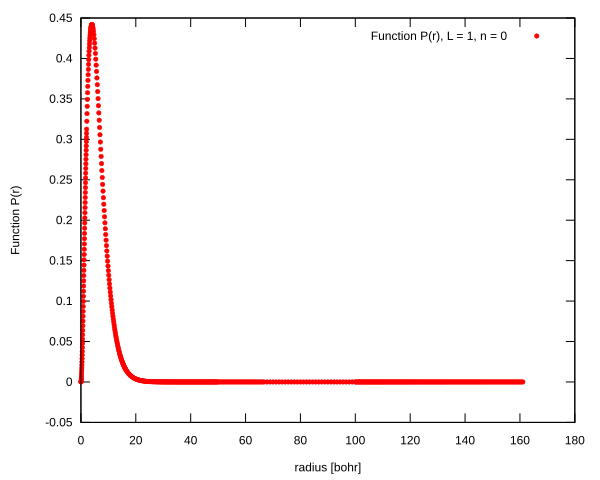</td>
</tr>
<tr>
    <td>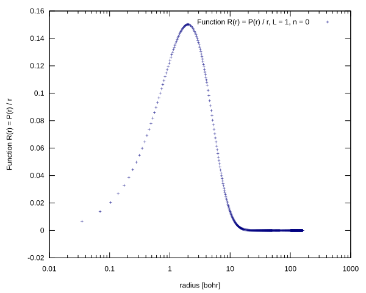</td>
    <td>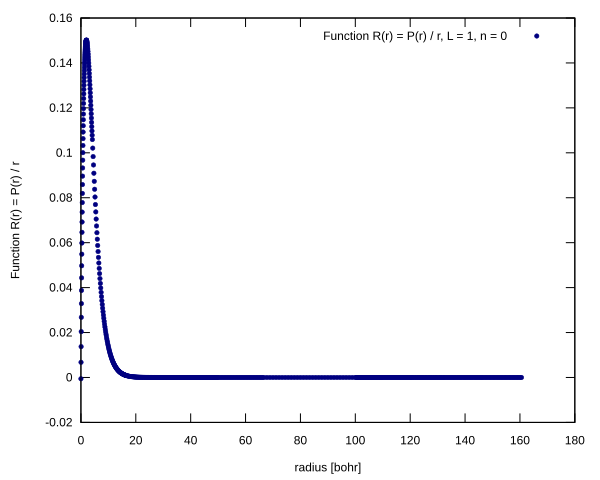</td>
</tr>
</table>

## Eigenfunction: L = 1, n = 1, $E_{n, l}$ = -5.555294428E-02

<table>
<tr>
    <td>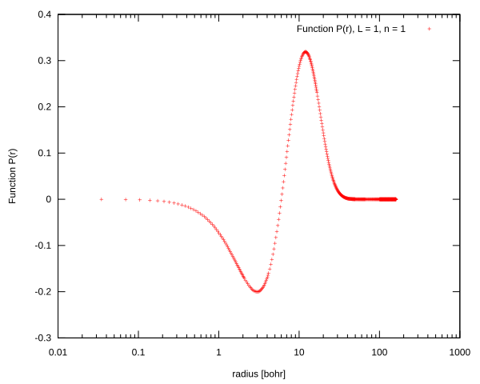</td>
    <td>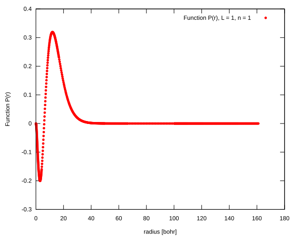</td>
</tr>
<tr>
    <td>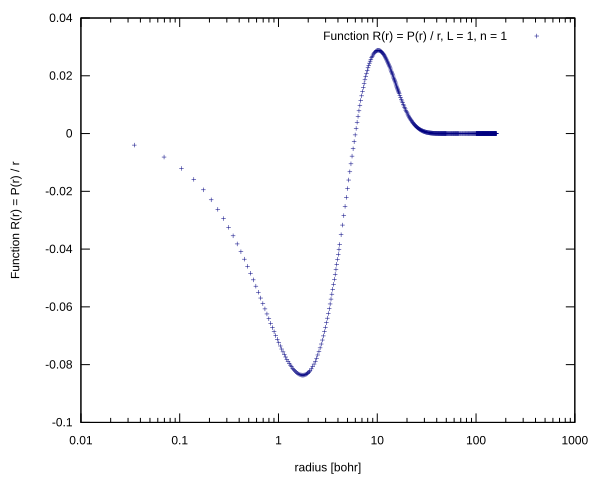</td>
    <td>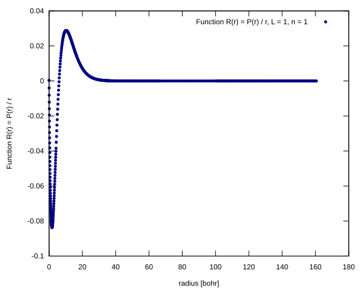</td>
</tr>
</table>

## Eigenfunction: L = 1, n = 2, $E_{n, l}$ = -3.124885048E-02

<table>
<tr>
    <td>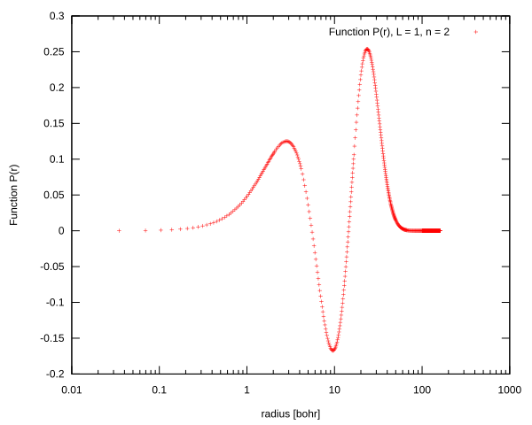</td>
    <td>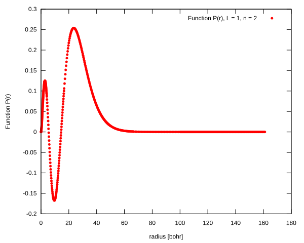</td>
</tr>
<tr>
    <td>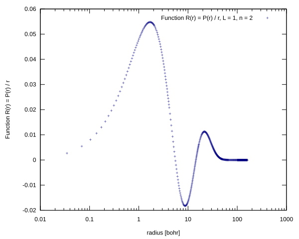</td>
    <td>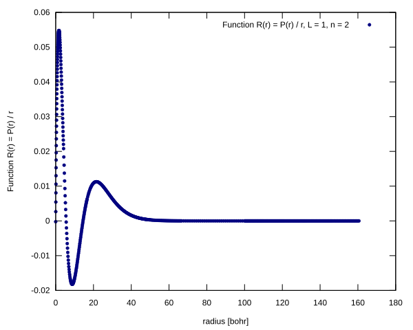</td>
</tr>
</table>

## Eigenfunction: L = 1, n = 3, $E_{n, l}$ = -1.999937891E-02

<table>
<tr>
    <td>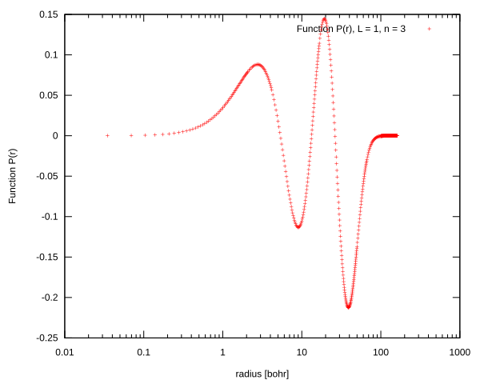</td>
    <td>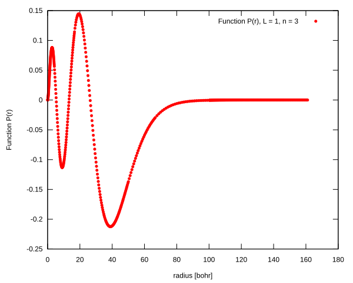</td>
</tr>
<tr>
    <td>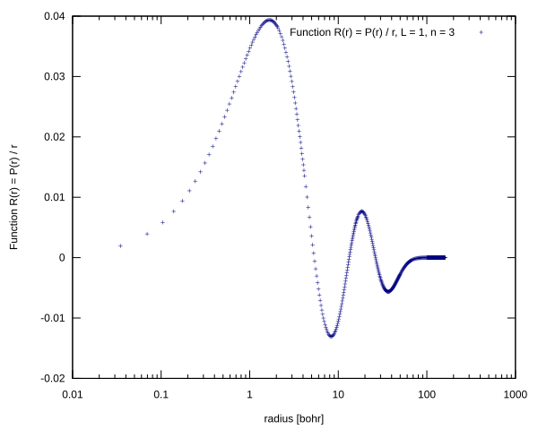</td>
    <td>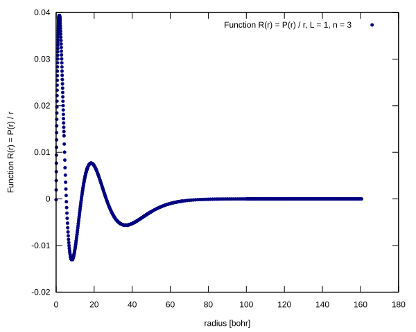</td>
</tr>
</table>

