# Soft-Coulomb potential (Z = 1 , a = 1 , q = 2): L = 2

## Eigenvalue convergence analysis

| Step | Dofs | n = 0 | n = 1 | n = 2 | n = 3 |
| ---  | ---  | ---   | ---   | ---   | ---   |
| 0 | 17 |  -5.232 017 067E-02 | -2.858 561 868E-02 | -1.799 839 099E-02 | -1.243 151 133E-02 |
| 1 | 23 |  -5.416 036 508E-02 | -3.054 163 934E-02 | -1.958 920 811E-02 | -1.363 142 211E-02 |
| 2 | 35 |  -5.442 605 619E-02 | -3.077 4832 21E-02 | -1.975 676 613E-02 | -1.374 806 947E-02 |
| 3 | 41 |  -5.443 620 645E-02 | -3.078 149 744E-02 | -1.976 088 621E-02 | -1.375 070 930E-02 |
| 4 | 53 |  -5.443 621 132E-02 | -3.078 150 169E-02 | -1.976 089 175E-02 | -1.375 071 547E-02 |
| 5 | 65 |  -5.443 621 132E-02 | -3.078 150 170E-02 | -1.976 089 175E-02 | -1.375 071 548E-02 |
| 6 | 71 |  -5.443 621 132E-02 | -3.078 150 170E-02 | -1.976 089 175E-02 | -1.375 071 850E-02 |
| 7 | 77 |  -5.443 621 132E-02 | -3.078 150 170E-02 | -1.976 089 175E-02 | -1.375 071 861E-02 |
| 8 | 83 |  -5.443 621 132E-02 | -3.078 150 170E-02 | -1.976 089 175E-02 | -1.375 071 862E-02 |
| 9 | 89 |  -5.443 621 132E-02 | -3.078 150 170E-02 | -1.976 089 175E-02 | -1.375 071 862E-02 |

<table>
<tr>
    <td>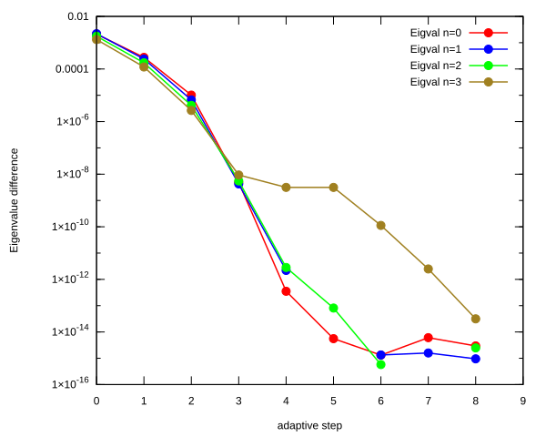</td>
    <td>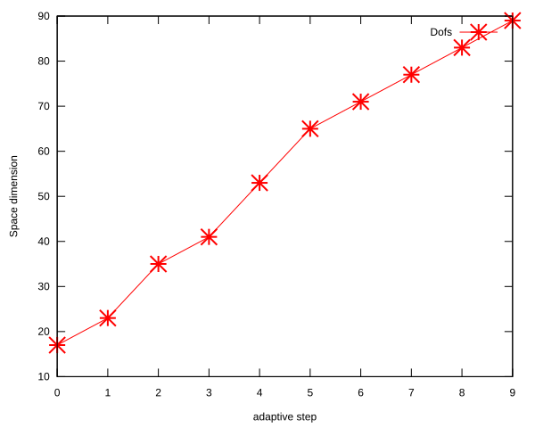</td>
</tr>
</table>

## Eigenfunction: L = 2, n = 0, $E_{n, l}$ = -5.443621132E-02

<table>
<tr>
    <td>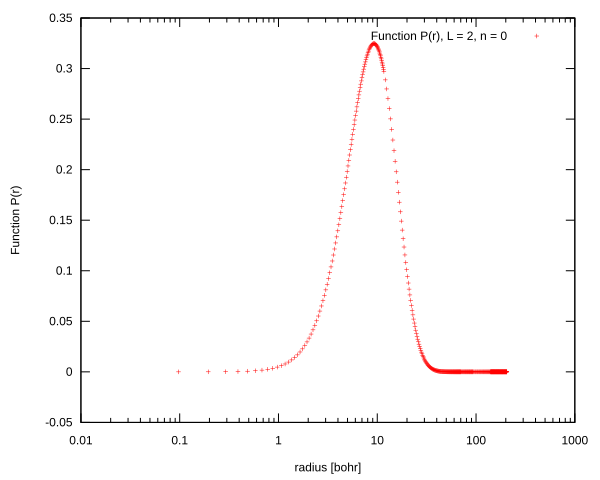</td>
    <td>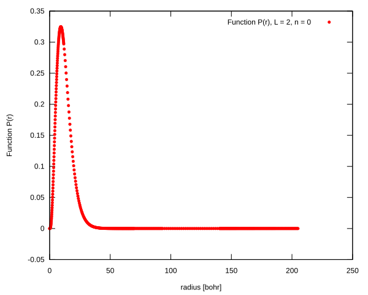</td>
</tr>
<tr>
    <td>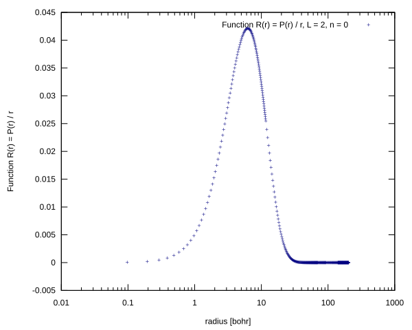</td>
    <td>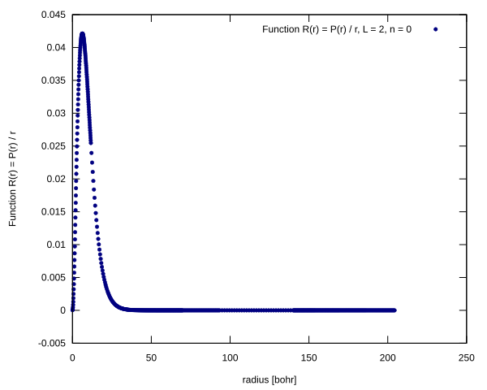</td>
</tr>
</table>

## Eigenfunction:L = 2, n = 1, $E_{n, l}$ = -3.078150170E-02

<table>
<tr>
    <td>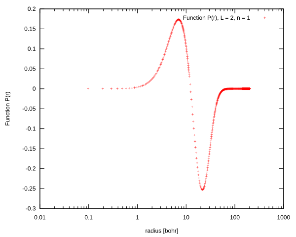</td>
    <td>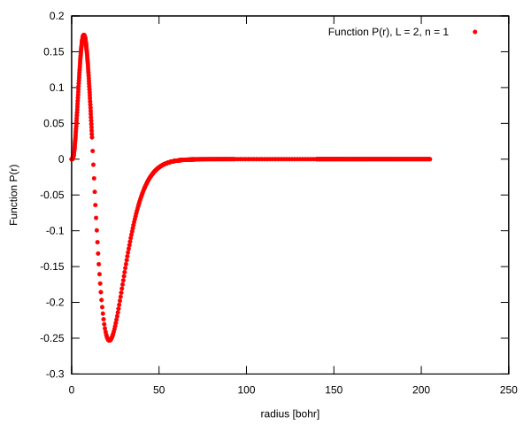</td>
</tr>
<tr>
    <td>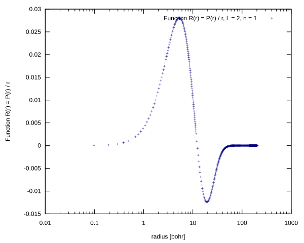</td>
    <td>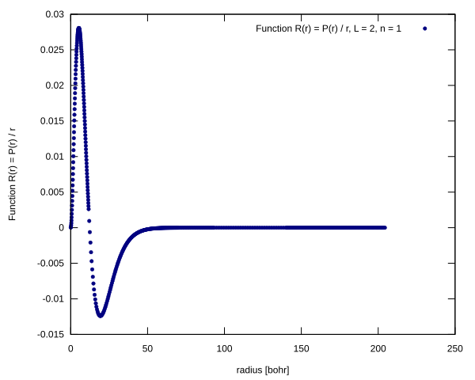</td>
</tr>
</table>

## Eigenfunction:L = 2, n = 2, $E_{n, l}$ = -1.976089175E-02

<table>
<tr>
    <td>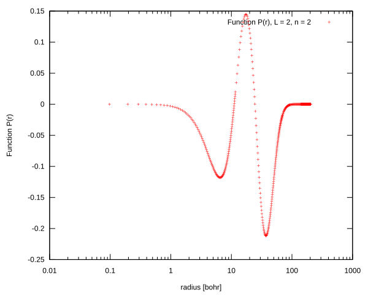</td>
    <td>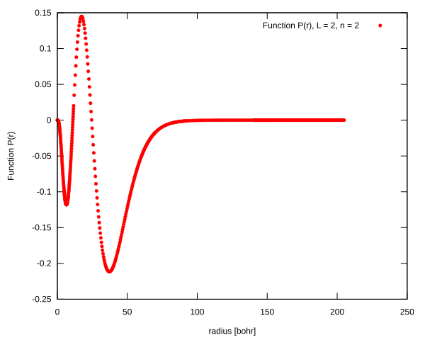</td>
</tr>
<tr>
    <td>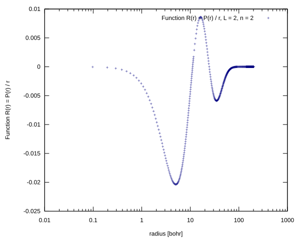</td>
    <td>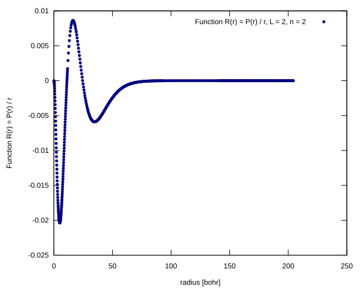</td>
</tr>
</table>

## Eigenfunction:L = 2, n = 3, $E_{n, l}$ = -1.375071548E-02

<table>
<tr>
    <td>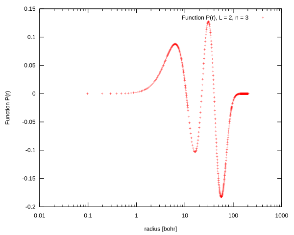</td>
    <td>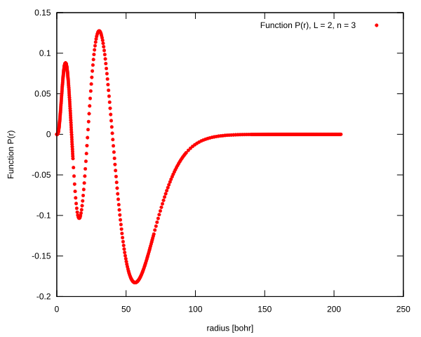</td>
</tr>
<tr>
    <td>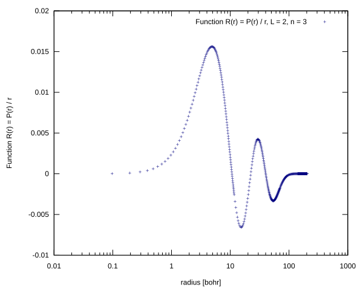</td>
    <td>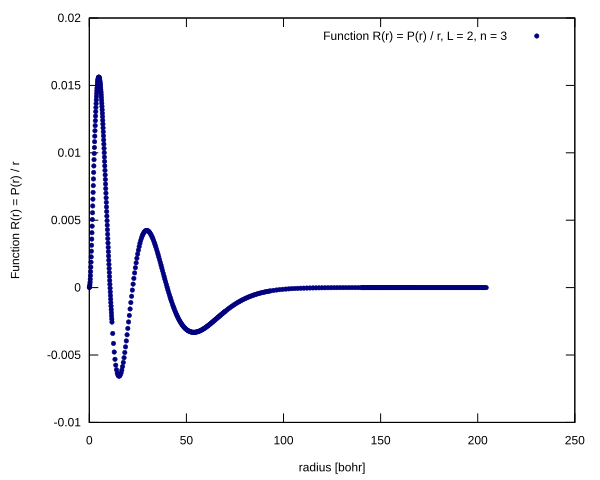</td>
</tr>
</table>

